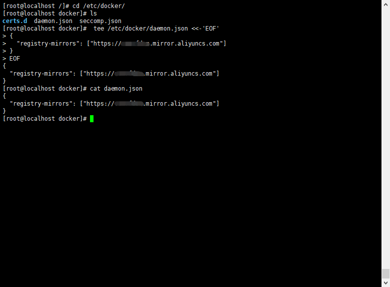

# centos简易安装docker

准备环境要求：请确保自己的centos的内核版本大于3.10，使用如下linux命令：
```bash
uname -r
```
显示如下类似信息：
```bash
3.10.0-862.3.3.el7.x86_64
```
如果安装了旧版本docker请先删除，运行如下linux命令：
```bash
 yum remove docker \
                  docker-client \
                  docker-client-latest \
                  docker-common \
                  docker-latest \
                  docker-latest-logrotate \
                  docker-logrotate \
                  docker-selinux \
                  docker-engine-selinux \
                  docker-engine
```

如想参考官方centos安装docker，地址如下：[https://docs.docker.com/install/linux/docker-ce/centos/#prerequisites](https://docs.docker.com/install/linux/docker-ce/centos/#prerequisites "centos安装docker 官方地址")

## 第一步 检查更新yum软件管理器 ##

在centos窗口中 执行如下命令：
```bash
yum -y update
```
说明：参数 -y 表示程序安装中的yes选项
## 第二步 安装docker ##


在centos窗口中 执行如下命令：
```bash
curl -s https://get.docker.com|sh
```

## 第三步 配置docker 镜像加速 ##
由于官方镜像是架设在国外，国内访问时较慢。在此列出国内常见的镜像加速器有DaoCloud、阿里云、网易等，来提升拉取镜像速度。
在此文章中，将使用阿里云docker镜像加速器。读者自行注册获得镜像加速地址。
注册完成后 进入 控制台，在菜单 ‘产品与服务’中， 选 ‘容器镜像服务’，在容器镜像服务界面 点击 ‘镜像库’ 下 ‘镜像加速器’菜单，会有ubuntu 、centos、mac、windows 四个系统的配置docker镜像加速器教程。
如下是centos配置图：



```
sudo mkdir -p /etc/docker
sudo tee /etc/docker/daemon.json <<-'EOF'
{
  "registry-mirrors": ["https://vcmrfdsm.mirror.aliyuncs.com"]
}
EOF
sudo systemctl daemon-reload
sudo systemctl restart docker
```
## 第四步 启动docker ##
启动运行docker。 如下linux命令：
```bash
service docker start
```
检验是否正常启动 ，查看版本。运行如下linux命令：
```bash
docker verison
```
出现类似如下版本信息：
```bash
Client:
 Version:      18.05.0-ce
 API version:  1.37
 Go version:   go1.9.5
 Git commit:   f150324
 Built:        Wed May  9 22:14:54 2018
 OS/Arch:      linux/amd64
 Experimental: false
 Orchestrator: swarm

Server:
 Engine:
  Version:      18.05.0-ce
  API version:  1.37 (minimum version 1.12)
  Go version:   go1.9.5
  Git commit:   f150324
  Built:        Wed May  9 22:18:36 2018
  OS/Arch:      linux/amd64
  Experimental: false

```
含有client和service信息表示docker安装启动都成功了。


附录：
docker 启动命令：
```bash
service docker start
```
docker 停止命令：
```bash
service docker stop
```
dockers 重启命令：
```bash
service docker restart
```
开机自启docker：
```bash
systemctl enable docker 
```