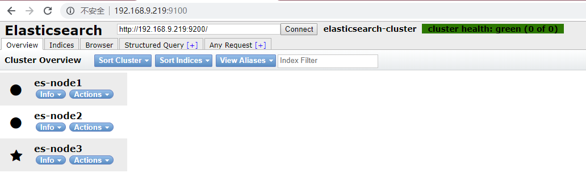

# docker简易搭建ElasticSearch集群

写在前面：为什么要用ElasticSearch？我们的应用经常需要添加检索功能，开源的Elastic Search是目前全文检索引擎的首选。它可以快速的存储、搜索和分析海量数据。ElasticSearch是一个分布式搜索框架，提供RestfulAPI，底层基于Lucene，采用多shard（分片）的方式保证数据安全，并且提供自动resharding的功能。

Elasticsearch: 权威指南(中文)：https://www.elastic.co/guide/cn/elasticsearch/guide/current/index.html

# 一、拉取ElasticSearch镜像
在centos窗口中，执行如下命令：
```bash
docker pull elasticsearch:5.6.8
```
当前ES镜像版本信息：
```xml
 {
  "name" : "WlwFyqU",
  "cluster_name" : "elasticsearch",
  "cluster_uuid" : "78UDZtviQqiWmzmenGpSrQ",
  "version" : {
    "number" : "5.6.8",
    "build_hash" : "cfe3d9f",
    "build_date" : "2018-09-10T20:12:43.732Z",
    "build_snapshot" : false,
    "lucene_version" : "6.6.1"
  },
  "tagline" : "You Know, for Search"
 }
```


# 二、创建数据挂在目录，以及配置ElasticSearch集群配置文件，调高JVM线程数限制数量
#### 1.创建数据文件挂载目录,并开放通信端口
在centos窗口中，执行如下操作：
```bash
[root@localhost soft]# pwd
/home/soft
[root@localhost soft]# mkdir -p ES/config
[root@localhost soft]# cd  ES 
[root@localhost ES]# mkdir data1
[root@localhost ES]# mkdir data2
[root@localhost ES]# mkdir data3
[root@localhost ES]# cd ES/config/
[root@localhost ES]# firewall-cmd --add-port=9300/tcp
success
[root@localhost ES]# firewall-cmd --add-port=9301/tcp
success
[root@localhost ES]# firewall-cmd --add-port=9302/tcp
success

``` 
*注：如果ELK选的6.X版本的，那么读者需将data1 data2 data3 开启777权限=> chmod 777 data1 data2 data3*

#### 2.创建ElasticSearch配置文件
在centos窗口中，使用vim命令分别创建如下文件：es1.yml,es2.yml,es3.yml

**es1.yml**
```xml
cluster.name: elasticsearch-cluster
node.name: es-node1
network.bind_host: 0.0.0.0
network.publish_host: 192.168.9.219
http.port: 9200
transport.tcp.port: 9300
http.cors.enabled: true
http.cors.allow-origin: "*"
node.master: true 
node.data: true  
discovery.zen.ping.unicast.hosts: ["192.168.9.219:9300","192.168.9.219:9301","192.168.9.219:9302"]
discovery.zen.minimum_master_nodes: 2
```
**es2.yml**
```xml
cluster.name: elasticsearch-cluster
node.name: es-node2
network.bind_host: 0.0.0.0
network.publish_host: 192.168.9.219
http.port: 9201
transport.tcp.port: 9301
http.cors.enabled: true
http.cors.allow-origin: "*"
node.master: true 
node.data: true  
discovery.zen.ping.unicast.hosts: ["192.168.9.219:9300","192.168.9.219:9301","192.168.9.219:9302"]
discovery.zen.minimum_master_nodes: 2
```

**es3.yml**
```xml
cluster.name: elasticsearch-cluster
node.name: es-node3
network.bind_host: 0.0.0.0
network.publish_host: 192.168.9.219
http.port: 9202
transport.tcp.port: 9302
http.cors.enabled: true
http.cors.allow-origin: "*"
node.master: true 
node.data: true  
discovery.zen.ping.unicast.hosts: ["192.168.9.219:9300","192.168.9.219:9301","192.168.9.219:9302"]
discovery.zen.minimum_master_nodes: 2
```

*注：本机虚拟机ip：192.168.9.219 读者请自行更改*

#### 3.调高JVM线程数限制数量
在centos窗口中，修改配置sysctl.conf
```bash
vim /etc/sysctl.conf
```
加入如下内容：
```bash
vm.max_map_count=262144 
```
启用配置：
```bash
sysctl -p
```
*注：这一步是为了防止启动容器时，报出如下错误：
bootstrap checks failed max virtual memory areas vm.max_map_count [65530] likely too low, increase to at least [262144]*

# 三、启动ElasticSearch集群容器
启动ElasticSearch集群容器
在centos窗口中，执行如下命令：
```bash
 docker run -e ES_JAVA_OPTS="-Xms256m -Xmx256m" -d -p 9200:9200 -p 9300:9300 -v /home/soft/ES/config/es1.yml:/usr/share/elasticsearch/config/elasticsearch.yml -v /home/soft/ES/data1:/usr/share/elasticsearch/data --name ES01 elasticsearch:5.6.8
 
 docker run -e ES_JAVA_OPTS="-Xms256m -Xmx256m" -d -p 9201:9201 -p 9301:9301 -v /home/soft/ES/config/es2.yml:/usr/share/elasticsearch/config/elasticsearch.yml -v /home/soft/ES/data2:/usr/share/elasticsearch/data --name ES02 elasticsearch:5.6.8

 docker run -e ES_JAVA_OPTS="-Xms256m -Xmx256m" -d -p 9202:9202 -p 9302:9302 -v /home/soft/ES/config/es3.yml:/usr/share/elasticsearch/config/elasticsearch.yml -v /home/soft/ES/data3:/usr/share/elasticsearch/data --name ES03 elasticsearch:5.6.8
```
*注：设置-e ES_JAVA_OPTS="-Xms256m -Xmx256m"  是因为/etc/elasticsearch/jvm.options 默认jvm最大最小内存是2G，读者启动容器后 可用docker stats命令查看*
 

# 四、验证是否搭建成功
#### 1.在浏览器地址栏访问http://192.168.9.219:9200/_cat/nodes?pretty 查看节点状态

*注：节点名称带*表示为主节点*
#### 2.使用elasticsearch-head前端框架
- 1.拉取镜像
```bash
docker pull mobz/elasticsearch-head:5
```
- 2.启动容器
```bash
docker run -d -p 9100:9100 --name es-manager  mobz/elasticsearch-head:5
```

- 3.浏览器访问http://192.168.9.219:9100/  



写在最后，这里要多提一点索引分片设置以及副本，官方推荐设置，读者根据自身需要进行修改：
curl -XPUT 'http://localhost:9200/_all/_settings?preserve_existing=true' -d '{
"index.number_of_replicas" : "1",
"index.number_of_shards" : "10"
}'
### 附录：
1.查看容器内存
```bash
docker stats $(docker ps --format={{.Names}})
```
2.查看容器日志
```bash
docker logs 容器名/容器ID
```
3.ElasticSearch配置文件说明
```xml
cluster.name: elasticsearch-cluster
node.name: es-node1
#index.number_of_shards: 2
#index.number_of_replicas: 1
network.bind_host: 0.0.0.0
network.publish_host: 192.168.9.219
http.port: 9200
transport.tcp.port: 9300
http.cors.enabled: true
http.cors.allow-origin: "*"
node.master: true 
node.data: true  
discovery.zen.ping.unicast.hosts: ["es-node1:9300","es-node2:9301","es-node3:9302"]
discovery.zen.minimum_master_nodes: 2
```
**注**：
- cluster.name：用于唯一标识一个集群，不同的集群，其 cluster.name 不同，集群名字相同的所有节点自动组成一个集群。如果不配置改属性，默认值是：elasticsearch。

- node.name：节点名，默认随机指定一个name列表中名字。集群中node名字不能重复

- index.number_of_shards: 默认的配置是把索引分为5个分片

- index.number_of_replicas:设置每个index的默认的冗余备份的分片数，默认是1
> 通过 index.number_of_shards，index.number_of_replicas默认设置索引将分为5个分片，每个分片1个副本，共10个结点。
> 禁用索引的分布式特性，使索引只创建在本地主机上：
  index.number_of_shards: 1
  index.number_of_replicas: 0
  但随着版本的升级 将不在配置文件中配置而实启动ES后，再进行配置

- bootstrap.memory_lock: true 当JVM做分页切换（swapping）时，ElasticSearch执行的效率会降低，推荐把ES_MIN_MEM和ES_MAX_MEM两个环境变量设置成同一个值，并且保证机器有足够的物理内存分配给ES，同时允许ElasticSearch进程锁住内存

- network.bind_host: 设置可以访问的ip,可以是ipv4或ipv6的，默认为0.0.0.0，这里全部设置通过 

- network.publish_host:设置其它结点和该结点交互的ip地址，如果不设置它会自动判断，值必须是个真实的ip地址
   >同时设置bind_host和publish_host两个参数可以替换成network.host
    >network.bind_host: 192.168.9.219
    >network.publish_host: 192.168.9.219
    >=>network.host: 192.168.9.219
    
- http.port:设置对外服务的http端口，默认为9200

- transport.tcp.port: 设置节点之间交互的tcp端口，默认是9300

- http.cors.enabled: 是否允许跨域REST请求

- http.cors.allow-origin: 允许 REST 请求来自何处 

- node.master: true  配置该结点有资格被选举为主结点（候选主结点），用于处理请求和管理集群。如果结点没有资格成为主结点，那么该结点永远不可能成为主结点；如果结点有资格成为主结点，只有在被其他候选主结点认可和被选举为主结点之后，才真正成为主结点。

- node.data: true 配置该结点是数据结点，用于保存数据，执行数据相关的操作（CRUD，Aggregation）；

- discovery.zen.minimum_master_nodes: //自动发现master节点的最小数，如果这个集群中配置进来的master节点少于这个数目，es的日志会一直报master节点数目不足。（默认为1）为了避免脑裂，个数请遵从该公式 => (totalnumber of master-eligible nodes / 2 + 1)。    * 脑裂是指在主备切换时，由于切换不彻底或其他原因，导致客户端和Slave误以为出现两个active master，最终使得整个集群处于混乱状态*

- discovery.zen.ping.unicast.hosts： 集群个节点IP地址，也可以使用es-node等名称，需要各节点能够解析


4.ElasticSearch使用七大原则
```
一、 硬件环境选择 
二、系统拓朴设计
三、ES的内存设置
四、 集群分片设置
五、Mapping建模
六、 索引优化设置
七、 查询优化
```
一、 硬件环境选择

　　如果有条件，尽可能使用SSD硬盘， 不错的CPU。ES的厉害之处在于ES本身的分布式架构以及lucene的特性；IO的提升，会极大改进ES的速度和性能；内存配置方面，一般来说，64G内存的机器节点较佳。

二、系统拓朴设计

　　ES集群在架构拓朴时，一般都会采用Hot-Warm的架构模式，即设置3种不同类型的节点：Master节点、Hot节点和Warm节点。

　　Master节点设置：一般会设置３个专用的maste节点，以提供最好的弹性扩展能力。当然，必须注意

　　discovery.zen.minimum_master_nodes属性的设置，以防split-brain问题，使用公式设置：N/2+1(N为候选master节点数）。 该节点保持: node.data: false ;因为master节点不参与查询、索引操作，仅负责对于集群管理，所以在CPU、内存、磁盘配置上，都可以比数据节点低很多。

　　Hot节点设置：索引节点（写节点），同时保持近期频繁使用的索引。 属于IO和CPU密集型操作，建议使用SSD的磁盘类型，保持良好的写性能；节点的数量设置一般是大于等于3个。将节点设置为hot类型：

　　node.attr.box_type:hot

　　针对index,通过设置

　　index.routing.allocation.require.box_type：hot可以设置将索引写入hot节点。

　　Warm节点设置： 用于不经常访问的read-only索引。由于不经常访问，一般使用普通的磁盘即可。内存、CPU的配置跟Hot节点保持一致即可；节点数量一般也是大于等于3个。

　　当索引不再被频繁查询时，可通过

　　index.routing.allocation.require.box_type：warm， 将索引标记为warm,从而保证索引不写入hot节点，以便将SSD磁盘资源用在刀刃上。一旦设置这个属性，ES会自动将索引合并到warm节点。同时，也可以在elasticsearch.yml中设置index.codec: best_compression保证warm节点的压缩配置。

　　Coordinating节点：协调节点用于做分布式里的协调，将各分片或节点返回的数据整合后返回。在ES集群中，所有的节点都有可能是协调节点，但是，可以通过设置node.master、node.data、node.ingest都为false来设置专门的协调节点。需要较好的CPU和较高的内存。

三、ES的内存设置

　　由于ES构建基于lucene,而lucene设计强大之处在于lucene能够很好的利用操作系统内存来缓存索引数据，以提供快速的查询性能。lucene的索引文件segements是存储在单文件中的，并且不可变，对于OS来说，能够很友好地将索引文件保持在cache中，以便快速访问；因此，我们很有必要将一半的物理内存留给lucene ;另一半的物理内存留给ES（JVM heap )。所以， 在ES内存设置方面，可以遵循以下原则：

　　1.当机器内存小于64G时，遵循通用的原则，50%给ES，50%留给lucene。

　　2.当机器内存大于64G时，遵循以下原则：

　　a.如果主要的使用场景是全文检索,那么建议给ES Heap分配4~32G的内存即可；其它内存留给操作系统,供lucene使用（segments cache),以提供更快的查询性能。

　　b.如果主要的使用场景是聚合或排序， 并且大多数是numerics, dates, geo_points以及not_analyzed的字符类型， 建议分配给ES Heap分配4~32G的内存即可，其它内存留给操作系统，供lucene使用(doc values cache)，提供快速的基于文档的聚类、排序性能。

　　c.如果使用场景是聚合或排序，并且都是基于analyzed字符数据，这时需要更多的heap size,建议机器上运行多ES实例，每个实例保持不超过50%的ES heap设置(但不超过32G，堆内存设置32G以下时，JVM使用对象指标压缩技巧节省空间)，50%以上留给lucene。

　　3.禁止swap，一旦允许内存与磁盘的交换，会引起致命的性能问题。

　　通过在elasticsearch.yml中bootstrap.memory_lock: true，以保持JVM锁定内存，保证ES的性能。

　　4. GC设置原则：

　　a.保持GC的现有设置，默认设置为：Concurrent-Mark and Sweep (CMS)，别换成G1GC，因为目前G1还有很多BUG。

　　b.保持线程池的现有设置，目前ES的线程池较1.X有了较多优化设置，保持现状即可；默认线程池大小等于CPU核心数。如果一定要改，按公式（（CPU核心数* 3）/ 2）+ 1设置；不能超过CPU核心数的2倍；但是不建议修改默认配置，否则会对CPU造成硬伤。

四、 集群分片设置

　　ES一旦创建好索引后，就无法调整分片的设置，而在ES中，一个分片实际上对应一个lucene索引，而lucene索引的读写会占用很多的系统资源，因此，分片数不能设置过大；所以，在创建索引时，合理配置分片数是非常重要的。一般来说，我们遵循一些原则：

　　1.控制每个分片占用的硬盘容量不超过ES的最大JVM的堆空间设置（一般设置不超过32G，参加上文的JVM设置原则），因此，如果索引的总容量在500G左右，那分片大小在16个左右即可；当然，最好同时考虑原则2。

　　2.考虑一下node数量，一般一个节点有时候就是一台物理机，如果分片数过多，大大超过了节点数，很可能会导致一个节点上存在多个分片，一旦该节点故障，即使保持了1个以上的副本，同样有可能会导致数据丢失，集群无法恢复。所以， 一般都设置分片数不超过节点数的3倍。

五、Mapping建模

　　1.尽量避免使用nested或parent/child，能不用就不用；nested query慢，parent/child query更慢，比nested query慢上百倍；因此能在mapping设计阶段搞定的（大宽表设计或采用比较smart的数据结构），就不要用父子关系的mapping。

　　2.如果一定要使用nested fields，保证nested fields字段不能过多，目前ES默认限制是50。参考：

　　index.mapping.nested_fields.limit ：50

　　因为针对1个document,每一个nested field,都会生成一个独立的document,这将使Doc数量剧增，影响查询效率，尤其是JOIN的效率。

　　3.避免使用动态值作字段(key),动态递增的mapping，会导致集群崩溃；同样，也需要控制字段的数量，业务中不使用的字段，就不要索引。控制索引的字段数量、mapping深度、索引字段的类型，对于ES的性能优化是重中之重。以下是ES关于字段数、mapping深度的一些默认设置：

　　index.mapping.nested_objects.limit :10000

　　index.mapping.total_fields.limit:1000

　　index.mapping.depth.limit: 20

六、 索引优化设置

　　1.设置refresh_interval为-1，同时设置number_of_replicas为0，通过关闭refresh间隔周期，同时不设置副本来提高写性能。

　　2.修改index_buffer_size的设置，可以设置成百分数，也可设置成具体的大小，大小可根据集群的规模做不同的设置测试。

　　indices.memory.index_buffer_size：10%（默认）

　　indices.memory.min_index_buffer_size： 48mb（默认）

　　indices.memory.max_index_buffer_size

　　3.修改translog相关的设置：

　　a.控制数据从内存到硬盘的操作频率，以减少硬盘IO。可将sync_interval的时间设置大一些。

　　index.translog.sync_interval：5s(默认)

　　b.控制tranlog数据块的大小，达到threshold大小时，才会flush到lucene索引文件。

　　index.translog.flush_threshold_size：512mb(默认)

　　4. _id字段的使用，应尽可能避免自定义_id,以避免针对ID的版本管理；建议使用ES的默认ID生成策略或使用数字类型ID做为主键。

　　5. _all字段及_source字段的使用，应该注意场景和需要，_all字段包含了所有的索引字段，方便做全文检索，如果无此需求，可以禁用；_source存储了原始的document内容，如果没有获取原始文档数据的需求，可通过设置includes、excludes属性来定义放入_source的字段。

　　6.合理的配置使用index属性，analyzed和not_analyzed，根据业务需求来控制字段是否分词或不分词。只有groupby需求的字段，配置时就设置成not_analyzed,以提高查询或聚类的效率。

七、 查询优化

　　1. query_string或multi_match的查询字段越多， 查询越慢。可以在mapping阶段，利用copy_to属性将多字段的值索引到一个新字段，multi_match时，用新的字段查询。

　　2.日期字段的查询， 尤其是用now的查询实际上是不存在缓存的，因此， 可以从业务的角度来考虑是否一定要用now,毕竟利用query cache是能够大大提高查询效率的。

　　3.查询结果集的大小不能随意设置成大得离谱的值， 如query.setSize不能设置成Integer.MAX_VALUE， 因为ES内部需要建立一个数据结构来放指定大小的结果集数据。

　　4.尽量避免使用script，万不得已需要使用的话，选择painless & experssions引擎。一旦使用script查询，一定要注意控制返回，千万不要有死循环（如下错误的例子），因为ES没有脚本运行的超时控制，只要当前的脚本没执行完，该查询会一直阻塞。

 

 　 5.避免层级过深的聚合查询， 层级过深的group by ,会导致内存、CPU消耗，建议在服务层通过程序来组装业务，也可以通过pipeline的方式来优化。

　　6.复用预索引数据方式来提高AGG性能：如通过terms aggregations替代range aggregations， 如要根据年龄来分组，分组目标是:少年（14岁以下） 青年（14-28） 中年（29-50） 老年（51以上）， 可以在索引的时候设置一个age_group字段，预先将数据进行分类。从而不用按age来做range aggregations,通过age_group字段就可以了。

　　7. Cache的设置及使用：

　　a.QueryCache: ES查询的时候，使用filter查询会使用query cache,如果业务场景中的过滤查询比较多，建议将querycache设置大一些，以提高查询速度。

　　indices.queries.cache.size： 10%（默认），可设置成百分比，也可设置成具体值，如256mb。

　　当然也可以禁用查询缓存（默认是开启）， 通过index.queries.cache.enabled：false设置。

　　b.FieldDataCache:在聚类或排序时，field data cache会使用频繁，因此，设置字段数据缓存的大小，在聚类或排序场景较多的情形下很有必要，可通过

　　indices.fielddata.cache.size：30%或具体值10GB来设置。但是如果场景或数据变更比较频繁，设置cache并不是好的做法，因为缓存加载的开销也是特别大的。

　　c.ShardRequestCache:查询请求发起后，每个分片会将结果返回给协调节点(Coordinating Node),由协调节点将结果整合。

　　如果有需求，可以设置开启;通过设置

　　index.requests.cache.enable: true来开启。

　　不过，shard request cache只缓存hits.total, aggregations, suggestions类型的数据，并不会缓存hits的内容。也可以通过设置

　　indices.requests.cache.size: 1%（默认）来控制缓存空间大小。


5.使用 Elasticsearch 的 44 条建议

01
—
es中建索引是指创建一个保存数据的目录，用于保存倒排索引，索引创建之后是不可变的（Immutable），只允许新增字段。

因为lucene中field是带类型的，不同类型的字段进入倒排索引后会经过压缩，long/int/short占用的字节长度不一，如果修改字段类型，很可能导致从索引文件中解压字段失败，更不要提string=>int之类的变换了；此外 es会将文档id压缩存储（有序列表->差值形式->压缩），并通过跳跃表来提高查询性能， 倒排索引查出term对应的doc_id集合，再用doc_id取field value用于排序或聚合，其实是lucene的实现，所以要变更索引文件代价很大，需要解压=>变更=>压缩，大量的CPU和io操作。


02
—
es字段是否索引只能在创建索引时配置，不能在字段创建后再给字段“加索引”。

lucene的字段有indexed的属性，如果设置false则不会写入倒排索引文件，如果要后期将某个字段改为indexed，相当于把整个索引重建一次，既然索引都要重建，也就没必要提供类似的功能了。


03
—
索引字段有为“索引（indexed）”和“存储（stored）”两个属性，只有被“索引”的字段才能在查询/排序条件中使用，只有被“存储”的字段才能在请求的时候返回字段内容。

同上，另外要说明的是，如果字段没有被设置为stored，则这个文档在update后会丢失该字段，因为Es的update操作其实是从索引文件中取到stored的原始值，合并后index回去，如果没有存储该字段内容，新生成的文档也不会带有该字段，index后原文档被覆盖也就丢失该字段了。


04

—

必须保证索引字段都存储（stored）才能使用update操作，update原理是先从索引中get到原文档内容，然后与传入的欲更新字段合并，作为一个新的文档index回去，如果有字段不是stored，那么update之后该字段就丢失了。

同03条注释。


05

—

为了提升查询性能，索引文件被设计为不可变文件（便于如跳跃表之类的访问性能优化），在生成后不会发生变更，通过Es看到的数据均为某个时刻引擎打开的快照数据，为了能做到反应数据变化，会有刷新时间refresh_interval的概念。

这里会反复提到近实时（NRT）的概念，希望大家在使用过程中一定明确一点，Es不是一个真实时的存储服务，务必不要用在实时业务场景中。

假定某个时刻为t，t时刻引擎打开的快照数据 也就是t时刻的全部有效段文件，t时刻之后写入的数据是不可见的，这些数据会生成新的段，在 t+refresh_interval时刻，Es会 重新扫描并打开该时刻的全部有效索引文件，以此近实时的反应数据变化。


06

—

es还无法做到资源二级调度（共享线程池/缓存区等，无法按索引隔离资源），所以如果集群内某一个索引发生大量慢查询或者污染缓存区（用低复用率内容踢出其他索引高复用率缓存），会导致search线程池满或者引起gc，阻塞集群内其他索引的响应。

如题，重要业务最好保障物理隔离。


07

—

es每次refresh需要重新打开所有索引文件（需要解压/刷缓存等），如果索引文件较多且更新频繁，每次refresh的开销会比较大，使机器负载升高，影响查询rt，所以更新频繁的大索引设置的刷新时间会限制到5s以上（实时程度下降），要提高实时性，必须减小索引大小。

Es默认是1s刷新，如果索引到达千万级别且更新频繁，rt可能会上升到100ms级别，算算qps是不是很虚呢。


08

—

es有window size的概念（from+size），每次查询先从每个shard中取window size条数据，然后在集群中某个节点汇聚数据，排序后取size条数据返回，假设有n个shard，有效数据占比＝size / (n * (from+size))，故Es查询时会限制window size，避免产生过多垃圾数据加重gc和IO负担。

如题。


09

—

因为索引文件是不可变的，要反应数据的变化需要一次刷新操作来重新扫描并加载新的索引文件，所以任意时刻查询的数据都是t时刻（扫描并加载索引文件的时刻）的快照数据，刷新时间的长短决定了数据的近实时（nrt）程度。

原因见第05条，刷新时间默认1s，可以通过settings API动态调整，一般建议5s，Es/Solr都是nrt（近实时）的服务，务必明确，不要当实时存储来用。


10

—

es有translog，也就是write ahead log，用来保障数据的故障恢复，写操作都必须保证写translog成功，避免服务挂的时候数据丢失。

translog其实也不是绝对的靠谱，有async和request两种模式，如果是async模式（Es1.x只有这个模式），会在内存中积累一定大小或到一定时间后触发flush操作来持久化到磁盘，如果掉电还是有丢数据的可能性，得通过主从副本来保障数据的持久化，如果是request模式（Es5.x默认）则要靠谱的多，每次写操作都会将translog落盘，但是很明显会导致磁盘io压力上升，依赖各自的实际业务场景来取舍。


11

—

search操作是检索searcher打开的快照数据，所以search是个近实时操作，取决于快照数据的近实时程度；不同于search，es的get操作可以在保证必要条件的情况下做到真实时，可以从translog中提取文档，拿到最新写入的文档数据。

其实get也有refresh和realtime的，要真实时必须指定realtime为true（默认），Es会通过检查versionMap（存储两次刷新间隔中写入数据的元信息）中是否有当前文档的_uid来判断是否触发一次刷新操作（Es是通过searcher来get到文档的，translog只是用来取source），refresh参数用来提示get操作前是否一定进行一次刷新操作（可以达到真实时目的，但是不建议开，性能损耗太大，用realtime就可以达到目的了），另外必须指定preference为_primary，否则还是可能会get到旧版本数据，比如写入时没有指 定wait_for_active_shards，默认只要_primary存活即可，且不保证写入到全部副本，如果副本短时上下线就有可能会导致数据延迟。


12

—

在假设正常情况下并发更新概率很小的前提下，为了性能考虑，es通过乐观锁解决文档并发更新问题，创建文档时如果不设置version，默认初始version=1，之后每次update时version自增；如果要重置version，只能通过index操作并设置force＝true，来强制重置文档version。

如题，另外Es6.x开始已经在考虑取消force参数了。


13

—

es原生不支持在update时设置version（理论上是可以实现的，给开发组提了个issue：https://github.com/elastic/elasticsearch/issues/25996，但是没通过），实在要做可以在业务程序中一定程度上模拟带version更新操作。

Es的更新操作就是先get到最新文档，然后与传入的文档合并后再index回去，同时标记原文档为deleted，这个过程就可以将自增的版本号设置为外部版本号。

还有要注意的一点是VersionType尽量不要设置为新version>=原version，可能会导致并发更新时的多个请求的数据有一个或多个被覆盖。


14

—

es1.x版本默认date类型处理会在format parse失败后尝试用long.valueOf来转换，假设字段配置为date类型，format为YYYY-MM-dd HH:mm:ss，那么传入一个"12345"的string类型，es1.x版本是不会报错的，会把"12345"转成long再转成UTC时间；es5.x版本已经修复这个问题。

如题。


15

—

es的source是单独作为一个字段存储的，而且是保持传入的样式原样保存，假设字段A类型为long，如果传入的doc={A: "12345"}，即使A为string类型也是可以正确录入的，但是返回的source中字段A还是保持string形式"12345"，不会转换成配置的long类型。

Es作为存储来说更像是一个文档数据库，下文有提到。


16

—

es版本执行写请求时，如果源文档设置的version与已存在的文档冲突（默认策略provided version > stored version算成功），会报version conflict异常，即使是在index或者create操作时显式设置version，也有可能会抛出版本冲突异常。

如题，除非修改VersionType为gte（设置force=true也行，不建议做，会强行覆盖原数据），否则有并发更新时，如果别的请求先于你的更新，乐观锁检查就会失败。


17

—

update时可以通过设置retry-on-conflict来降低版本冲突异常出现次数，在遇到version冲突时，引擎会根据设置的retry次数（默认是0）来自动重试，如果重试后更新成功则返回成功，当然在极端情况下（重试n次之后依然冲突）还是会抛version conflict异常。

注意，设置retryOnConflict请保证此次操作是幂等的，如果不是，还是在业务程序内处理重试吧，比如一个带状态的字段更新，A请求更新为1，B请求更新为2，B先于A更新成功，A报conflict异常，如果设置了重试，最终的更新结果是状态变为1，sad。


18

—

es的match操作不走缓存，即使索引量较小（几十万文档），一次匹配全文档的match操作（match: {title: xxx}）至少有几十万次计算（与文档数正相关），如果qps很高，同样会因为集群CPU过高而阻塞search线程池，导致集群无响应。

如题，match操作每次都会实打实的计算，耗CPU，搜索应用务必保证基础的结果缓存（需要自己实现）可用，减少match请求次数。


19

—

translog有request落盘的方式（每次写数据都会落盘）和async方式（batch，累积一定量数据后落盘），es5.x默认使用的是request方式，也就是优先保障数据不丢；但es1.x只有async方式，以性能优先，每隔一段时间（默认5s）检查是否需要将translog落盘，在机器掉电情况会有数据丢失风险。

translog的持久化参数主要有三个： index.translog.durability控制通过request还是async方式持久化到磁盘，如果通过async方式， index.translog.flush_threshold_size控制堆积多少数据后触发一次flush操作，index.translog.sync_interval控制间隔多少时间出发一次flush操作。


20

—

如果Es应用场景数据更新很频繁，新对象生命周期很短，如果young区分配比较小，可能会造成大量短生命周期的新对象涌入old区，引起full gc导致集群不能正常响应（视old gc的算法而定，如果是g1则full gc会退化成serial gc），需要控制young区在合适的比例，但是也会造成ygc的停顿时间变长，表现为比较明显的rt毛刺。

视gc算法而定，g1算法的ygc也会stw，cms算法在heap超过16g情况下表现不是很好。


21

—

操作es常见的三种异常：DocumentAlreadyExists（文档已存在，有并发create操作易发生），VersionConflict（版本冲突，有并发update操作易发生），DocumentMissing（文档不存在，有并发的create／update／delete操作时易发生）。

Es5.x取消了DocumentAlreadyExists异常，也将其视为VersionConflict。


22

—

should查询子句在query和filter中语义不同，在filter中should条件必须至少满足一个（is or not的问题），在query中如果同时存在must或must_not条件则不要求should条件必须满足一个（how well的问题，should条件满足会提高查询得分_score），如果要求query中should与filter的语义类似，可以设置bool字句中的minimum_should_match参数为1解决。

bool query中的should默认不做必须命中要求（只有should条件除外），bool filter中的should必要至少命中其中一个子条件。


23

—

推荐将不用来计算相似度的字段的norm属性关闭，比如时间/状态等仅用来filter或aggregation的字段，可以减小索引大小，默认会用1 byte/doc来存储字段的norm值，即使某个文档根本没有对应的字段。

tf/idf是经典的相似度计算模型， 可以用来理解相似度计算，一个查询先分解为n个term，计算每个term的tf/idf值（其中就有norm），然后以该值作为空间向量权重，形成n维向量空间，再应用余弦定理计算n维空间内查询词与文档的相似度，得到文档匹配分。

Es5.x默认使用bm25作为相似度计算方法了。


24

—

Es的核心是倒排索引，也就是term -> doc_id的形式，如果是分词字段，索引过程是先分词，然后将分词后的term与文档id结对成为倒排索引文件，假设索引字段为title=“测试商品”，采用bigram的分词方式，那么最终的倒排索引是"测试"=>id / "试商"=>id / "商品"=>id；match查询则是将查询词分词后转为term，再用term去和倒排索引进行"精确"匹配，比如查询"商品"，分词后term="商品"，和倒排表精确匹配得到doc_id即是查询结果，如果搜索"商"，分词term="商"，倒排索引中是没有这个term的，因此查询结果为空；搜索引擎的match查询并不等同与mysql的like查询，如果要搜索类似mysql的"商品%"条件，Es的表现是不太好的。

Es没有B树索引，prefix查询是通过状态机实现的。

match操作能不能搜到结果主要看存储字段分词后的term能不能与查询条件分词后的term匹配上，假设"美观建筑真好看"分词后得到"美观"/"建筑"/"真"/"好看"/"好"，如果用term搜索"真好看"，那么在倒排表中无法找到对应的词条（term不分词），找不到结果；如果用match搜索"真好看"，那么也会被分词为"真"/"好看"/"好"，这时就可以在倒排表中找到对应的词条了；再比如搜索"观建"，假设分词后得到"观"/"建"/"观建"，虽然字段中存在这几个字符，但是倒排表中并没有，所以也找不到结果。


25

—

match_phrase匹配比较严格，在全匹配的基础上还要求字符顺序一致，可以有效提高查询准确率，但是为了保证召回率，一般情况下会搭配一个半匹配match使用，例如："bool":{"should":[{"match_phrase":{"title":"test"}},{"match":{"title":"test"}}]}。

比如"漂亮又美观的建筑"，通过match查询"漂亮 建筑"可以得到结果，但是通过match_phrase查不到，因为"漂亮"和"建筑"之间的position_gap>1，可以通过slop参数控制position_gap的大小。


26

—

使用scan操作时需注意，es1.x版本init scan不会返回hits，只有在next scroll时才会返回，循环调用scan时注意控制条件，第一次应当判断totalHits>0，后续可以用hits.length>0判断。

scan操作只有Es1.x版本支持，Es5.x版本只提供scroll。


27

—

es1.x版本scroll和scan是不同的操作，在scan时如果设置size＝10，则返回size num_of_shards条数据，假设索引分了5个shard，共返回50条数据，而普通scroll操作时如果设置size＝10，则最多只会返回size条数据，即使索引分了5个shard，也只会返回10条数据，但是普通scroll效率没有scan高；es5.x对默认排序的scroll操作做了定向优化来替换scan，因此只保留了scroll。

按照段内顺序（doc_id）直接出结果，减去聚合排序步骤，但是得到的结果可以被认为是无序的，doc_id按照写入顺序排列。


28

—

es的数值类型都是带符号的，尽量将数值字段值控制在signed long范围内[-2^63]~[2^63-1]，否则只能用分拆方法或者用string类型来存储，但是会使排序或者范围查询达不到预期效果。

对于java不是很熟悉的同学更需注意，不要因为数值范围限制而导致重建索引。


29

—

索引mapping默认关闭了自动映射功能，写入不在mapping中的字段会抛出异常，原因是自动映射是根据第一次遇到的字段内容来推断类型的，假设字段A是商品名称且事先未配置mapping，那么如果第一个写入es的doc中字段A内容是"12345"，es就会给字段A定义为long类型，就不符合预期了。

推荐将mapping中的dynamic设置为strict，在出现未配置的字段时抛出异常，避免因为字段自动映射错误而导致重建索引（原因见01条）。


30

—

es通过任务队列来削峰限流，默认search queue=1000，index queue=200，如果短时流量过高导致队列溢出，就会抛出EsExecutionReject异常，而任务队列都是全集群共享的（某索引大量占用队列就会导致其他索引占不到资源，而无法响应），如果多索引共享集群，尽量能控制每个索引的写入速率。

如题，另外最好也能控制每个索引的match qps，避免过多match导致CPU资源耗尽。


31

—

慢查询比较多的索引也同样会堵塞es的search任务队列（典型的如单一的海量数据索引，短时一个波峰很容易导致es抛Reject异常），因此线上业务最好根据自身应用场景开启索引的慢查询日志。

Es默认的慢查询阈值有点大（秒级），一般偏存储类的应用能接受的rt在200ms以内，线上业务需要做好慢查询优化，比如没有合理使用用filter缓存/terms条件内id过多/多次sort/match长度过长/索引数据量过大等。


32

—

Es的Java API需要通过捕捉运行时异常来处理异常操作。

如题，写业务代码最好加上try catch代码块。


33

—

es的增改删（cud）操作本质都是lucene的index/delete两种操作的组合，update操作就是先取出stored的原文档字段，与本次操作数据合并后重新index回索引，然后delete原文档，也因此写操作index queue其实就包含了所有增改删的任务。

lucene暴露的接口是addDocument/updateDocument，而addDocument接口还是调用updateDocument方法，不要只看名字，其实updateDocument就是先写入新文档（不是partial update），然后标记老文档为deleted状态。


34

—

Es是一个近实时（NRT）的服务，索引的刷新时间（refresh_interval）控制了文档数据的延时程度，如果设置了-1，则新增文档或被更新的文档必须等到索引的translog达到commit条件触发刷新操作后才能可见。

也就是达 到index.translog.flush_threshold_size配置的大小，进行一次lucene commit操作，生成新段并打开，注意不要混淆索引的flush操作和translog的fsync操作。


35

—

因为lucene在删除文档时只是标记删除，标记删除的doc_id在查询出候选结果时被用来过滤，标记删除的文档只有在merge阶段才会被物理删除，真正释放磁盘空间和机器资源，一般更新比较多的索引残留的deleted docs会比较多（更新就是index＋delete的组合），在实际的搜索过程中，标记删除的索引文档会和普通文档一样会被加载到内存并纳入计算，也会被decode到doc_id，撑大倒排索引，这直接影响到索引的读写性能。

Es的删除操作（也就是lucene的删除操作）是先标记删除，并单独在一个文件中存放标记删除的doc_id，用于在查询时将删除文档过滤掉；删除的文档只有在段合并（merge）阶段通过重写索引文件才会物理删除 。

更新太频繁导致merge跟不上新产生的标记删除文档，可以通过deleted文档比例来判断更新操作是否过于频繁，尽量合并多个字段的更新为一次请求。


36

—

Es带sort的查询需要在倒排索引匹配结束后，拿到索引文档的id_set（此时无序），然后通过id获取对应字段的值（fielddata/doc_value），通过优先级队列或者其他容器来计算顺序，建议能少做sort就少做。

如题，尽量减少带文档字段排序的请求，如果有多个字段排序，避免第一字段值太单一（第一排序相等，降级到第二字段排序来确定文档顺序）

另外尽量避免用string/array/nested等高级类型来做排序，string排序是字典序，多值字段排序会有更多运行时计算，会拖慢查询影响时间。


37

—

Es的_score排序表示按照查询匹配分排序，需要注意两点：1. 比如term之类的精确匹配其得分是固定值的；2. 模糊查询match条件返回的得分经过normalize之后也可能会得到相同的得分，得分相同的查询结果会在结果展示上表现出一定的随机性，建议在_score之后加上第二排序条件，在匹配分相同时保证顺序固定，比如：[{"_score":"desc"},{"_id":"desc"}]。

如题，另外需要注意的是，如果查询的意图是match，匹配度最高在前，但是又在sort条件中指定了字段排序，比如time:desc，那么得到的结果是满足match匹配度（默认75%）前提下time越新的越前（一般是不满足期望的）。解决方法可以是设置匹配度100%，要求全部文字匹配，或者用上面提到的方法，将_score排序放到第一位。


38

—

close索引的时候最好先把alias去掉，如果一个alias包含多个索引，其中一个索引带着alias被close掉，用这个alias来检索会失败。

Es可以通过一个alias来关联多个真实索引，可以实现比如按天切分的索引当作单一索引使用，但是如果alias包含了closed状态的索引，Es不会跳过这个索引，而是会抛出IndexClosed异常。


39

—

使用了nested字段类型的索引，其创建某个文档，如果其中嵌套了2个子文档，加上父文档，总共会创建2+1个文档。

使用nested字段类型如果嵌套文档过多，会导致索引极速膨胀，影响读写性能，使用嵌套字段务必先了解清楚业务应用场景。


40

—

lucene 6.x使用有限状态机FSA来提高模糊查询性能（fuzzy/prefix），但是实现有缺陷，使用了递归来判断状态机是否有限状态，如果前缀查询输入了一个长字符串（状态机很大），在调用Operations.isFinite方法时会导致栈溢出StackOverflow异常，使得执行此查询的索引的shard所在进程直接退出，Es6.x版本修复，6以下版本建议限制查询长度及正则查询，同时控制索引shard个数，避免全集群机器全部宕机。

lucene内部用了一个递归操作来判断状态机是否有限，如果是个无限状态机或者状态机很大，递归太深就会导致栈溢出。。sad。


41

—

es5.x版本在update时会判断更新前后的值是否有变化，如果欲更新字段的新值与已存在的值一致，那么会跳过实际的写操作直接返回OK，所以如果发现更新返回成功，但是version没有自增，可以检查是否欲更新字段的值与已存在的值相同。

如果发现更新后version没有变化，可以check一下是否此类情况，如有依赖version自增的业务，这点更是务必明确。


42

—

Es作为存储更像是个文档数据库，存的是个json，返回的数据格式也是json反序列化时自动推测的，不会按照预置的mapping字段类型返回，Es设置的mapping对存储内容无效，只是在建索引时类型检查/转换用。

Es的_source内部是lucene的一个indexed=false/stored=true的字段，之所以单独存放到一个_source字段，猜想是为了提高存储内容的访问速度，如果是用lucene索引字段的stored内容，取一次source就需要遍历全部fields了。


43

—

推荐根据字段的取值来设置字段类型，如小于7个枚举值可以用byte，减少索引文件的overhead，也避免在Es中存储大容量字段，即使不用来索引；可以不索引的字段就不索引（indexed: no），可以减小倒排索引文件，提高读写性能。

lucene生成的索引文件在存储时会根据字段类型占用的字节长度进行补齐，方便跳跃访问，用精确的字段类型可以减少io上的虚耗。

Es中存储的大字段也会在段文件中保存（段文件有很多不同用途文件组成），会影响读写性能（merge操作会变多，也变慢，访问频率如果很高也会导致内存中不断生成大对象）


44

—

分词后的字段会变成小粒度的词条，比如"美观的建筑"分词后可能会变成"美观"/"建筑"（视分词算法而定），不会保留原始内容（"美观的建筑"不会进入倒排表），也就无法用term条件来查询了，只能用match。

如果需要同时对某个字段进行多种分词（包括不分词），可以通过multi-field来解决。

分词问题详见第24条。


