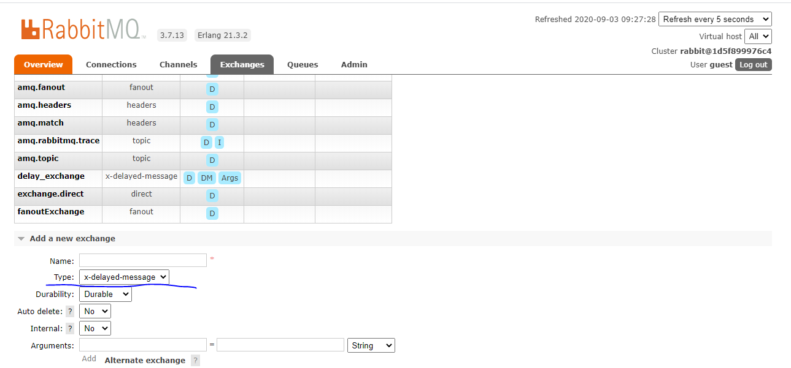

# springboot简易实现延迟队列

>写在前面：当我们需要一个延迟场景，消息在指定的时间被消费，例如：1.下单但未付款，超过30分钟自动取消订单，及时释放库存 2.当商品收到后超过14天，自动确认收货 等等
这里推荐一个解决方法：rabbitmq的延迟插件。

# 一、拉取rabbitmq镜像
在centos窗口中，执行如下命令：
```bash
docker pull rabbitmq:3.7-management
```
# 二、创建映射数据卷目录，启动rabbitmq容器
在centos窗口中，执行如下命令创建文件夹：
```
docker run -d  --name rabbitmq-single  -v /home/software/rabbitmq/:/var/lib/rabbitmq -p 15672:15672 -p 5672:5672 rabbitmq:3.7-management
```

启动容器成功后，读者可以访问 http://192.168.9.219:15672/#/ 
查看是否正常启动成功。账号/密码：guest / guest。
读者登陆后，查看overview Tab页，可看到节点信息

# 三、安装延迟插件
插件地址：https://github.com/rabbitmq/rabbitmq-delayed-message-exchange/releases/tag/v3.8.0
注：请注意自己的rabbitmq版本，本人用的rabbitmq的3.7


上传至服务器：本人位置 /home/software/rabbitmq-plugins

```
docker cp /home/soft/rabbitmq_delayed_message_exchange-3.8.0.ez rabbitmq-single:/plugins

#进入容器

docker exec -it rabbitmq-single /bin/bash

#启用插件

rabbitmq-plugins enable rabbitmq_delayed_message_exchange

#查看

rabbitmq-plugins list

#重新启动容器

docker restart rabbitmq-single
```

在控制台中出现了x-delayed-message则说明启动成功了



# 四、springboot集成rabbitmq实现延迟
1.引入web和qmqp的依赖
```
      <dependency>
            <groupId>org.springframework.boot</groupId>
            <artifactId>spring-boot-starter-amqp</artifactId>
        </dependency>
        <dependency>
            <groupId>org.springframework.boot</groupId>
            <artifactId>spring-boot-starter-web</artifactId>
        </dependency>
```

2.创建application.yml,配置rabbitmq环境
```
spring:
  rabbitmq:
    host: 192.168.9.219
    port: 5672
    username: guest
    password: guest

```

3.编写rabbitmq队列配置，RabbitmqDelayConfig.java
```
import org.springframework.amqp.core.Binding;
import org.springframework.amqp.core.BindingBuilder;
import org.springframework.amqp.core.CustomExchange;
import org.springframework.amqp.core.Queue;
import org.springframework.context.annotation.Bean;
import org.springframework.context.annotation.Configuration;

import java.util.HashMap;
import java.util.Map;

@Configuration
public class RabbitmqDelayConfig {
    /**
     * 队列名称
     */
    public  final static String QUEUE_NAME = "delayed.test.queue";
    /**
     * 交换机名称
     */
    public  final static String EXCHANGE_NAME = "delayed.test.exchange";

    /**
     * 创建队列
     * @return
     */
    @Bean
    public Queue queue() {
        return new Queue(QUEUE_NAME);
    }

    /**
     * 配置默认的交换机
     */
    @Bean
    CustomExchange customExchange() {
        Map<String, Object> args = new HashMap<>();
        args.put("x-delayed-type", "direct");
        //参数二为类型：必须是x-delayed-message
        return new CustomExchange(EXCHANGE_NAME, "x-delayed-message", true, false, args);
    }

    /**
     * 绑定队列到交换器
     */
    @Bean
    Binding binding(Queue queue, CustomExchange exchange) {
        return BindingBuilder.bind(queue).to(exchange).with(QUEUE_NAME).noargs();
    }
}

```

4.编写消息的消费者 DelayedTestQueueConsumer.java
```
import com.example.rabbitmqspringboot.config.RabbitmqDelayConfig;
import org.springframework.amqp.rabbit.annotation.RabbitHandler;
import org.springframework.amqp.rabbit.annotation.RabbitListener;
import org.springframework.stereotype.Component;

/**
 * 消费者
 */
@Component
@RabbitListener(queues = RabbitmqDelayConfig.QUEUE_NAME)
public class DelayedTestQueueConsumer {
    /**
     * 消息消费
     *
     * @RabbitHandler 代表此方法为接受到消息后的处理方法
     */
    @RabbitHandler
    public void received(String msg) {
        System.out.println("[" + RabbitmqDelayConfig.QUEUE_NAME + "] received message: " + msg);
    }
}

```

5.编写消息的生产者 SenderController.java
```
import com.example.rabbitmqspringboot.config.RabbitmqDelayConfig;
import org.springframework.amqp.core.AmqpTemplate;
import org.springframework.beans.factory.annotation.Autowired;
import org.springframework.web.bind.annotation.RequestMapping;
import org.springframework.web.bind.annotation.RestController;

import java.text.SimpleDateFormat;
import java.util.Date;

/**
 * 发送消息至rabbitmq
 */
@RestController
public class SenderController {

    @Autowired
    private AmqpTemplate rabbitTemplate;
    /**
     * 延迟的秒数
     */
    private int delaySeconds = 5;

    /**
     * 发送消息
     */
    @RequestMapping("send")
    public void sendMsgQueue() {
        Date date = new Date();
        String dateString = new SimpleDateFormat("yyyy-MM-dd HH:mm:ss").format(date);
        System.out.println("[" + RabbitmqDelayConfig.QUEUE_NAME + "] send msg: " + dateString);
        rabbitTemplate.convertAndSend(RabbitmqDelayConfig.EXCHANGE_NAME, RabbitmqDelayConfig.QUEUE_NAME, dateString, message -> {
            message.getMessageProperties().setHeader("x-delay", delaySeconds * 1000);
            return message;
        });
    }
}

```

启动项目后，访问http://localhost:8080/send ，然后等待5秒后控制台，打印出received msg的日志即正确