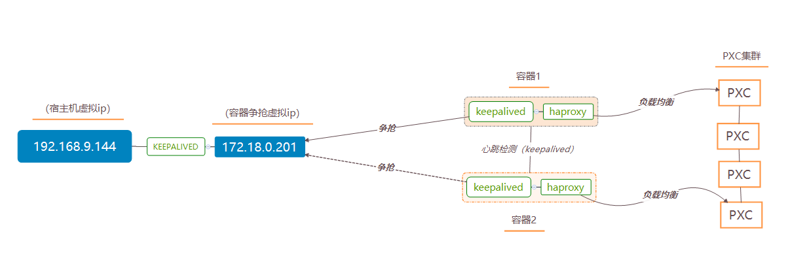
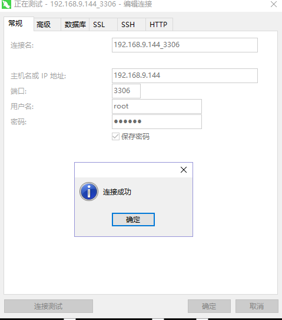
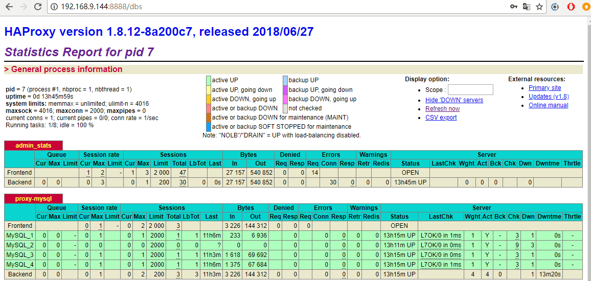

# docker简易实现数据库的双机热备
写在前面：为什么要采用双机热备？虽然我们在数据库进行了负载均衡，但单节点Haproxy不具备高可用，一旦Haroxy节点故障，应用程序将无法访问，故必须要有冗余设计，使用keepalived进行双机热备。注：在阅读此文之前，最好请先阅读《docker简易搭建MySQL集群的负载均衡》[https://blog.csdn.net/belonghuang157405/article/details/80883342](https://blog.csdn.net/belonghuang157405/article/details/80883342)

最终想实现的架构效果图：


## 第一步 Haproxy容器安装Keepalived
Keepalived必须要在Haproxy所在的容器之内。故首先进入Haproxy容器内，执行如下命令：
```bash
docker exec -it haproxy1 bash
```
在进入haproxy1容器后，执行如下命令，安装keepalived：
```bash
apt-get update
apt-get install keepalived
```
*注：由于Haproxy镜像是基于Ubuntu创建出来的，故使用apt-get 而不是yum。
如果读者在运行apt-get更新较慢，或者发现安装keepalived出现‘Unable to locate package’错误，是由于更新的数据在国外，可百度apt-get加速方式，也可参考附录提供的方式。*

## 第二步 编写Keepalived配置文件
Keepalived的配置文件位置：  /etc/keepalived/keepalived.conf
```bash
apt-get install vim
vim /etc/keepalived/keepalived.conf

```
将如下文件内容，复制进文件中：
```xml
vrrp_instance  VI_1 {
    state  MASTER
    interface  eth0
    virtual_router_id  51
    priority  100
    advert_int  1
    authentication {
        auth_type  PASS
        auth_pass  123456
    }
    virtual_ipaddress {
        172.18.0.201
    }
}

```
*注：VI_1 | 名称
    state  MASTER         | keepalived的身份（MASTERZ主服务器，抢占虚拟机ip。BACKUP备份服务器，不会抢占虚拟机ip）。
    interface  eth0       | 网卡设备 
    virtual_router_id  51 | 虚拟路由标识，MASTER和BACKUP的虚拟路由标识必须一致。标识可以是0-255
    priority  100         | 权重。MASTER权重要高于BACKUP 数字越大优选级越高
    advert_int  1         | 心跳检测。MASTER与BACKUP节点间同步检查的时间间隔，单位为秒。主备之间必须一致
    authentication        | 主从服务器验证方式。主备必须使用相同的密码才能正常通信
    virtual_ipaddress     | 虚拟ip地址，可以设置多个虚拟ip地址，每行一个*

## 第三步 启动keepalived
在keepalived容器中，执行如下命令：
```bash
service keepalived start
```
## 第四步 验证是否成功启动keepalived
在宿主机中，ping keepalived设置的虚拟ip（virtual_ipaddress ），执行如下命令：
```bash
ping 172.18.0.201
```
检查是否能ping通。结果如下：
```xml
[root@localhost ~]# ping 172.18.0.201
PING 172.18.0.201 (172.18.0.201) 56(84) bytes of data.
64 bytes from 172.18.0.201: icmp_seq=1 ttl=64 time=0.110 ms
64 bytes from 172.18.0.201: icmp_seq=2 ttl=64 time=0.140 ms
64 bytes from 172.18.0.201: icmp_seq=3 ttl=64 time=0.080 ms


```


## 第五步 创建haproxy2容器,并配置与haproxy1相同的环境
创建与haproxy1一样环境的haproxy2容器，安装keepalived实现争抢虚拟ip，实现双机热备。 执行如下命令：
###1.创建第2个Haproxy负载均衡服务器haproxy2
```bash
   docker run -it -d -p 4003:8888 -p 4004:3306 -v /home/soft/haproxy:/usr/local/etc/haproxy --name haproxy2 --privileged --net=net1 haproxy
```
###2.进入haproxy2容器中，并启动Haproxy 
```bash
   docker exec -it harpoxy2 bash
   haproxy -f /usr/local/etc/haproxy/haproxy.cfg
```

### 3.在haproxy2容器中，安装keepalived并编写该配置文件
```bash
    #更新软件包
    apt-get update
    #安装VIM
    apt-get install vim
    #安装Keepalived
    apt-get install keepalived
    #编辑Keepalived配置文件
    vim /etc/keepalived/keepalived.conf
   ```

 配置文件内容如下：
 ```xml
    vrrp_instance  VI_1 {
        state  MASTER
        interface  eth0
        virtual_router_id  51
        priority  100
        advert_int  1
        authentication {
            auth_type  PASS
            auth_pass  123456
        }
        virtual_ipaddress {
            172.18.0.201
        }
    }
    ```
###4.启动keepalived，并测试验证
```bash
    #启动Keepalived
    service keepalived start
    #宿主机停止haproxy1容器
    docker pause haproxy1
    #宿主机执行ping命令
    ping 172.18.0.201
    #宿主机恢复haproxy1容器
    docker unpause haproxy1
```

## 第六步 在宿主机上安装keepalived，实现双机热备
在宿主机安装keepalived，并配置该配置文件。执行如下四步操作：
###1.在centos窗口执行如下命令,安装keepalived：
```bash
 yum -y install keepalived
```
###2.编写keepalived.conf配置文件，执行如下命令：
```bash
 vi /etc/keepalived/keepalived.conf
```
删除原先内容，将内容如下粘贴进去：
```xml
  vrrp_instance VI_1 {
        state MASTER
        interface eth0
        virtual_router_id 51
        priority 100
        advert_int 1
        authentication {
            auth_type PASS
            auth_pass 1111
        }
        virtual_ipaddress {
           	192.168.9.144
        }
    }

    virtual_server 192.168.9.144 8888 {
        delay_loop 3
        lb_algo rr
        lb_kind NAT
        persistence_timeout 50
        protocol TCP

        real_server 172.18.0.201 8888 {
            weight 1
        }
    }

    virtual_server 192.168.9.144 3306 {
        delay_loop 3
        lb_algo rr
        lb_kind NAT
        persistence_timeout 50
        protocol TCP

        real_server 172.18.0.201 3306 {
            weight 1
        }
    }
```
*注：内容中192.168.9.144 该ip是宿主虚拟ip，读者可自定义请自行更改。 172.18.0.201 是容器keepalived设置争抢的虚拟ip，8888是监控界面端口 3306是数据库端口*
###3.启动keepalived，执行如下命令：
```bash
 service keepalived start
```
###4.验证keepalived是否成功。
1.数据库验证

2.haproxy监控界面验证

*注：宿主机定义的虚拟ip为192.168.9.144，读者自行更改*


###附录：
**1.Ubuntu将apt-get修改成163镜像的源**

第一步 修改sources.list配置文件

```bash
vim /etc/apt/sources.list
```
注：如果没有vim，请预先安装vim，执行如下命令：
```bash
apt-get install vim
```
删除sources.list文件内容，将下方内容粘贴进去，sources.list内容如下：
```xml
deb http://mirrors.163.com/ubuntu/ precise main universe restricted multiverse 
deb-src http://mirrors.163.com/ubuntu/ precise main universe restricted multiverse 
deb http://mirrors.163.com/ubuntu/ precise-security universe main multiverse restricted 
deb-src http://mirrors.163.com/ubuntu/ precise-security universe main multiverse restricted 
deb http://mirrors.163.com/ubuntu/ precise-updates universe main multiverse restricted 
deb http://mirrors.163.com/ubuntu/ precise-proposed universe main multiverse restricted 
deb-src http://mirrors.163.com/ubuntu/ precise-proposed universe main multiverse restricted 
deb http://mirrors.163.com/ubuntu/ precise-backports universe main multiverse restricted 
deb-src http://mirrors.163.com/ubuntu/ precise-backports universe main multiverse restricted 
deb-src http://mirrors.163.com/ubuntu/ precise-updates universe main multiverse restricted
```
粘贴完后，保存退出。
第二步 apt清除原先的配置并更新，执行如下命令：
```bash
apt-get clean
apt-get update
```

**2.当Ubuntu容器apt-get update执行后 报错如下错误：**
```bash
0% [Connecting to deb.debian.org] [Connecting to security.debian.org]
0% [Connecting to deb.debian.org] [Connecting to security.debian.org]
Err:1 http://security.debian.org/debian-security stretch/updates InRelease
  Temporary failure resolving 'security.debian.org'
Err:2 http://deb.debian.org/debian stretch InRelease                 
  Temporary failure resolving 'deb.debian.org'
Err:3 http://deb.debian.org/debian stretch-updates InRelease
  Temporary failure resolving 'deb.debian.org'
Reading package lists... Done    
W: Failed to fetch http://deb.debian.org/debian/dists/stretch/InRelease  Temporary failure resolving 'deb.debian.org'
W: Failed to fetch http://security.debian.org/debian-security/dists/stretch/updates/InRelease  Temporary failure resolving 'security.debian.org'
W: Failed to fetch http://deb.debian.org/debian/dists/stretch-updates/InRelease  Temporary failure resolving 'deb.debian.org'
W: Some index files failed to download. They have been ignored, or old ones used instead.
```
请查看自己的docker是否加入了镜像加速。方法如下：
在宿主机 修改docker的damemon.json文件，如果不存在请新建，将如下内容粘贴保存：
```bash
{
   "registry-mirrors": ["https://vcmrfdsm.mirror.aliyuncs.com"]
}

```
保存成功后，请重启docker服务(在执行此命令前，请先保存好数据库数据)，执行如下命令：
```bash
service docker restart
```
如果意外重启了，发现node1，node2，node3，node4容器节点节无法重启启动，请将先删除这四个容器，并删除v1，v2，v3，v4四个docker卷。而后参考《docker简易搭建MySQL集群》重新创建这四个节点容器。
