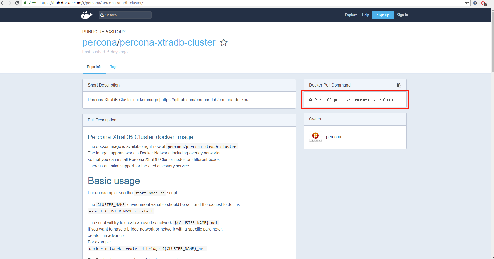
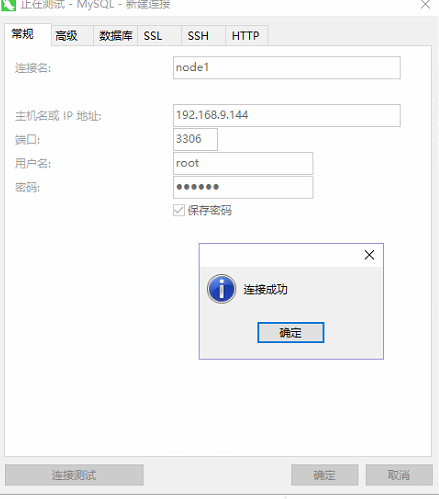

# docker简易搭建MySQL集群

----------

 写在前面：MySQL集群方式众多，针对不同业务场景采用不同集群方式。本文假设自己的数据较为重要，采用同步复制的方式，强一致性，故采用了MySQL高可用架构Percona XtraDB Cluster。如果读者业务数据属于弱一致性，只想简单高效的读写分离，可以采用异步复制的Replication。注：PXC是基于Galera，它的主从复制仅仅支持InnoDB存储引擎。 文中将用PXC来简称Percona XtraDB Cluster。 

## 第一步 安装PXC集群
在centos窗口中 执行如下命令：
```bash
docker pull percona/percona-xtradb-cluster
```
运行命令上方后，可执行如下命令查看是否安装成功：
```bash
docker images
```

结果如下图所示：


说明：
Docker PXC集群镜像官方地址：[https://hub.docker.com/r/percona/percona-xtradb-cluster/](https://hub.docker.com/r/percona/percona-xtradb-cluster/ "PXC镜像官方地址")   ，如下图所示：


在图中也红框框出Docker PXC安装命令，官方地址也写了基本使用教程。

## 第二步 重命名镜像（可跳过，用原先的镜像名称即可）

在centos窗口中 执行如下命令：
```bash
docker tag percona/percona-xtradb-cluster pxc
```
执行后，可执行如下命令查看镜像列表是否多了一个pxc的镜像：
```bash
docker images
```
然后 再将原先的镜像（percona/percona-xtradb-cluster）删除，保留一份pxc即可。执行如下命令
```bash
docker rmi percona/percona-xtradb-cluster
```

## 第三步 创建内部网络

说明：出于安全考虑，将PXC集群放置于docker内部网络中。只需将宿主的端口与之映射并开放出来即可。

在centos窗口中，执行如下命令：
```bash
docker network create --subnet=172.18.0.0/24 net1
```
执行成功后，执行如下命令 查看net1详细信息：

```bash
docker inspect net1
```
出现类似如下信息：
```bash
[
    {
        "Name": "net1",
        "Id": "4d32c3667ac88e11355bfb3071e8951b64a914bf3eac57ab57709d70d7532022",
        "Created": "2018-06-25T20:27:08.715620025+08:00",
        "Scope": "local",
        "Driver": "bridge",
        "EnableIPv6": false,
        "IPAM": {
            "Driver": "default",
            "Options": {},
            "Config": [
                {
                    "Subnet": "172.18.0.0/24"
                }
            ]
        },
        "Internal": false,
        "Attachable": false,
        "Ingress": false,
        "ConfigFrom": {
            "Network": ""
        },
        "ConfigOnly": false,
        "Containers": {},
        "Options": {},
        "Labels": {}
    }
]

```


说明：--subnet=172.18.0.0/24 自定义网段172.18.0.0，24是指24位子网掩码 net1 网段名称。
当然读者 也可以执行如下命令：
```bash
docker network create  net1
```
使用默认的网关，该网关是从172.17.0.X开始的,创建net2时 172.18.0.X，以此类推。
 

## 第四步 创建docker卷

 docker容器的运行规则：通过目录映射的方法，将业务数据写入到宿主机中。好处是如果容器故障，只需将容器删除，重新启用一个容器即可，这样就不会丢失原来的数据。
由于PXC较为特殊，无法直接使用映射目录的方法做映射（使用后会闪退），故使用docker卷。

在centos窗口中，执行如下命令：
```bash 
docker volume create --name v1
```
执行成功后，想查看映射的地址，可通过如下命令进行查看：
```bash
docker inspect v1
```
执行接口如下：
```bash
[
    {
        "CreatedAt": "2018-06-25T20:50:06+08:00",
        "Driver": "local",
        "Labels": {},
        "Mountpoint": "/var/lib/docker/volumes/v1/_data",
        "Name": "v1",
        "Options": {},
        "Scope": "local"
    }
]
```
可以看到Mountpoint字段 就是映射在宿主机的路径。

用于后续会在不同容器中一使用不同的docker卷，故再这预先执行以下命令：
```bash
docker volume create --name v2
docker volume create --name v3
docker volume create --name v4
```

## 第五步 创建PXC容器
在centos窗口中，执行如下命令：
```bash
docker run -d -p 3306:3306 -v v1:/var/lib/mysql -e MYSQL_ROOT_PASSWORD=123456 -e CLUSTER_NAME=PXC -e XTRABACKUP_PASSWORD=123456 --privileged --name=node1 --net=net1 --ip 172.18.0.2 pxc
```
说明：
<pre>
-d  默认在后台运行
-p  3306（宿主）:3306（容器）   端口映射，将容器3306端口映射到宿主3306坤口
-v  目录映射，将第四步创建的v1映射到容器/var/lib/mysql
-e MYSQL_ROOT_PASSROWD  创建的用户实例的密码，默认实例root
-e CLUSTER_NAME  集群名称
-e XTRABACKUP_PASSWORD  数据库之间同步使用的密码
--privileged  权限.给予最高权限
--name 给容器容命名
--net 使用内部网段
--ip 内部网段分到的地址
pxc 指的是镜像
</pre>
**特别说明一点**：在创建第一个容器时 初始化数据库需要一点时间（两分钟左右），不可过快执行创建下方容器命令。是由于第一个mysql还未初始化启动完成，无法找到对应节点造成闪退。
读者可以通过数据库连接工具连接，进行验证是否启动完成。在本文中使用Navicat for mysql工具。创建mysql连接，将宿主的ip（ip可在centos窗口输入ifconfig即可查看ip）、用户root、密码（指的是MYSQL_ROOT_PASSROWD：123456） 配置好点击“测试连接”，连接成功后 点击确定即可。如下图：



接下来创建其他容器

```bash
docker run -d -p 3307:3306 -v v2:/var/lib/mysql -e MYSQL_ROOT_PASSWORD=123456 -e CLUSTER_NAME=PXC -e XTRABACKUP_PASSWORD=123456 -e CLUSTER_JOIN=node1 --privileged --name=node2 --net=net1 --ip 172.18.0.3 pxc
```
```bash
docker run -d -p 3308:3306 -v v3:/var/lib/mysql -e MYSQL_ROOT_PASSWORD=123456 -e CLUSTER_NAME=PXC -e XTRABACKUP_PASSWORD=123456 -e CLUSTER_JOIN=node1 --privileged --name=node3 --net=net1 --ip 172.18.0.4 pxc
```
```bash
docker run -d -p 3309:3306 -v v4:/var/lib/mysql -e MYSQL_ROOT_PASSROWD=123456 -e CLUSTER_NAME=PXC -e XTRABACKUP_PASSWORD=123456 -e CLUSTER_JOIN=node1 --privileged --name=node4 --net=net1 --ip 172.18.0.5 pxc
```

在创建好以上容器后，用数据库连接工具对数据库连接配置以此类推配置（3306分别改为3307、3308、3309）。

## 第六步 验证是否创建成功PCX集群

用Navicat for mysql连接到之前四个节点的数据库，在四个节点数据库中 在任意一个数据库进行建库、建表、增删改查数据等操作后，再查看其它节点进行查看，或者在其它不同的节点进行操作看是否数据能成功进行同步。

###附录：
 
docker 查看具体详情
```bash 
docker inspect sth.
```
docker 创建网关net1
```bash 
docker network create  net1
```
docker 删除网关net1
```bash 
docker network rm  net1
```
docker 创建docker卷v1
```bash 
docker volume create --name v1
```
docker 删除docker卷v1
```bash 
docker volume rm v1
```
<table width="100%">
<tr><th></th><th>存储数据价值</th><th>一致性</th><th>速度</th><th>应用场景</th></tr>
<tr><td>PXC</td><td>高</td><td>强</td><td>慢</td><td>交易、金额、订单 、财务</td></tr>
<tr><td>Replication</td><td>低</td><td>弱</td><td>快</td><td>权限、通知、日志、新闻、帖子</td></tr>
</table>

注：PXC 集群越多 速度越慢，并取决最慢的从服务器的执行时间。故推荐在小规模使用PXC。或许有读者在想那就PXC与Replication组合使用，但怎么实现呢？可以采用Mycat、JDBC-sharding或者altas切分数据管理集群。在后续的博文中，再实践这些方式。
