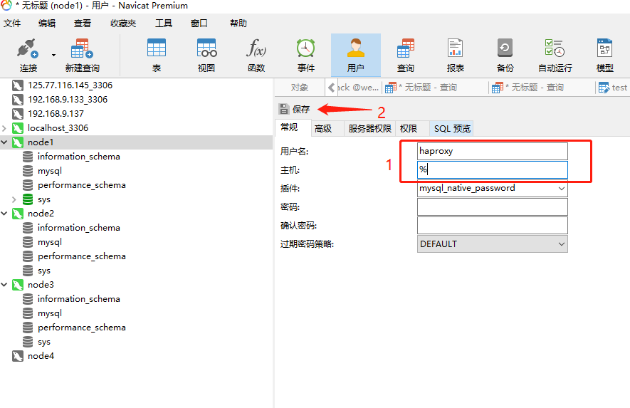
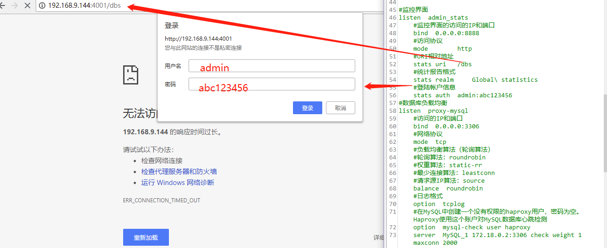
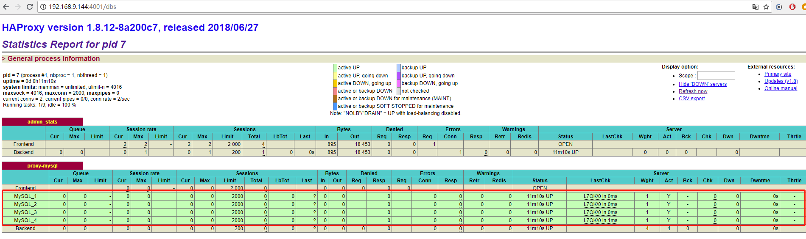
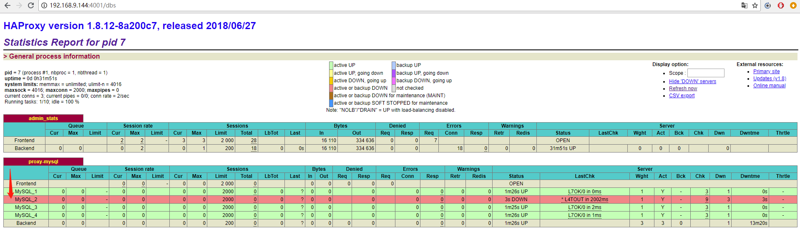
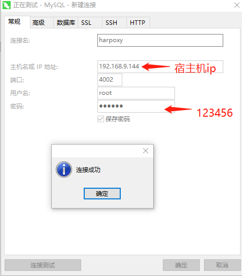

# docker简易搭建MySQL集群的负载均衡

----------
写在前面：为什么要搭建MySQL集群的负载均衡呢？在拥有集群的情况，如果始终都是对集群中的某个节点服务器进行数据库请求，仍然是会造成负载高，性能差。故使用harpoxy中间件进行负载均衡。 *注：在阅读此文之前，最好请先阅读《docker简易搭建MySQL集群》*[https://blog.csdn.net/belonghuang157405/article/details/80774506](https://blog.csdn.net/belonghuang157405/article/details/80774506 "docker简易搭建MySQL集群")。

## 第一步 安装Haproxy：
在centos窗口中 执行如下命令,拉取haproxy镜像：
```bash
docker pull haproxy
```

## 第二步 创建Haproxy配置文件
由于拉取下来的haproxy镜像中并不包含haproxy配置文件。故首先在宿主机上centos窗口中 执行如下两条命令创建haproxy配置文件：
```bash
mkdir /home/soft/haproxy
vi /home/soft/haproxy/haproxy.cfg
```
*注：读者并非一定要指定在/home/soft/haproxy目录下，可自行选择，该目录将用于映射与docker容器中使用。*

按 **i** 键，进入编辑模式，并将下方haproxy配置内容复制到haproxy.cfg中，读者可根据自身的环境进行修改，内容如下：
```xml
global
	#工作目录
	chroot /usr/local/etc/haproxy
	#日志文件，使用rsyslog服务中local5日志设备（/var/log/local5），等级info
	log 127.0.0.1 local5 info
	#守护进程运行
	daemon

defaults
	log	global
	mode	http
	#日志格式
	option	httplog
	#日志中不记录负载均衡的心跳检测记录
	option	dontlognull
    #连接超时（毫秒）
	timeout connect 5000
    #客户端超时（毫秒）
	timeout client  50000
	#服务器超时（毫秒）
    timeout server  50000

#监控界面	
listen  admin_stats
	#监控界面的访问的IP和端口
	bind  0.0.0.0:8888
	#访问协议
    mode        http
	#URI相对地址
    stats uri   /dbs
	#统计报告格式
    stats realm     Global\ statistics
	#登陆帐户信息
    stats auth  admin:abc123456
#数据库负载均衡
listen  proxy-mysql
	#访问的IP和端口
	bind  0.0.0.0:3306  
    #网络协议
	mode  tcp
	#负载均衡算法（轮询算法）
	#轮询算法：roundrobin
	#权重算法：static-rr
	#最少连接算法：leastconn
	#请求源IP算法：source 
    balance  roundrobin
	#日志格式
    option  tcplog
	#在MySQL中创建一个没有权限的haproxy用户，密码为空。Haproxy使用这个账户对MySQL数据库心跳检测
    option  mysql-check user haproxy
    server  MySQL_1 172.18.0.2:3306 check weight 1 maxconn 2000  
    server  MySQL_2 172.18.0.3:3306 check weight 1 maxconn 2000  
	server  MySQL_3 172.18.0.4:3306 check weight 1 maxconn 2000 
	server  MySQL_4 172.18.0.5:3306 check weight 1 maxconn 2000
	#使用keepalive检测死链
    option  tcpka  
```
*注：bind  0.0.0.0:3306 |  不限定访问ip。
   option  mysql-check user haproxy | 用于心跳的mysql用户，请在mysql集群数据库进行创建该用户haproxy，读者可自己配置该用户名。在此处我们按照约定俗成定为haproxy。 
server  MySQL_1 172.18.0.2:3306 check weight 1 maxconn 2000 | 172.18.0.2（容器的ip）:3306（容器的端口），check（心跳检测），weight 1（权重，只有当算法为static-rr才生效），maxconn 2000（最大连接数）*

粘贴内容后，按** Esc **键，并输入 ** :wq ** ,退出并保存文件。
在这还需用做一步的是在mysql窗口中，创建mysql用户,运行如下命令：
```sql
create user 'haproxy'@'%'  identified by '';
```
也可以用图形化工具创建该用户，如图所示：





## 第三步 创建Haproxy容器，并运行Haproxy中间件
在centos窗口中，执行如下命令：
```bash
docker run -it -d -p 4001:8888 -p 4002:3306 -v /home/soft/haproxy:/usr/local/etc/haproxy --name haproxy1 --privileged --net=net1 haproxy 
```
创建Haproxy容器完成后，执行如下命令启动Haproxy：
```bash
haproxy -f /usr/local/etc/haproxy/haproxy.cfg
```
## 第四步 访问Haproxy监控界面
在浏览器访问 http://宿主机ip:4001/dbs ， 输入haproxy.cfg中配置的账号密码。
如图所示：

)
登陆后，可以查看数据集群的运行情况，如图所示：



## 第五步 试验是否监控成功
挂起其中一个容器，进行测试，在宿主机centos窗口中输入如下命令：
```bash
docker stop node2
```
再次刷新haproxy刷新界面，即可查看到结果，发现对应node2的MySQL_2变红，如图所示：



验证完成后，在centos窗口中执行如下命令，重新启动node2：
```bash
docker start node2
```
再次刷新haproxy监控界面即可看到恢复正常。

## 第五步 使用Haproxy中间件连接数据库
利用MySQL图形界面建立haproxy数据库连接，如图所示：


*注：4002端口，就是第三步操作中 -p 4002:3306 命令，将docker容器的3306端口映射给宿主机的4002端口，读者可自行替换。*

接下来创建好haproxy数据连接，就可以在该haproxy数据库连接中进行数据库操作，haproxy会帮你将操作按照haproxy配置的策略分发到各个容器（node1，node2，node3，node4）的数据库中，从而实现负载均衡。


###附录：
 
docker 停止容器
```bash 
docker stop 容器名/容器id
```
docker 启动容器
```bash 
docker start 容器名/容器id
```
docker 暂停容器
```bash 
docker pause 容器名/容器id
```
docker 恢复容器
```bash 
docker unpause  容器名/容器id
```

 
以后台进程运行haproxy
```bash 
/usr/local/haproxy/sbin/haproxy -D -f  ${path}/haproxy.conf
```
正式运行前，或修改文件后，先检查配置文件语法是否正确，再运行。
```bash 
/usr/local/haproxy/sbin/haproxy  -c  -f  ${path}/haproxy.conf
```
类似于reload操作，修改配置文件后，不停止进程的情况下重新加载配置文件。
```bash 
/usr/local/haprpxy/sbin/haproxy -D -f /usr/local/haprpxy/conf/haproxy.cfg -sf `cat haproxy.pid`
```
重载，在旧的连接处理完成后再杀掉旧的进程
可将sf替换成st，启用新的线程，不等旧的线程数据处理而直接杀掉老的线程.


写在最后：为什么没有考虑到其他中间件来做负载均衡？由于本人的centos安装在vmware中，故排除了LVS，又由于本次博文使用到的TCP/IP协议故排除Apache，最后在Haproxy与Nginx中，由于Haproxy支持TCP/IP协议支持的时间较为长远，故最终选择了Haproxy。读者可根据自身的情况，自行选择合适的中间件。
请参考如下 负载均衡中间件对比表格：
<table width="100%" >
<tr> <td>比较项</td>  <td>Haproxy </td> <td>Nginx </td> <td>Apache </td> <td>LVS </td>  </tr>
<tr> <td>是否免费 </td>  <td>免费 </td> <td>免费 </td> <td>免费 </td> <td>免费 </td>   </tr>
<tr> <td>支持虚拟机 </td>  <td>支持 </td> <td>支持 </td> <td>支持 </td> <td>否 </td>   </tr>
<tr> <td>HTTP协议 </td>  <td>支持 </td> <td>支持 </td> <td>支持 </td> <td>支持 </td>  </tr>
<tr> <td>TCP/IP协议 </td>  <td>支持 </td> <td>刚刚支持 </td> <td>不支持 </td> <td>支持 </td>  </tr>
<tr> <td>支持插件 </td>  <td>不支持 </td> <td>支持 </td> <td>不支持 </td> <td>不支持 </td>  </tr>
<tr> <td>性能 </td>  <td>好 </td> <td>好 </td> <td>一般 </td> <td>最好 </td>  </tr>
</table>

