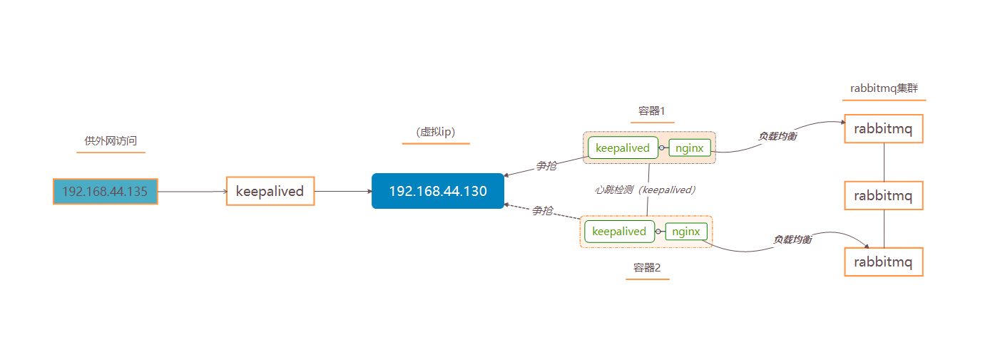
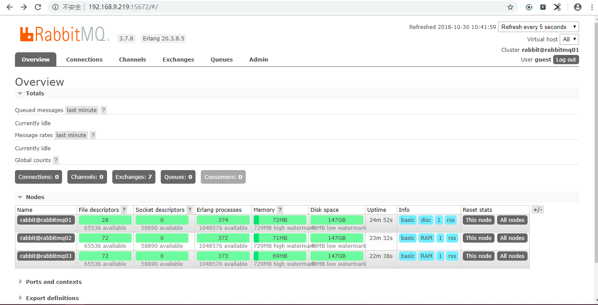

# docker简易搭建RabbitMQ集群

写在前面：第一种 普通集群模式：rabbitmq集群与其他集群有些不同，rabbitmq集群同步的指是复制队列，元数据信息的同步，即同步的是数据存储信息；消息的存放只会存储在创建该消息队列的那个节点上。并非在节点上都存储一个完整的数据。在通过非数据所在节点获取数据时，通过元数据信息，路由转发到存储数据节点上，从而得到数据 。第二种 镜像集群模式：与普通集群模式区别 主要是消息实体会主动在镜像节点间同步数据，而不是只存储数据元信息。 故普通集群模式 但凡数据节点挂了，容易造成数据丢失但镜像集群模式可以保证集群只要不全部挂掉，数据就不会丢失，当相对于性能来说，镜像集群模式会比普通集群模式多出消耗数据的传输。故取决于业务场景进行取舍。


# <font color=red>第一种</font>
## 一、拉取rabbitmq镜像
在centos窗口中，执行如下命令：
```bash
docker pull rabbitmq:3.7-management
```
## 二、创建映射数据卷目录，启动rabbitmq容器
在centos窗口中，执行如下命令创建文件夹：
```bash
mkdir rabbitmqcluster
cd rabbitmqcluster/
mkdir rabbitmq01 rabbitmq02 rabbitmq03
```

操作日志如下：
```bash
[root@localhost rabbitmqcluster]# pwd
/home/soft/
[root@localhost soft]# mkdir rabbitmqcluster
[root@localhost soft]# cd rabbitmqcluster/
[root@localhost rabbitmqcluster]# mkdir rabbitmq01 rabbitmq02 rabbitmq03

```
*注：请读者自行找寻创建数据映射目录。*
创建完成映射目录后，在centos窗口中，执行如下命令创建容器：
```bash
docker run -d --hostname rabbitmq01 --name rabbitmqCluster01 -v /home/soft/rabbitmqcluster/rabbitmq01:/var/lib/rabbitmq -p 15672:15672 -p 5672:5672 -e RABBITMQ_ERLANG_COOKIE='rabbitmqCookie' rabbitmq:3.7-management

docker run -d --hostname rabbitmq02 --name rabbitmqCluster02 -v /home/soft/rabbitmqcluster/rabbitmq02:/var/lib/rabbitmq -p 15673:15672 -p 5673:5672 -e RABBITMQ_ERLANG_COOKIE='rabbitmqCookie'  --link rabbitmqCluster01:rabbitmq01 rabbitmq:3.7-management

docker run -d --hostname rabbitmq03 --name rabbitmqCluster03 -v /home/soft/rabbitmqcluster/rabbitmq03:/var/lib/rabbitmq -p 15674:15672 -p 5674:5672 -e RABBITMQ_ERLANG_COOKIE='rabbitmqCookie'  --link rabbitmqCluster01:rabbitmq01 --link rabbitmqCluster02:rabbitmq02  rabbitmq:3.7-management
```
*注：  --hostname  设置容器的主机名  
   RABBITMQ_ERLANG_COOKIE 节点认证作用，部署集成时 需要同步该值*

启动容器成功后，读者可以访问
 http://192.168.9.219:15672/#/
http://192.168.9.219:15673/#/   
http://192.168.9.219:15674/#/ 
查看是否正常启动成功。账号/密码：**guest / guest**。
读者登陆后，查看**overview** Tab页，可看到节点信息。


## 三、容器节点加入集群
**首先**在centos窗口中，执行如下命令，进入第一个rabbitmq节点容器：
```bash
docker exec -it rabbitmqCluster01 bash
```
进入容器后，操作rabbitmq,执行如下命令：
```bash
rabbitmqctl stop_app
rabbitmqctl reset
rabbitmqctl start_app
exit
```

操作日志信息如下：
```bash
[root@localhost rabbitmq01]# docker exec -it rabbitmqCluster01 bash
root@rabbitmq01:/# rabbitmqctl stop_app
Stopping rabbit application on node rabbit@rabbitmq01 ...
root@rabbitmq01:/# rabbitmqctl reset
Resetting node rabbit@rabbitmq01 ...
root@rabbitmq01:/# rabbitmqctl start_app
Starting node rabbit@rabbitmq01 ...
 completed with 3 plugins.
root@rabbitmq01:/# exit
exit

```

**接下来**，进入第二个rabbitmq节点容器，执行如下命令：
```bash
docker exec -it rabbitmqCluster02 bash
rabbitmqctl stop_app
rabbitmqctl reset
rabbitmqctl join_cluster --ram rabbit@rabbitmq01
rabbitmqctl start_app
exit
```

操作日志信息如下：
```bash
[root@localhost rabbitmq01]# docker exec -it rabbitmqCluster02 bash
root@rabbitmq02:/# rabbitmqctl stop_app
Stopping rabbit application on node rabbit@rabbitmq02 ...
root@rabbitmq02:/# rabbitmqctl reset
Resetting node rabbit@rabbitmq02 ...
root@rabbitmq02:/# rabbitmqctl join_cluster --ram rabbit@rabbitmq01
Clustering node rabbit@rabbitmq02 with rabbit@rabbitmq01
root@rabbitmq02:/# rabbitmqctl start_app
Starting node rabbit@rabbitmq02 ...
 completed with 3 plugins.
root@rabbitmq02:/# exit
exit

```

**最后**，进入第三个rabbitmq节点容器，执行如下命令：
```bash
docker exec -it rabbitmqCluster03 bash
rabbitmqctl stop_app
rabbitmqctl reset
rabbitmqctl join_cluster --ram rabbit@rabbitmq01
rabbitmqctl start_app
exit
```
操作日志信息如下：

```bash
[root@localhost rabbitmq01]# docker exec -it rabbitmqCluster03 bash
root@rabbitmq03:/#  rabbitmqctl stop_app
Stopping rabbit application on node rabbit@rabbitmq03 ...
root@rabbitmq03:/# rabbitmqctl reset
Resetting node rabbit@rabbitmq03 ...
root@rabbitmq03:/# rabbitmqctl join_cluster --ram rabbit@rabbitmq01
Clustering node rabbit@rabbitmq03 with rabbit@rabbitmq01
root@rabbitmq03:/# rabbitmqctl start_app
Starting node rabbit@rabbitmq03 ...
 completed with 3 plugins.
root@rabbitmq03:/# exit
exit
```

执行上述操作，这时候 再查看 http://192.168.9.219:15672/#/  的**overview**面板中的**Nodes**信息，可查看到节点信息。


## 四、负载均衡设置
 有了集群之后 还要设置负载均,为了防止出现对单一节点造成高负载的情况。
本次测试用例 采用nginx中间件。读者可根据自身需要进行选择。
### 1.本机上存放着一个nginx配置文件：/home/soft/nginx/nginx_rabbitmq.conf
**nginx_rabbitmq.conf**
```xml

user  nginx;
worker_processes  1;

error_log  /var/log/nginx/error.log warn;
pid        /var/run/nginx.pid;


events {
    worker_connections  1024;
}


http {
    include       /etc/nginx/mime.types;
    default_type  application/octet-stream;

    log_format  main  '$remote_addr - $remote_user [$time_local] "$request" '
                      '$status $body_bytes_sent "$http_referer" '
                      '"$http_user_agent" "$http_x_forwarded_for"';

    access_log  /var/log/nginx/access.log  main;

    sendfile        on;
    #tcp_nopush     on;

    keepalive_timeout  65;

    #gzip  on;
	
	proxy_redirect          off;
	proxy_set_header        Host $host;
	proxy_set_header        X-Real-IP $remote_addr;
	proxy_set_header        X-Forwarded-For $proxy_add_x_forwarded_for;
	client_max_body_size    10m;
	client_body_buffer_size   128k;
	proxy_connect_timeout   5s;
	proxy_send_timeout      5s;
	proxy_read_timeout      5s;
	proxy_buffer_size        4k;
	proxy_buffers           4 32k;
	proxy_busy_buffers_size  64k;
	proxy_temp_file_write_size 64k;
	#rabbitmq管理界面
	upstream rabbitManage {
		server 192.168.9.219:15672;
		server 192.168.9.219:15673;
		server 192.168.9.219:15674;
	}
	server {
        listen       15675;
        server_name  192.168.9.219; 
        location / {  
            proxy_pass   http://rabbitManage;
            index  index.html index.htm;  
        }  

    }
}
# rabbitmq通信
stream{
	upstream rabbitTcp{
        server 192.168.9.219:5672;
        server 192.168.9.219:5673;
		server 192.168.9.219:5674;
    }

    server {
        listen 5675;
        proxy_pass rabbitTcp;
    }
}
 
```

*注：这里配置rabbitmq管理界面 以及通信反向代理*

#### 2.启动nginx容器
在centos窗口中，执行如下命令：
```bash
docker run -it -d --name nginxRabbitmq -v /home/soft/nginx/nginx_rabbitmq.conf:/etc/nginx/nginx.conf  --privileged --net=host nginx
```
接着读者可以通过 http://192.168.9.219:15675 进行管理 以及通过 **5675** 端口 进行rabbitmq通信。


# <font color=red>第二种</font>
跟第一种 普通集群模式相比，该模式加入镜像队列供，以及加入keepalived实现HA高可用进行容灾。
架构图如下：

## 一、拉取rabbitmq镜像
在centos窗口中，执行如下命令：
```bash
docker pull rabbitmq:3.7-management
```
## 二、创建映射数据卷目录，启动rabbitmq容器
在centos窗口中，执行如下命令创建文件夹：
```bash
mkdir rabbitmqcluster
cd rabbitmqcluster/
mkdir rabbitmq01 rabbitmq02 rabbitmq03
```

操作日志如下：
```bash
[root@localhost rabbitmqcluster]# pwd
/home/software/
[root@localhost soft]# mkdir rabbitmqcluster
[root@localhost soft]# cd rabbitmqcluster/
[root@localhost rabbitmqcluster]# mkdir rabbitmq01 rabbitmq02 rabbitmq03

```
*注：请读者自行找寻创建数据映射目录。*
创建完成映射目录后，在centos窗口中，执行如下命令创建容器：
```bash
docker run -d --hostname rabbitmq01 --name rabbitmqCluster01 -v /home/software/rabbitmqcluster/rabbitmq01:/var/lib/rabbitmq -p 15672:15672 -p 5672:5672 -e RABBITMQ_ERLANG_COOKIE='rabbitmqCookie' rabbitmq:3.7-management

docker run -d --hostname rabbitmq02 --name rabbitmqCluster02 -v /home/software/rabbitmqcluster/rabbitmq02:/var/lib/rabbitmq -p 15673:15672 -p 5673:5672 -e RABBITMQ_ERLANG_COOKIE='rabbitmqCookie'  --link rabbitmqCluster01:rabbitmq01 rabbitmq:3.7-management

docker run -d --hostname rabbitmq03 --name rabbitmqCluster03 -v /home/software/rabbitmqcluster/rabbitmq03:/var/lib/rabbitmq -p 15674:15672 -p 5674:5672 -e RABBITMQ_ERLANG_COOKIE='rabbitmqCookie'  --link rabbitmqCluster01:rabbitmq01 --link rabbitmqCluster02:rabbitmq02  rabbitmq:3.7-management
```
*注：  --hostname  设置容器的主机名  
   RABBITMQ_ERLANG_COOKIE 节点认证作用，部署集成时 需要同步该值*

启动容器成功后，读者可以访问
 http://192.168.44.129:15672/#/
http://192.168.44.129:15673/#/   
http://192.168.44.129:15674/#/ 
查看是否正常启动成功。账号/密码：**guest / guest**。
读者登陆后，查看**overview** Tab页，可看到节点信息。

## 三、容器节点加入集群
**首先**在centos窗口中，执行如下命令，进入第一个rabbitmq节点容器：
```bash
docker exec -it rabbitmqCluster01 bash
```
进入容器后，操作rabbitmq,执行如下命令：
```bash
rabbitmqctl stop_app
rabbitmqctl reset
rabbitmqctl start_app
exit
```

操作日志信息如下：
```bash
[root@localhost rabbitmq01]# docker exec -it rabbitmqCluster01 bash
root@rabbitmq01:/# rabbitmqctl stop_app
Stopping rabbit application on node rabbit@rabbitmq01 ...
root@rabbitmq01:/# rabbitmqctl reset
Resetting node rabbit@rabbitmq01 ...
root@rabbitmq01:/# rabbitmqctl start_app
Starting node rabbit@rabbitmq01 ...
 completed with 3 plugins.
root@rabbitmq01:/# exit
exit

```

**接下来**，进入第二个rabbitmq节点容器，执行如下命令：
```bash
docker exec -it rabbitmqCluster02 bash
rabbitmqctl stop_app
rabbitmqctl reset
rabbitmqctl join_cluster --ram rabbit@rabbitmq01
rabbitmqctl start_app
exit
```

操作日志信息如下：
```bash
[root@localhost rabbitmq01]# docker exec -it rabbitmqCluster02 bash
root@rabbitmq02:/# rabbitmqctl stop_app
Stopping rabbit application on node rabbit@rabbitmq02 ...
root@rabbitmq02:/# rabbitmqctl reset
Resetting node rabbit@rabbitmq02 ...
root@rabbitmq02:/# rabbitmqctl join_cluster --ram rabbit@rabbitmq01
Clustering node rabbit@rabbitmq02 with rabbit@rabbitmq01
root@rabbitmq02:/# rabbitmqctl start_app
Starting node rabbit@rabbitmq02 ...
 completed with 3 plugins.
root@rabbitmq02:/# exit
exit

```

**紧接着**，进入第三个rabbitmq节点容器，执行如下命令：
```bash
docker exec -it rabbitmqCluster03 bash
rabbitmqctl stop_app
rabbitmqctl reset
rabbitmqctl join_cluster --ram rabbit@rabbitmq01
rabbitmqctl start_app
exit
```
操作日志信息如下：

```bash
[root@localhost rabbitmq01]# docker exec -it rabbitmqCluster03 bash
root@rabbitmq03:/#  rabbitmqctl stop_app
Stopping rabbit application on node rabbit@rabbitmq03 ...
root@rabbitmq03:/# rabbitmqctl reset
Resetting node rabbit@rabbitmq03 ...
root@rabbitmq03:/# rabbitmqctl join_cluster --ram rabbit@rabbitmq01
Clustering node rabbit@rabbitmq03 with rabbit@rabbitmq01
root@rabbitmq03:/# rabbitmqctl start_app
Starting node rabbit@rabbitmq03 ...
 completed with 3 plugins.
root@rabbitmq03:/# exit
exit
```


**最后**，实现镜像模式集群
进入rabbitmqCluster01容器中，执行第二行命令
```bash
docker exec -it rabbitmqCluster01 bash
root@rabbitmq01:/#rabbitmqctl set_policy-p/ha-all"^"'{"ha-mode":"all"}'
```

>在cluster中任意节点启用策略，策略会自动同步到集群节点
1 rabbitmqctl set_policy-p/ha-all"^"'{"ha-mode":"all"}'
这行命令在vhost名称为hrsystem创建了一个策略，策略名称为ha-allqueue,策略模式为 all 即复制到所有节点，包含新增节点，策略正则表达式为 “^” 表示所有匹配所有队列名称。例如：
```
  rabbitmqctl set_policy-p/ha-all"^message"'{"ha-mode":"all"}'
```
注：“^message” 这个规则要根据自己修改，这个是指同步“message”开头的队列名称，我们配置时使用的应用于所有队列，所以表达式为“^”
 

执行上述操作，这时候 再查看 http://192.168.44.129:15672/#/  的**overview**面板中的**Nodes**信息，可查看到节点信息。


## 四、负载均衡设置
 有了集群之后 还要设置负载均,为了防止出现对单一节点造成高负载的情况。
本次测试用例 采用nginx中间件。读者可根据自身需要进行选择。
### 1.本机上存放着两个nginx配置文件：/home/software/nginx/nginx_rabbitmq_1.conf
**nginx_rabbitmq_1.conf**
```xml
user  nginx;
worker_processes  1;

error_log  /var/log/nginx/error.log warn;
pid        /var/run/nginx.pid;


events {
    worker_connections  1024;
}


http {
    include       /etc/nginx/mime.types;
    default_type  application/octet-stream;

    log_format  main  '$remote_addr - $remote_user [$time_local] "$request" '
                      '$status $body_bytes_sent "$http_referer" '
                      '"$http_user_agent" "$http_x_forwarded_for"';

    access_log  /var/log/nginx/access.log  main;

    sendfile        on;
    #tcp_nopush     on;

    keepalive_timeout  65;

    #gzip  on;
	
	proxy_redirect          off;
	proxy_set_header        Host $host;
	proxy_set_header        X-Real-IP $remote_addr;
	proxy_set_header        X-Forwarded-For $proxy_add_x_forwarded_for;
	client_max_body_size    10m;
	client_body_buffer_size   128k;
	proxy_connect_timeout   5s;
	proxy_send_timeout      5s;
	proxy_read_timeout      5s;
	proxy_buffer_size        4k;
	proxy_buffers           4 32k;
	proxy_busy_buffers_size  64k;
	proxy_temp_file_write_size 64k;
	#rabbitmq管理界面
	upstream rabbitManage {
		server 192.168.44.129:15672;
		server 192.168.44.129:15673;
		server 192.168.44.129:15674;
	}
	server {
        listen       15675;
        server_name   192.168.44.129; 
        location / {  
            proxy_pass   http://rabbitManage;
            index  index.html index.htm;  
        }  

    }
}
# rabbitmq通信
stream{
	upstream rabbitTcp{
        server 192.168.44.129:5672;
        server 192.168.44.129:5673;
		server 192.168.44.129:5674;
    }

    server {
        listen 5675;
        proxy_pass rabbitTcp;
    }
}
 
```


/home/software/nginx/nginx_rabbitmq_2.conf
**nginx_rabbitmq_2.conf**
```xml

user  nginx;
worker_processes  1;

error_log  /var/log/nginx/error.log warn;
pid        /var/run/nginx.pid;


events {
    worker_connections  1024;
}


http {
    include       /etc/nginx/mime.types;
    default_type  application/octet-stream;

    log_format  main  '$remote_addr - $remote_user [$time_local] "$request" '
                      '$status $body_bytes_sent "$http_referer" '
                      '"$http_user_agent" "$http_x_forwarded_for"';

    access_log  /var/log/nginx/access.log  main;

    sendfile        on;
    #tcp_nopush     on;

    keepalive_timeout  65;

    #gzip  on;
	
	proxy_redirect          off;
	proxy_set_header        Host $host;
	proxy_set_header        X-Real-IP $remote_addr;
	proxy_set_header        X-Forwarded-For $proxy_add_x_forwarded_for;
	client_max_body_size    10m;
	client_body_buffer_size   128k;
	proxy_connect_timeout   5s;
	proxy_send_timeout      5s;
	proxy_read_timeout      5s;
	proxy_buffer_size        4k;
	proxy_buffers           4 32k;
	proxy_busy_buffers_size  64k;
	proxy_temp_file_write_size 64k;
	#rabbitmq管理界面
	upstream rabbitManage {
		server 192.168.44.129:15672;
		server 192.168.44.129:15673;
		server 192.168.44.129:15674;
	}
	server {
        listen       15676;
        server_name   192.168.44.129; 
        location / {  
            proxy_pass   http://rabbitManage;
            index  index.html index.htm;  
        }  

    }
}
# rabbitmq通信
stream{
	upstream rabbitTcp{
        server 192.168.44.129:5672;
        server 192.168.44.129:5673;
		server 192.168.44.129:5674;
    }

    server {
        listen 5676;
        proxy_pass rabbitTcp;
    }
}
```
#### 2.启动两个nginx容器
在centos窗口中，执行如下命令：
```bash
docker run -it -d --name nginxRabbitmq1 -v /home/software/nginx/nginx_rabbitmq_1.conf:/etc/nginx/nginx.conf  --privileged --net=host nginx

docker run -it -d --name nginxRabbitmq2 -v /home/software/nginx/nginx_rabbitmq_2.conf:/etc/nginx/nginx.conf  --privileged --net=host nginx
```
这时候 可以通过访问http://192.168.44.129:15675 http://192.168.44.129:15676 进行测试。是否搭建成功。

*注：这里配置rabbitmq管理界面 以及通信反向代理*

## 五、安装keepalived 实现HA

#### 1.在两个nginx容器分别安装keepalived，并编写keepalived配置文件以及启动keepalived
1.1进入nginxRabbitmq1容器中，执行如下命令：
```bash
apt-get  -y update
apt-get -y  install vim
apt-get -y install keepalived
```
安装完成后，编写keekpalived.conf,
```bash
vim /etc/keepalived/keepalived.conf
```
内容如下：
```xml
vrrp_instance VI_1 {
    state MASTER
    interface eno16777736
    virtual_router_id 51
    priority 100
    advert_int 1
    authentication {
        auth_type PASS
        auth_pass 123456
    }
    virtual_ipaddress {
        192.168.44.130
    }
}
virtual_server 192.168.44.130 15678 {
    delay_loop 3
    lb_algo rr
    lb_kind NAT
    persistence_timeout 50
    protocol TCP
    real_server 192.168.44.129 15675 {
        weight 1
    }
}
virtual_server 192.168.44.130 5678 {
    delay_loop 3
    lb_algo rr
    lb_kind NAT
    persistence_timeout 50
    protocol TCP
    real_server 192.168.44.129 5675 {
        weight 1
    }
}
```
保存完配置，启动keepalived
```bash
service keepalived start
```

注：interface 表示绑定的网络接口,请用ip addr 查看本机的网卡进行替换 ，virtual_router_id  表示keepalived家族标识信息，全局唯一，节点间保持相同

1.2进入nginxRabbitmq2容器中，执行如下命令：
```bash
apt-get  -y update
apt-get -y  install vim
apt-get -y install keepalived
```
安装完成后，编写keekpalived.conf,
```bash
vim /etc/keepalived/keepalived.conf
```
内容如下：
```xml
vrrp_instance VI_1 {
    state MASTER
    interface eno16777736
    virtual_router_id 51
    priority 100
    advert_int 1
    authentication {
        auth_type PASS
        auth_pass 123456
    }
    virtual_ipaddress {
        192.168.44.130
    }
}
virtual_server 192.168.44.130 15678 {
    delay_loop 3
    lb_algo rr
    lb_kind NAT
    persistence_timeout 50
    protocol TCP
    real_server 192.168.9.144 15676 {
        weight 1
    }
}
virtual_server 192.168.44.130 5678 {
    delay_loop 3
    lb_algo rr
    lb_kind NAT
    persistence_timeout 50
    protocol TCP
    real_server 192.168.44.129 5676 {
        weight 1
    }
}
```
保存完配置，启动keepalived
```bash
service keepalived start
```


# 六、主机上安装keepaplived进行转发
在centos窗口中，执行如下命令：
```bash
yum -y install keepalived
```
安装完成后，编写配置文件keepalived.conf
```xml
vrrp_instance VI_1 {
    state MASTER
    interface eno16777736
    virtual_router_id 51
    priority 100
    advert_int 1
    authentication {
        auth_type PASS
        auth_pass 123456
    }
    virtual_ipaddress {
        192.168.44.135
    }
}
virtual_server 192.168.44.135 15678 {
    delay_loop 3
    lb_algo rr
    lb_kind NAT
    persistence_timeout 50
    protocol TCP
    real_server 192.168.44.130 15675 {
        weight 1
    }
    real_server 192.168.44.130 15676{
        weight 1
    }

}
virtual_server 192.168.44.135 5678 {
    delay_loop 3
    lb_algo rr
    lb_kind NAT
    persistence_timeout 50
    protocol TCP
    real_server 192.168.44.130 5675 {
        weight 1
    }
    real_server 192.168.44.130 5676 {
        weight 1
    } 

}

```
保存完配置后，启动keepalived
```bash
service keepalived start
```

接着读者可以通过 http://192.168.44.135:15678 进行管理 以及通过 **5678** 端口 进行rabbitmq通信。
可以测试停止nginxRabbitmq1或者nginxRabbitmq2进行测试，本文就不再赘述测试过程。


写在最后：感谢**鬼见愁**提出错误与宝贵意见。 本文为了测试将rabbitmq 以及 nginx容器端口暴露出来，读者可以创建内部网络（docker network create .....）进行规划达到安全性，


## 附录
启动rabbitmq
```bash
rabbitmqctl start_app
```
停止rabbitmq
```bash
rabbitmqctl stop_app
```
rabbitmq 查看所有队列信息
```bash
rabbitmqctl list_queues
```
还原 rabbitmq 清除所有队列
```bash
rabbitmqctl reset
```
rabbitmq 查看用户
```bash
rabbitmqctl list_users
```
rabbitmq添加用户
```bash
rabbitmqctl add_user root root
```
rabbitmq设置权限
```bash
rabbitmqctl set_permissions -p / root ".*" ".*" ".*"
```
rabbitmq查看集群状态信息
```bash
rabbitmqctl cluster_status
```
移除某个集群节点：一般情况当节点故障时，在正常的节点中，移除该故障节点
```bash
rabbitmqctl  -n rabbit@rabbitmq01 forget_cluster_node rabbit@rabbitmq03
```

如果遇到nginx 502问题请关闭防火墙。
```bash
systemctl stop firewalld.service
```
keepalived配置文件部分说明
```
vrrp_instance VI_1 {              --- vrrp协议相关配置（vip地址设置）

    state MASTER                  --- keepalived角色描述（状态）信息，可以配置参数（MASTER BACKUP）

    interface eth0                --- 表示将生成虚IP地址，设置在指定的网卡上(一般为外网卡)

    virtual_router_id 51          --- 表示keepalived家族标识信息

    priority 100                  --- keepalived服务竞选主备服务器优先级设置（越大越优先）

    advert_int 1                  --- 主服务组播包发送间隔时间       

    authentication {              --- 主备主机之间通讯认证机制，

        auth_type PASS            --- 采用明文认证机制

        auth_pass 123456            --- 编写明文密码（用于主备认证）

    }

    virtual_ipaddress {           --- 设置虚拟IP地址信息

       192.168.44.130

    }
   virtual_server 192.168.44.130 15678 {  --- 设置虚拟IP地址 端口转发
   
      delay_loop 3                    ---- service polling的delay时间，即服务轮询的时间间隔
    
      lb_algo rr                     --- LVS调度算法 
      
      lb_kind NAT                    --- LVS集群模式  
    
	  persistence_timeout 50          --- 会话保持时间（秒为单位），即以用户在120秒内被分配到同一个后端realserver
    
      protocol TCP                    --- 健康检查用的是TCP还是UDP
    
      real_server 192.168.9.144 15676 {
        
           weight 1                   --- 给每台的权重，0表示失效(不知给他转发请求知道他恢复正常)，默认是1
   
     }
  }

}
```

