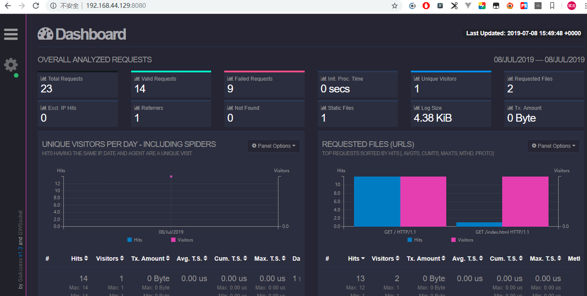

# docker简易搭建nginx日志分析工具

写在前面：GoAccess 被设计成快速的并基于终端的日志分析工具。其核心理念是不需要通过 Web 浏览器就能快速分析并实时查看 Web 服务器的统计数。
官网：https://goaccess.io
>特色功能速览
>- 完全实时
所有面板以及指标均按照指定时间间隔更新，在终端(Terminal)下是200ms，HTML则是每秒。
- 增长日志处理
需要持续保持数据？GoAccess 有能力处理在磁盘上以 B+Tree 数据库存储并且不断增长的日志。
- 访客画像
可以按照小时或者指定日期确定最慢请求的访问次数，访客数量，带宽以及其他相关度量值。
-  支持几乎所有 Web 日志格式
GoAccess 允许任意自定义日志格式。 可预定义的格式包括： Apache, Nginx, Amazon S3, Elastic Load Balancing, CloudFront, 等等
- 仅依赖一个模块
GoAccess 是用 C 语言编写的。 仅仅需要 ncurses 这一个模块即可运行。同时 GoAccess 甚至还拥有自己的兼容 RFC6455 协议的 Web Socket 服务器。
- 支持虚拟主机
拥有多个虚拟主机？在控制面板中能够显示出哪一个虚拟主机消耗 Web 服务器上最多的资源。
- 跟踪应用响应时间
跟踪处理请求的时间消耗。对于解决站点页面访问速度下降非常有用。
- 易于使用
您可以直接运行 GoAccess 去处理您的访问日志文件，仅需选取日志格式然后让 GoAccess 解析日志内容并将统计结果展示出来。
-  配色风格可定制化
GoAccess 的配色风格十分易于定制化。无论是通过终端，还是仅仅通过简单修改 HTML 页面的层叠样式表。


# 一、准备配置，运行nginx容器
1.准备目录，编写配置nginx.conf,goaccess.conf

目录准备：
  -  /home/software/nginx_log/test_log    存放nginx生成的日志文件
  -  /home/software/nginx_html/test_html  nginx的静态界面存放，以及goaccess生成分析html存放
  -  /home/software/nginx/nginx_test.conf nginx.conf配置文件
  - /home/software/goaccess/data          goaccess.conf存放


1.1 nginx_test.conf
```xml
user  nginx;
worker_processes  1;

error_log  /var/log/nginx/error.log warn;
pid        /var/run/nginx.pid;


events {
    worker_connections  1024;
}


http {
    include       /etc/nginx/mime.types;
    default_type  application/octet-stream;

    log_format  main  '$remote_addr - $remote_user [$time_local] "$request" '
                      '$status $body_bytes_sent "$http_referer" '
                      '"$http_user_agent" "$http_x_forwarded_for"';

    access_log  /var/log/nginx/access.log  main;

    sendfile        on;
    #tcp_nopush     on;

    keepalive_timeout  65;

    #gzip  on;
        
        proxy_redirect          off;
        proxy_set_header        Host $host;
        proxy_set_header        X-Real-IP $remote_addr;
        proxy_set_header        X-Forwarded-For $proxy_add_x_forwarded_for;
        client_max_body_size    10m;
        client_body_buffer_size   128k;
        proxy_connect_timeout   5s;
        proxy_send_timeout      5s;
        proxy_read_timeout      5s;
        proxy_buffer_size        4k;
        proxy_buffers           4 32k;
        proxy_busy_buffers_size  64k;
        proxy_temp_file_write_size 64k;
        
        server {
        listen       8080;
        server_name  192.168.44.129; 
        location / {  
            root /usr/share/nginx/html;
            index  index.html index.htm;  
        }  

    }
}

```


1.2.goaccess.conf
```xml
time-format %H:%M:%S

date-format %d/%b/%Y

log-format %h %^ %^ [%d:%t %^] "%r" %^ %s %b "%R" "%u" "%^" "%T"

```
*配置文件下载地址：https://raw.githubusercontent.com/allinurl/goaccess/master/config/goaccess.conf*

*注：nginx配置文件中 log_format 与 goaccess配置文件中的log-format当对应，查看附录*
2.启动nginx容器
在centos窗口中，执行如下命令：
```bash
docker run --name test-nginx  -v /home/software/nginx_log/test_log:/var/log/nginx/   -v /home/software/nginx_html/test_html:/usr/share/nginx/html -v /home/software/nginx/nginx_test.conf:/etc/nginx/nginx.conf   -itd  --privileged --net=host nginx
```
# 二、 运行goaccess容器
在centos窗口中，执行如下命令：
```bash
docker run  -dit -p 7890:7890  -v /home/software/goaccess/data:/srv/data  -v  /home/software/nginx_html/test_html:/srv/report   -v   /home/software/nginx_log/test_log:/srv/logs   --name=goaccess allinurl/goaccess goaccess --no-global-config --config-file=/srv/data/goaccess.conf --output=/srv/report/index.html --log-file=/srv/logs/access.log --real-time-html
```

这是通过访问 http://192.168.44.129:8080/ 即可看到，具体的界面介绍请看附录


不断的刷新，界面上的数据值也会进行实时变化。

### 附录：
goaccess的log-format与 nginx的log_format对应关系
```
    %T				$request_time   	(请求时间)
    %h				$remote_addr		(客户端地址)
    %d:%t %^		[$time_local]		(时间日期)
    %m 				$request_method		(请求方法)
    %U				$request_uri		(请求路径)
    %H				$server_protocol	(服务器请求协议)
    %s 				$status				(状态码)
    %b 				$body_bytes_sent	(字节数)
    "%R"			"$http_referer"		("referer" Http请求标头)
    %^				(当在统计信息里不需要这个参数时，可以使用忽略此参数)
```

goaccess的html面板解析
```
General Statistics：此面板提供了几个指标的摘要，其中一些包括：有效和无效请求的数量，分析数据集所花费的时间，唯一访问者，请求的文件，静态文件（CSS，ICO，JPG等）HTTP引用，404s，已解析日志文件的大小和带宽消耗。

Unique visitors：此面板显示点击次数，唯一身份访问者和每个日期的累积带宽等指标。包含相同IP，相同日期和相同用户代理的HTTP请求被视为唯一访问者。默认情况下，它包括网络爬虫/蜘蛛。 可以使用--date-spec = hr将日期特异性设置为小时级别，这将显示日期，例如05 / Jun / 2016：16。如果您想跟踪小时级别的每日流量，这非常棒。

Requested files：此面板显示Web服务器上请求最多的文件。它显示了匹配，唯一身份访问者和百分比，以及累积带宽，协议和使用的请求方法。

Requested static files：列出了最常用静态文件，如：JPG，CSS，SWF，JS，GIF，和PNG文件类型，使用相同的指标作为最后的面板一起。可以将其他静态文件添加到配置文件中。

404 or Not Found：显示与先前请求面板相同的指标，但是，其数据包含在服务器上找不到的所有页面，或通常称为404状态代码。

Hosts：此面板包含有关主机本身的详细信息。这非常适合发现×××性爬虫，并确定谁在吃你的带宽。 扩展面板可以显示更多信息，例如主机的反向DNS查找结果，原产国和城市。如果-a启用了参数，则可以通过选择所需的IP地址，然后按Enter来显示用户代理列表。

Operating Systems：此面板将报告主机在到达服务器时使用的操作系统。它试图提供每个操作系统的最具体版本。

Browsers：此面板将报告主机在访问服务器时使用的浏览器。它试图提供每个浏览器的最具体版本。

Visit Times：此面板将显示每小时报告。此选项显示24个数据点，每天一小时一个。 可选地，可以使用--hour-spec = min将小时特异性设置为十分之一水平，这将显示小时为16：4如果您想要发现服务器上的流量峰值，这很好。

Virtual Hosts：此面板将显示从访问日志中解析的所有不同虚拟主机。如果在日志格式字符串中使用％v，则会显示此面板。

Referrers URLs：如果相关主机通过其他资源访问了网站，或者是从其他主机链接/转移给您，则会在此面板中提供引用它们的网址。请参阅`--ignore-panel`配置文件以启用它。 （默认禁用）

Referring Sites：此面板仅显示主机部分，但不显示整个URL。请求来自的URL。

Keyphrases：它报告了用于Google搜索，Google缓存和Google翻译的关键字，这些关键字已导致您的网络服务器。目前，它仅通过HTTP支持Google搜索查询。请参阅`--ignore-panel`配置文件以启用它。 （默认禁用）

Geo Location：确定IP地址在地理位置的位置。统计数据按大陆和国家分列。它需要使用GeoLocation支持进行编译。

HTTP Status Codes：HTTP请求的数字状态代码的值。

Remote User (HTTP authentication)：这是HTTP身份验证确定的请求文档的人员的用户ID。如果文档没有密码保护，则此部分将为“ - ”，就像前一个部分一样。除非%e在log-format变量中给出，否则不会启用此面板。

```