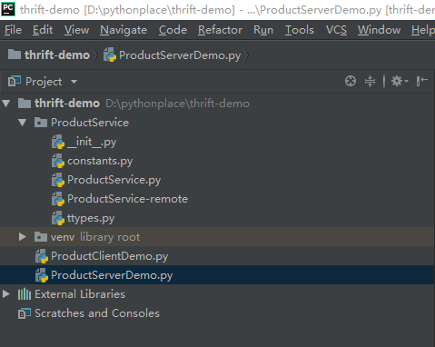

# docker简易搭建thrift
写在前面：thrift是一个软件框架，用来进行可扩展且跨语言的服务的开发。它结合了功能强大的软件堆栈和代码生成引擎，以构建在 C++, Java, Go,Python, PHP, Ruby, Erlang, Perl, Haskell, C#, Cocoa, JavaScript, Node.js, Smalltalk, and OCaml 这些编程语言间无缝结合的、高效的服务。如果对dubbo比较熟悉，也看做没有注册中心的rpc（远程过程调用）框架。
本文使用的环境：docker ，java 1.8 ，python 3.7
thrift官网：http://thrift.apache.org

thrift java版本源码：https://github.com/Blankwhiter/thrift-java-demo

thrift python版本源码：https://github.com/Blankwhiter/thrift-demo

# 第一步 thrift环境以及测试文件准备

1.在centos窗口中，执行如下命令，拉取thrift镜像：
```bash
docker pull thrift
```

2.创建并编写接口thrift文件 **ProductService.thrift**
在centos窗口中，/home/thrift/data目录下创建**ProductService.thrift**：
```thrift
namespace java com.thrift.demo.api
service ProductService{
	void printProductName() 
	string getProuctDesc(1:string name)
    bool isHaveStock()
}
```

# 第二步 编译thrift文件（将编写java版本以及python版本）

1.java版本：在centos窗口中，执行如下命令：
```bash
docker run  -v /home/thrift/data:/data thrift thrift -o /data --gen java /data/ProductService.thrift
```
执行成功后，会在 /home/thrift/data/gen-java目录下，生成具有（com.thrift.demo.api）包（文件夹）的**ProductService.java**
```bash
.
└── com
    └── thrift
        └── demo
            └── api
                └── ProductService.java

4 directories, 1 file

```

注：读者可以进入gen-java目录，使用 **tree**  命令查看，如果未安装，可使用命令 **yum install tree**  进行安装

2.python版本：在centos窗口中，执行如下命令：
```bash
docker run  -v /home/thrift/data:/data thrift thrift -o /data --gen py /data/ProductService.thrift
```
执行成功后会生成 /home/thrift/data/gen-py目录下，生成一系列python文件。目录结构如下:
```bash
.
├── __init__.py
└── ProductService
    ├── constants.py
    ├── __init__.py
    ├── ProductService.py
    ├── ProductService-remote
    └── ttypes.py

1 directory, 6 files

```

注：
   - -v   目录映射将主机/home/thrift/data 映射 docker容器 /data
   - ```thrift -o   <output path>  --gen <language> <Thrift filename> ```
   该命令将 'Thrift filename' 文件 使用thrift框架生成 'language' 语言的代码 放置于 'output path' 。

# 第三步  测试Java版本

项目目录结构示意图：


读者请自行创建目录结构，或者放置同个项目也行。
目录说明：
- api目录：thrift接口存放位置
- consumer目录：消费者目录，即调用远程接口类的存放位置
- provider目录：提供者目录，即编写接口实现的地方，给consumer提供具体实现类的存放地方

**一.api模块：api接口的复制**
1.引入依赖
**pom.xml**
```xml
<?xml version="1.0" encoding="UTF-8"?>
<project xmlns="http://maven.apache.org/POM/4.0.0"
         xmlns:xsi="http://www.w3.org/2001/XMLSchema-instance"
         xsi:schemaLocation="http://maven.apache.org/POM/4.0.0 http://maven.apache.org/xsd/maven-4.0.0.xsd">
    <modelVersion>4.0.0</modelVersion>

    <groupId>com.thrift</groupId>
    <artifactId>api</artifactId>
    <version>1.0-SNAPSHOT</version>

    <dependencies>
        <dependency>
            <groupId>org.apache.thrift</groupId>
            <artifactId>libthrift</artifactId>
            <version>0.11.0</version>
        </dependency>
    </dependencies>

    <build>
        <plugins>
            <plugin>
                <groupId>org.springframework.boot</groupId>
                <artifactId>spring-boot-maven-plugin</artifactId>
            </plugin>
        </plugins>
    </build>
</project>

```
2.将第二步生成的java代码放入 api模块中。
**ProductService.java**
```java
/**
 * Autogenerated by Thrift Compiler (0.11.0)
 *
 * DO NOT EDIT UNLESS YOU ARE SURE THAT YOU KNOW WHAT YOU ARE DOING
 *  @generated
 */
package com.thrift.demo.api;

@SuppressWarnings({"cast", "rawtypes", "serial", "unchecked", "unused"})
@javax.annotation.Generated(value = "Autogenerated by Thrift Compiler (0.11.0)", date = "2018-11-20")
public class ProductService {

  public interface Iface {

    public void printProductName() throws org.apache.thrift.TException;

    public java.lang.String getProductDesc(java.lang.String name) throws org.apache.thrift.TException;

    public boolean isHaveStock() throws org.apache.thrift.TException;

  }

  public interface AsyncIface {

    public void printProductName(org.apache.thrift.async.AsyncMethodCallback<Void> resultHandler) throws org.apache.thrift.TException;

    public void getProductDesc(java.lang.String name, org.apache.thrift.async.AsyncMethodCallback<java.lang.String> resultHandler) throws org.apache.thrift.TException;

    public void isHaveStock(org.apache.thrift.async.AsyncMethodCallback<java.lang.Boolean> resultHandler) throws org.apache.thrift.TException;

  }

  public static class Client extends org.apache.thrift.TServiceClient implements Iface {
    public static class Factory implements org.apache.thrift.TServiceClientFactory<Client> {
      public Factory() {}
      public Client getClient(org.apache.thrift.protocol.TProtocol prot) {
        return new Client(prot);
      }
      public Client getClient(org.apache.thrift.protocol.TProtocol iprot, org.apache.thrift.protocol.TProtocol oprot) {
        return new Client(iprot, oprot);
      }
    }

    public Client(org.apache.thrift.protocol.TProtocol prot)
    {
      super(prot, prot);
    }

    public Client(org.apache.thrift.protocol.TProtocol iprot, org.apache.thrift.protocol.TProtocol oprot) {
      super(iprot, oprot);
    }

    public void printProductName() throws org.apache.thrift.TException
    {
      send_printProductName();
      recv_printProductName();
    }

    public void send_printProductName() throws org.apache.thrift.TException
    {
      printProductName_args args = new printProductName_args();
      sendBase("printProductName", args);
    }

    public void recv_printProductName() throws org.apache.thrift.TException
    {
      printProductName_result result = new printProductName_result();
      receiveBase(result, "printProductName");
      return;
    }

    public java.lang.String getProductDesc(java.lang.String name) throws org.apache.thrift.TException
    {
      send_getProductDesc(name);
      return recv_getProductDesc();
    }

    public void send_getProductDesc(java.lang.String name) throws org.apache.thrift.TException
    {
      getProductDesc_args args = new getProductDesc_args();
      args.setName(name);
      sendBase("getProductDesc", args);
    }

    public java.lang.String recv_getProductDesc() throws org.apache.thrift.TException
    {
      getProductDesc_result result = new getProductDesc_result();
      receiveBase(result, "getProductDesc");
      if (result.isSetSuccess()) {
        return result.success;
      }
      throw new org.apache.thrift.TApplicationException(org.apache.thrift.TApplicationException.MISSING_RESULT, "getProductDesc failed: unknown result");
    }

    public boolean isHaveStock() throws org.apache.thrift.TException
    {
      send_isHaveStock();
      return recv_isHaveStock();
    }

    public void send_isHaveStock() throws org.apache.thrift.TException
    {
      isHaveStock_args args = new isHaveStock_args();
      sendBase("isHaveStock", args);
    }

    public boolean recv_isHaveStock() throws org.apache.thrift.TException
    {
      isHaveStock_result result = new isHaveStock_result();
      receiveBase(result, "isHaveStock");
      if (result.isSetSuccess()) {
        return result.success;
      }
      throw new org.apache.thrift.TApplicationException(org.apache.thrift.TApplicationException.MISSING_RESULT, "isHaveStock failed: unknown result");
    }

  }
  public static class AsyncClient extends org.apache.thrift.async.TAsyncClient implements AsyncIface {
    public static class Factory implements org.apache.thrift.async.TAsyncClientFactory<AsyncClient> {
      private org.apache.thrift.async.TAsyncClientManager clientManager;
      private org.apache.thrift.protocol.TProtocolFactory protocolFactory;
      public Factory(org.apache.thrift.async.TAsyncClientManager clientManager, org.apache.thrift.protocol.TProtocolFactory protocolFactory) {
        this.clientManager = clientManager;
        this.protocolFactory = protocolFactory;
      }
      public AsyncClient getAsyncClient(org.apache.thrift.transport.TNonblockingTransport transport) {
        return new AsyncClient(protocolFactory, clientManager, transport);
      }
    }

    public AsyncClient(org.apache.thrift.protocol.TProtocolFactory protocolFactory, org.apache.thrift.async.TAsyncClientManager clientManager, org.apache.thrift.transport.TNonblockingTransport transport) {
      super(protocolFactory, clientManager, transport);
    }

    public void printProductName(org.apache.thrift.async.AsyncMethodCallback<Void> resultHandler) throws org.apache.thrift.TException {
      checkReady();
      printProductName_call method_call = new printProductName_call(resultHandler, this, ___protocolFactory, ___transport);
      this.___currentMethod = method_call;
      ___manager.call(method_call);
    }

    public static class printProductName_call extends org.apache.thrift.async.TAsyncMethodCall<Void> {
      public printProductName_call(org.apache.thrift.async.AsyncMethodCallback<Void> resultHandler, org.apache.thrift.async.TAsyncClient client, org.apache.thrift.protocol.TProtocolFactory protocolFactory, org.apache.thrift.transport.TNonblockingTransport transport) throws org.apache.thrift.TException {
        super(client, protocolFactory, transport, resultHandler, false);
      }

      public void write_args(org.apache.thrift.protocol.TProtocol prot) throws org.apache.thrift.TException {
        prot.writeMessageBegin(new org.apache.thrift.protocol.TMessage("printProductName", org.apache.thrift.protocol.TMessageType.CALL, 0));
        printProductName_args args = new printProductName_args();
        args.write(prot);
        prot.writeMessageEnd();
      }

      public Void getResult() throws org.apache.thrift.TException {
        if (getState() != org.apache.thrift.async.TAsyncMethodCall.State.RESPONSE_READ) {
          throw new java.lang.IllegalStateException("Method call not finished!");
        }
        org.apache.thrift.transport.TMemoryInputTransport memoryTransport = new org.apache.thrift.transport.TMemoryInputTransport(getFrameBuffer().array());
        org.apache.thrift.protocol.TProtocol prot = client.getProtocolFactory().getProtocol(memoryTransport);
        return null;
      }
    }

    public void getProductDesc(java.lang.String name, org.apache.thrift.async.AsyncMethodCallback<java.lang.String> resultHandler) throws org.apache.thrift.TException {
      checkReady();
      getProductDesc_call method_call = new getProductDesc_call(name, resultHandler, this, ___protocolFactory, ___transport);
      this.___currentMethod = method_call;
      ___manager.call(method_call);
    }

    public static class getProductDesc_call extends org.apache.thrift.async.TAsyncMethodCall<java.lang.String> {
      private java.lang.String name;
      public getProductDesc_call(java.lang.String name, org.apache.thrift.async.AsyncMethodCallback<java.lang.String> resultHandler, org.apache.thrift.async.TAsyncClient client, org.apache.thrift.protocol.TProtocolFactory protocolFactory, org.apache.thrift.transport.TNonblockingTransport transport) throws org.apache.thrift.TException {
        super(client, protocolFactory, transport, resultHandler, false);
        this.name = name;
      }

      public void write_args(org.apache.thrift.protocol.TProtocol prot) throws org.apache.thrift.TException {
        prot.writeMessageBegin(new org.apache.thrift.protocol.TMessage("getProductDesc", org.apache.thrift.protocol.TMessageType.CALL, 0));
        getProductDesc_args args = new getProductDesc_args();
        args.setName(name);
        args.write(prot);
        prot.writeMessageEnd();
      }

      public java.lang.String getResult() throws org.apache.thrift.TException {
        if (getState() != org.apache.thrift.async.TAsyncMethodCall.State.RESPONSE_READ) {
          throw new java.lang.IllegalStateException("Method call not finished!");
        }
        org.apache.thrift.transport.TMemoryInputTransport memoryTransport = new org.apache.thrift.transport.TMemoryInputTransport(getFrameBuffer().array());
        org.apache.thrift.protocol.TProtocol prot = client.getProtocolFactory().getProtocol(memoryTransport);
        return (new Client(prot)).recv_getProductDesc();
      }
    }

    public void isHaveStock(org.apache.thrift.async.AsyncMethodCallback<java.lang.Boolean> resultHandler) throws org.apache.thrift.TException {
      checkReady();
      isHaveStock_call method_call = new isHaveStock_call(resultHandler, this, ___protocolFactory, ___transport);
      this.___currentMethod = method_call;
      ___manager.call(method_call);
    }

    public static class isHaveStock_call extends org.apache.thrift.async.TAsyncMethodCall<java.lang.Boolean> {
      public isHaveStock_call(org.apache.thrift.async.AsyncMethodCallback<java.lang.Boolean> resultHandler, org.apache.thrift.async.TAsyncClient client, org.apache.thrift.protocol.TProtocolFactory protocolFactory, org.apache.thrift.transport.TNonblockingTransport transport) throws org.apache.thrift.TException {
        super(client, protocolFactory, transport, resultHandler, false);
      }

      public void write_args(org.apache.thrift.protocol.TProtocol prot) throws org.apache.thrift.TException {
        prot.writeMessageBegin(new org.apache.thrift.protocol.TMessage("isHaveStock", org.apache.thrift.protocol.TMessageType.CALL, 0));
        isHaveStock_args args = new isHaveStock_args();
        args.write(prot);
        prot.writeMessageEnd();
      }

      public java.lang.Boolean getResult() throws org.apache.thrift.TException {
        if (getState() != org.apache.thrift.async.TAsyncMethodCall.State.RESPONSE_READ) {
          throw new java.lang.IllegalStateException("Method call not finished!");
        }
        org.apache.thrift.transport.TMemoryInputTransport memoryTransport = new org.apache.thrift.transport.TMemoryInputTransport(getFrameBuffer().array());
        org.apache.thrift.protocol.TProtocol prot = client.getProtocolFactory().getProtocol(memoryTransport);
        return (new Client(prot)).recv_isHaveStock();
      }
    }

  }

  public static class Processor<I extends Iface> extends org.apache.thrift.TBaseProcessor<I> implements org.apache.thrift.TProcessor {
    private static final org.slf4j.Logger _LOGGER = org.slf4j.LoggerFactory.getLogger(Processor.class.getName());
    public Processor(I iface) {
      super(iface, getProcessMap(new java.util.HashMap<java.lang.String, org.apache.thrift.ProcessFunction<I, ? extends org.apache.thrift.TBase>>()));
    }

    protected Processor(I iface, java.util.Map<java.lang.String, org.apache.thrift.ProcessFunction<I, ? extends org.apache.thrift.TBase>> processMap) {
      super(iface, getProcessMap(processMap));
    }

    private static <I extends Iface> java.util.Map<java.lang.String,  org.apache.thrift.ProcessFunction<I, ? extends org.apache.thrift.TBase>> getProcessMap(java.util.Map<java.lang.String, org.apache.thrift.ProcessFunction<I, ? extends  org.apache.thrift.TBase>> processMap) {
      processMap.put("printProductName", new printProductName());
      processMap.put("getProductDesc", new getProductDesc());
      processMap.put("isHaveStock", new isHaveStock());
      return processMap;
    }

    public static class printProductName<I extends Iface> extends org.apache.thrift.ProcessFunction<I, printProductName_args> {
      public printProductName() {
        super("printProductName");
      }

      public printProductName_args getEmptyArgsInstance() {
        return new printProductName_args();
      }

      protected boolean isOneway() {
        return false;
      }

      @Override
      protected boolean handleRuntimeExceptions() {
        return false;
      }

      public printProductName_result getResult(I iface, printProductName_args args) throws org.apache.thrift.TException {
        printProductName_result result = new printProductName_result();
        iface.printProductName();
        return result;
      }
    }

    public static class getProductDesc<I extends Iface> extends org.apache.thrift.ProcessFunction<I, getProductDesc_args> {
      public getProductDesc() {
        super("getProductDesc");
      }

      public getProductDesc_args getEmptyArgsInstance() {
        return new getProductDesc_args();
      }

      protected boolean isOneway() {
        return false;
      }

      @Override
      protected boolean handleRuntimeExceptions() {
        return false;
      }

      public getProductDesc_result getResult(I iface, getProductDesc_args args) throws org.apache.thrift.TException {
        getProductDesc_result result = new getProductDesc_result();
        result.success = iface.getProductDesc(args.name);
        return result;
      }
    }

    public static class isHaveStock<I extends Iface> extends org.apache.thrift.ProcessFunction<I, isHaveStock_args> {
      public isHaveStock() {
        super("isHaveStock");
      }

      public isHaveStock_args getEmptyArgsInstance() {
        return new isHaveStock_args();
      }

      protected boolean isOneway() {
        return false;
      }

      @Override
      protected boolean handleRuntimeExceptions() {
        return false;
      }

      public isHaveStock_result getResult(I iface, isHaveStock_args args) throws org.apache.thrift.TException {
        isHaveStock_result result = new isHaveStock_result();
        result.success = iface.isHaveStock();
        result.setSuccessIsSet(true);
        return result;
      }
    }

  }

  public static class AsyncProcessor<I extends AsyncIface> extends org.apache.thrift.TBaseAsyncProcessor<I> {
    private static final org.slf4j.Logger _LOGGER = org.slf4j.LoggerFactory.getLogger(AsyncProcessor.class.getName());
    public AsyncProcessor(I iface) {
      super(iface, getProcessMap(new java.util.HashMap<java.lang.String, org.apache.thrift.AsyncProcessFunction<I, ? extends org.apache.thrift.TBase, ?>>()));
    }

    protected AsyncProcessor(I iface, java.util.Map<java.lang.String,  org.apache.thrift.AsyncProcessFunction<I, ? extends  org.apache.thrift.TBase, ?>> processMap) {
      super(iface, getProcessMap(processMap));
    }

    private static <I extends AsyncIface> java.util.Map<java.lang.String,  org.apache.thrift.AsyncProcessFunction<I, ? extends  org.apache.thrift.TBase,?>> getProcessMap(java.util.Map<java.lang.String,  org.apache.thrift.AsyncProcessFunction<I, ? extends  org.apache.thrift.TBase, ?>> processMap) {
      processMap.put("printProductName", new printProductName());
      processMap.put("getProductDesc", new getProductDesc());
      processMap.put("isHaveStock", new isHaveStock());
      return processMap;
    }

    public static class printProductName<I extends AsyncIface> extends org.apache.thrift.AsyncProcessFunction<I, printProductName_args, Void> {
      public printProductName() {
        super("printProductName");
      }

      public printProductName_args getEmptyArgsInstance() {
        return new printProductName_args();
      }

      public org.apache.thrift.async.AsyncMethodCallback<Void> getResultHandler(final org.apache.thrift.server.AbstractNonblockingServer.AsyncFrameBuffer fb, final int seqid) {
        final org.apache.thrift.AsyncProcessFunction fcall = this;
        return new org.apache.thrift.async.AsyncMethodCallback<Void>() { 
          public void onComplete(Void o) {
            printProductName_result result = new printProductName_result();
            try {
              fcall.sendResponse(fb, result, org.apache.thrift.protocol.TMessageType.REPLY,seqid);
            } catch (org.apache.thrift.transport.TTransportException e) {
              _LOGGER.error("TTransportException writing to internal frame buffer", e);
              fb.close();
            } catch (java.lang.Exception e) {
              _LOGGER.error("Exception writing to internal frame buffer", e);
              onError(e);
            }
          }
          public void onError(java.lang.Exception e) {
            byte msgType = org.apache.thrift.protocol.TMessageType.REPLY;
            org.apache.thrift.TSerializable msg;
            printProductName_result result = new printProductName_result();
            if (e instanceof org.apache.thrift.transport.TTransportException) {
              _LOGGER.error("TTransportException inside handler", e);
              fb.close();
              return;
            } else if (e instanceof org.apache.thrift.TApplicationException) {
              _LOGGER.error("TApplicationException inside handler", e);
              msgType = org.apache.thrift.protocol.TMessageType.EXCEPTION;
              msg = (org.apache.thrift.TApplicationException)e;
            } else {
              _LOGGER.error("Exception inside handler", e);
              msgType = org.apache.thrift.protocol.TMessageType.EXCEPTION;
              msg = new org.apache.thrift.TApplicationException(org.apache.thrift.TApplicationException.INTERNAL_ERROR, e.getMessage());
            }
            try {
              fcall.sendResponse(fb,msg,msgType,seqid);
            } catch (java.lang.Exception ex) {
              _LOGGER.error("Exception writing to internal frame buffer", ex);
              fb.close();
            }
          }
        };
      }

      protected boolean isOneway() {
        return false;
      }

      public void start(I iface, printProductName_args args, org.apache.thrift.async.AsyncMethodCallback<Void> resultHandler) throws org.apache.thrift.TException {
        iface.printProductName(resultHandler);
      }
    }

    public static class getProductDesc<I extends AsyncIface> extends org.apache.thrift.AsyncProcessFunction<I, getProductDesc_args, java.lang.String> {
      public getProductDesc() {
        super("getProductDesc");
      }

      public getProductDesc_args getEmptyArgsInstance() {
        return new getProductDesc_args();
      }

      public org.apache.thrift.async.AsyncMethodCallback<java.lang.String> getResultHandler(final org.apache.thrift.server.AbstractNonblockingServer.AsyncFrameBuffer fb, final int seqid) {
        final org.apache.thrift.AsyncProcessFunction fcall = this;
        return new org.apache.thrift.async.AsyncMethodCallback<java.lang.String>() { 
          public void onComplete(java.lang.String o) {
            getProductDesc_result result = new getProductDesc_result();
            result.success = o;
            try {
              fcall.sendResponse(fb, result, org.apache.thrift.protocol.TMessageType.REPLY,seqid);
            } catch (org.apache.thrift.transport.TTransportException e) {
              _LOGGER.error("TTransportException writing to internal frame buffer", e);
              fb.close();
            } catch (java.lang.Exception e) {
              _LOGGER.error("Exception writing to internal frame buffer", e);
              onError(e);
            }
          }
          public void onError(java.lang.Exception e) {
            byte msgType = org.apache.thrift.protocol.TMessageType.REPLY;
            org.apache.thrift.TSerializable msg;
            getProductDesc_result result = new getProductDesc_result();
            if (e instanceof org.apache.thrift.transport.TTransportException) {
              _LOGGER.error("TTransportException inside handler", e);
              fb.close();
              return;
            } else if (e instanceof org.apache.thrift.TApplicationException) {
              _LOGGER.error("TApplicationException inside handler", e);
              msgType = org.apache.thrift.protocol.TMessageType.EXCEPTION;
              msg = (org.apache.thrift.TApplicationException)e;
            } else {
              _LOGGER.error("Exception inside handler", e);
              msgType = org.apache.thrift.protocol.TMessageType.EXCEPTION;
              msg = new org.apache.thrift.TApplicationException(org.apache.thrift.TApplicationException.INTERNAL_ERROR, e.getMessage());
            }
            try {
              fcall.sendResponse(fb,msg,msgType,seqid);
            } catch (java.lang.Exception ex) {
              _LOGGER.error("Exception writing to internal frame buffer", ex);
              fb.close();
            }
          }
        };
      }

      protected boolean isOneway() {
        return false;
      }

      public void start(I iface, getProductDesc_args args, org.apache.thrift.async.AsyncMethodCallback<java.lang.String> resultHandler) throws org.apache.thrift.TException {
        iface.getProductDesc(args.name,resultHandler);
      }
    }

    public static class isHaveStock<I extends AsyncIface> extends org.apache.thrift.AsyncProcessFunction<I, isHaveStock_args, java.lang.Boolean> {
      public isHaveStock() {
        super("isHaveStock");
      }

      public isHaveStock_args getEmptyArgsInstance() {
        return new isHaveStock_args();
      }

      public org.apache.thrift.async.AsyncMethodCallback<java.lang.Boolean> getResultHandler(final org.apache.thrift.server.AbstractNonblockingServer.AsyncFrameBuffer fb, final int seqid) {
        final org.apache.thrift.AsyncProcessFunction fcall = this;
        return new org.apache.thrift.async.AsyncMethodCallback<java.lang.Boolean>() { 
          public void onComplete(java.lang.Boolean o) {
            isHaveStock_result result = new isHaveStock_result();
            result.success = o;
            result.setSuccessIsSet(true);
            try {
              fcall.sendResponse(fb, result, org.apache.thrift.protocol.TMessageType.REPLY,seqid);
            } catch (org.apache.thrift.transport.TTransportException e) {
              _LOGGER.error("TTransportException writing to internal frame buffer", e);
              fb.close();
            } catch (java.lang.Exception e) {
              _LOGGER.error("Exception writing to internal frame buffer", e);
              onError(e);
            }
          }
          public void onError(java.lang.Exception e) {
            byte msgType = org.apache.thrift.protocol.TMessageType.REPLY;
            org.apache.thrift.TSerializable msg;
            isHaveStock_result result = new isHaveStock_result();
            if (e instanceof org.apache.thrift.transport.TTransportException) {
              _LOGGER.error("TTransportException inside handler", e);
              fb.close();
              return;
            } else if (e instanceof org.apache.thrift.TApplicationException) {
              _LOGGER.error("TApplicationException inside handler", e);
              msgType = org.apache.thrift.protocol.TMessageType.EXCEPTION;
              msg = (org.apache.thrift.TApplicationException)e;
            } else {
              _LOGGER.error("Exception inside handler", e);
              msgType = org.apache.thrift.protocol.TMessageType.EXCEPTION;
              msg = new org.apache.thrift.TApplicationException(org.apache.thrift.TApplicationException.INTERNAL_ERROR, e.getMessage());
            }
            try {
              fcall.sendResponse(fb,msg,msgType,seqid);
            } catch (java.lang.Exception ex) {
              _LOGGER.error("Exception writing to internal frame buffer", ex);
              fb.close();
            }
          }
        };
      }

      protected boolean isOneway() {
        return false;
      }

      public void start(I iface, isHaveStock_args args, org.apache.thrift.async.AsyncMethodCallback<java.lang.Boolean> resultHandler) throws org.apache.thrift.TException {
        iface.isHaveStock(resultHandler);
      }
    }

  }

  public static class printProductName_args implements org.apache.thrift.TBase<printProductName_args, printProductName_args._Fields>, java.io.Serializable, Cloneable, Comparable<printProductName_args>   {
    private static final org.apache.thrift.protocol.TStruct STRUCT_DESC = new org.apache.thrift.protocol.TStruct("printProductName_args");


    private static final org.apache.thrift.scheme.SchemeFactory STANDARD_SCHEME_FACTORY = new printProductName_argsStandardSchemeFactory();
    private static final org.apache.thrift.scheme.SchemeFactory TUPLE_SCHEME_FACTORY = new printProductName_argsTupleSchemeFactory();


    /** The set of fields this struct contains, along with convenience methods for finding and manipulating them. */
    public enum _Fields implements org.apache.thrift.TFieldIdEnum {
;

      private static final java.util.Map<java.lang.String, _Fields> byName = new java.util.HashMap<java.lang.String, _Fields>();

      static {
        for (_Fields field : java.util.EnumSet.allOf(_Fields.class)) {
          byName.put(field.getFieldName(), field);
        }
      }

      /**
       * Find the _Fields constant that matches fieldId, or null if its not found.
       */
      public static _Fields findByThriftId(int fieldId) {
        switch(fieldId) {
          default:
            return null;
        }
      }

      /**
       * Find the _Fields constant that matches fieldId, throwing an exception
       * if it is not found.
       */
      public static _Fields findByThriftIdOrThrow(int fieldId) {
        _Fields fields = findByThriftId(fieldId);
        if (fields == null) throw new java.lang.IllegalArgumentException("Field " + fieldId + " doesn't exist!");
        return fields;
      }

      /**
       * Find the _Fields constant that matches name, or null if its not found.
       */
      public static _Fields findByName(java.lang.String name) {
        return byName.get(name);
      }

      private final short _thriftId;
      private final java.lang.String _fieldName;

      _Fields(short thriftId, java.lang.String fieldName) {
        _thriftId = thriftId;
        _fieldName = fieldName;
      }

      public short getThriftFieldId() {
        return _thriftId;
      }

      public java.lang.String getFieldName() {
        return _fieldName;
      }
    }
    public static final java.util.Map<_Fields, org.apache.thrift.meta_data.FieldMetaData> metaDataMap;
    static {
      java.util.Map<_Fields, org.apache.thrift.meta_data.FieldMetaData> tmpMap = new java.util.EnumMap<_Fields, org.apache.thrift.meta_data.FieldMetaData>(_Fields.class);
      metaDataMap = java.util.Collections.unmodifiableMap(tmpMap);
      org.apache.thrift.meta_data.FieldMetaData.addStructMetaDataMap(printProductName_args.class, metaDataMap);
    }

    public printProductName_args() {
    }

    /**
     * Performs a deep copy on <i>other</i>.
     */
    public printProductName_args(printProductName_args other) {
    }

    public printProductName_args deepCopy() {
      return new printProductName_args(this);
    }

    @Override
    public void clear() {
    }

    public void setFieldValue(_Fields field, java.lang.Object value) {
      switch (field) {
      }
    }

    public java.lang.Object getFieldValue(_Fields field) {
      switch (field) {
      }
      throw new java.lang.IllegalStateException();
    }

    /** Returns true if field corresponding to fieldID is set (has been assigned a value) and false otherwise */
    public boolean isSet(_Fields field) {
      if (field == null) {
        throw new java.lang.IllegalArgumentException();
      }

      switch (field) {
      }
      throw new java.lang.IllegalStateException();
    }

    @Override
    public boolean equals(java.lang.Object that) {
      if (that == null)
        return false;
      if (that instanceof printProductName_args)
        return this.equals((printProductName_args)that);
      return false;
    }

    public boolean equals(printProductName_args that) {
      if (that == null)
        return false;
      if (this == that)
        return true;

      return true;
    }

    @Override
    public int hashCode() {
      int hashCode = 1;

      return hashCode;
    }

    @Override
    public int compareTo(printProductName_args other) {
      if (!getClass().equals(other.getClass())) {
        return getClass().getName().compareTo(other.getClass().getName());
      }

      int lastComparison = 0;

      return 0;
    }

    public _Fields fieldForId(int fieldId) {
      return _Fields.findByThriftId(fieldId);
    }

    public void read(org.apache.thrift.protocol.TProtocol iprot) throws org.apache.thrift.TException {
      scheme(iprot).read(iprot, this);
    }

    public void write(org.apache.thrift.protocol.TProtocol oprot) throws org.apache.thrift.TException {
      scheme(oprot).write(oprot, this);
    }

    @Override
    public java.lang.String toString() {
      java.lang.StringBuilder sb = new java.lang.StringBuilder("printProductName_args(");
      boolean first = true;

      sb.append(")");
      return sb.toString();
    }

    public void validate() throws org.apache.thrift.TException {
      // check for required fields
      // check for sub-struct validity
    }

    private void writeObject(java.io.ObjectOutputStream out) throws java.io.IOException {
      try {
        write(new org.apache.thrift.protocol.TCompactProtocol(new org.apache.thrift.transport.TIOStreamTransport(out)));
      } catch (org.apache.thrift.TException te) {
        throw new java.io.IOException(te);
      }
    }

    private void readObject(java.io.ObjectInputStream in) throws java.io.IOException, java.lang.ClassNotFoundException {
      try {
        read(new org.apache.thrift.protocol.TCompactProtocol(new org.apache.thrift.transport.TIOStreamTransport(in)));
      } catch (org.apache.thrift.TException te) {
        throw new java.io.IOException(te);
      }
    }

    private static class printProductName_argsStandardSchemeFactory implements org.apache.thrift.scheme.SchemeFactory {
      public printProductName_argsStandardScheme getScheme() {
        return new printProductName_argsStandardScheme();
      }
    }

    private static class printProductName_argsStandardScheme extends org.apache.thrift.scheme.StandardScheme<printProductName_args> {

      public void read(org.apache.thrift.protocol.TProtocol iprot, printProductName_args struct) throws org.apache.thrift.TException {
        org.apache.thrift.protocol.TField schemeField;
        iprot.readStructBegin();
        while (true)
        {
          schemeField = iprot.readFieldBegin();
          if (schemeField.type == org.apache.thrift.protocol.TType.STOP) { 
            break;
          }
          switch (schemeField.id) {
            default:
              org.apache.thrift.protocol.TProtocolUtil.skip(iprot, schemeField.type);
          }
          iprot.readFieldEnd();
        }
        iprot.readStructEnd();

        // check for required fields of primitive type, which can't be checked in the validate method
        struct.validate();
      }

      public void write(org.apache.thrift.protocol.TProtocol oprot, printProductName_args struct) throws org.apache.thrift.TException {
        struct.validate();

        oprot.writeStructBegin(STRUCT_DESC);
        oprot.writeFieldStop();
        oprot.writeStructEnd();
      }

    }

    private static class printProductName_argsTupleSchemeFactory implements org.apache.thrift.scheme.SchemeFactory {
      public printProductName_argsTupleScheme getScheme() {
        return new printProductName_argsTupleScheme();
      }
    }

    private static class printProductName_argsTupleScheme extends org.apache.thrift.scheme.TupleScheme<printProductName_args> {

      @Override
      public void write(org.apache.thrift.protocol.TProtocol prot, printProductName_args struct) throws org.apache.thrift.TException {
        org.apache.thrift.protocol.TTupleProtocol oprot = (org.apache.thrift.protocol.TTupleProtocol) prot;
      }

      @Override
      public void read(org.apache.thrift.protocol.TProtocol prot, printProductName_args struct) throws org.apache.thrift.TException {
        org.apache.thrift.protocol.TTupleProtocol iprot = (org.apache.thrift.protocol.TTupleProtocol) prot;
      }
    }

    private static <S extends org.apache.thrift.scheme.IScheme> S scheme(org.apache.thrift.protocol.TProtocol proto) {
      return (org.apache.thrift.scheme.StandardScheme.class.equals(proto.getScheme()) ? STANDARD_SCHEME_FACTORY : TUPLE_SCHEME_FACTORY).getScheme();
    }
  }

  public static class printProductName_result implements org.apache.thrift.TBase<printProductName_result, printProductName_result._Fields>, java.io.Serializable, Cloneable, Comparable<printProductName_result>   {
    private static final org.apache.thrift.protocol.TStruct STRUCT_DESC = new org.apache.thrift.protocol.TStruct("printProductName_result");


    private static final org.apache.thrift.scheme.SchemeFactory STANDARD_SCHEME_FACTORY = new printProductName_resultStandardSchemeFactory();
    private static final org.apache.thrift.scheme.SchemeFactory TUPLE_SCHEME_FACTORY = new printProductName_resultTupleSchemeFactory();


    /** The set of fields this struct contains, along with convenience methods for finding and manipulating them. */
    public enum _Fields implements org.apache.thrift.TFieldIdEnum {
;

      private static final java.util.Map<java.lang.String, _Fields> byName = new java.util.HashMap<java.lang.String, _Fields>();

      static {
        for (_Fields field : java.util.EnumSet.allOf(_Fields.class)) {
          byName.put(field.getFieldName(), field);
        }
      }

      /**
       * Find the _Fields constant that matches fieldId, or null if its not found.
       */
      public static _Fields findByThriftId(int fieldId) {
        switch(fieldId) {
          default:
            return null;
        }
      }

      /**
       * Find the _Fields constant that matches fieldId, throwing an exception
       * if it is not found.
       */
      public static _Fields findByThriftIdOrThrow(int fieldId) {
        _Fields fields = findByThriftId(fieldId);
        if (fields == null) throw new java.lang.IllegalArgumentException("Field " + fieldId + " doesn't exist!");
        return fields;
      }

      /**
       * Find the _Fields constant that matches name, or null if its not found.
       */
      public static _Fields findByName(java.lang.String name) {
        return byName.get(name);
      }

      private final short _thriftId;
      private final java.lang.String _fieldName;

      _Fields(short thriftId, java.lang.String fieldName) {
        _thriftId = thriftId;
        _fieldName = fieldName;
      }

      public short getThriftFieldId() {
        return _thriftId;
      }

      public java.lang.String getFieldName() {
        return _fieldName;
      }
    }
    public static final java.util.Map<_Fields, org.apache.thrift.meta_data.FieldMetaData> metaDataMap;
    static {
      java.util.Map<_Fields, org.apache.thrift.meta_data.FieldMetaData> tmpMap = new java.util.EnumMap<_Fields, org.apache.thrift.meta_data.FieldMetaData>(_Fields.class);
      metaDataMap = java.util.Collections.unmodifiableMap(tmpMap);
      org.apache.thrift.meta_data.FieldMetaData.addStructMetaDataMap(printProductName_result.class, metaDataMap);
    }

    public printProductName_result() {
    }

    /**
     * Performs a deep copy on <i>other</i>.
     */
    public printProductName_result(printProductName_result other) {
    }

    public printProductName_result deepCopy() {
      return new printProductName_result(this);
    }

    @Override
    public void clear() {
    }

    public void setFieldValue(_Fields field, java.lang.Object value) {
      switch (field) {
      }
    }

    public java.lang.Object getFieldValue(_Fields field) {
      switch (field) {
      }
      throw new java.lang.IllegalStateException();
    }

    /** Returns true if field corresponding to fieldID is set (has been assigned a value) and false otherwise */
    public boolean isSet(_Fields field) {
      if (field == null) {
        throw new java.lang.IllegalArgumentException();
      }

      switch (field) {
      }
      throw new java.lang.IllegalStateException();
    }

    @Override
    public boolean equals(java.lang.Object that) {
      if (that == null)
        return false;
      if (that instanceof printProductName_result)
        return this.equals((printProductName_result)that);
      return false;
    }

    public boolean equals(printProductName_result that) {
      if (that == null)
        return false;
      if (this == that)
        return true;

      return true;
    }

    @Override
    public int hashCode() {
      int hashCode = 1;

      return hashCode;
    }

    @Override
    public int compareTo(printProductName_result other) {
      if (!getClass().equals(other.getClass())) {
        return getClass().getName().compareTo(other.getClass().getName());
      }

      int lastComparison = 0;

      return 0;
    }

    public _Fields fieldForId(int fieldId) {
      return _Fields.findByThriftId(fieldId);
    }

    public void read(org.apache.thrift.protocol.TProtocol iprot) throws org.apache.thrift.TException {
      scheme(iprot).read(iprot, this);
    }

    public void write(org.apache.thrift.protocol.TProtocol oprot) throws org.apache.thrift.TException {
      scheme(oprot).write(oprot, this);
      }

    @Override
    public java.lang.String toString() {
      java.lang.StringBuilder sb = new java.lang.StringBuilder("printProductName_result(");
      boolean first = true;

      sb.append(")");
      return sb.toString();
    }

    public void validate() throws org.apache.thrift.TException {
      // check for required fields
      // check for sub-struct validity
    }

    private void writeObject(java.io.ObjectOutputStream out) throws java.io.IOException {
      try {
        write(new org.apache.thrift.protocol.TCompactProtocol(new org.apache.thrift.transport.TIOStreamTransport(out)));
      } catch (org.apache.thrift.TException te) {
        throw new java.io.IOException(te);
      }
    }

    private void readObject(java.io.ObjectInputStream in) throws java.io.IOException, java.lang.ClassNotFoundException {
      try {
        read(new org.apache.thrift.protocol.TCompactProtocol(new org.apache.thrift.transport.TIOStreamTransport(in)));
      } catch (org.apache.thrift.TException te) {
        throw new java.io.IOException(te);
      }
    }

    private static class printProductName_resultStandardSchemeFactory implements org.apache.thrift.scheme.SchemeFactory {
      public printProductName_resultStandardScheme getScheme() {
        return new printProductName_resultStandardScheme();
      }
    }

    private static class printProductName_resultStandardScheme extends org.apache.thrift.scheme.StandardScheme<printProductName_result> {

      public void read(org.apache.thrift.protocol.TProtocol iprot, printProductName_result struct) throws org.apache.thrift.TException {
        org.apache.thrift.protocol.TField schemeField;
        iprot.readStructBegin();
        while (true)
        {
          schemeField = iprot.readFieldBegin();
          if (schemeField.type == org.apache.thrift.protocol.TType.STOP) { 
            break;
          }
          switch (schemeField.id) {
            default:
              org.apache.thrift.protocol.TProtocolUtil.skip(iprot, schemeField.type);
          }
          iprot.readFieldEnd();
        }
        iprot.readStructEnd();

        // check for required fields of primitive type, which can't be checked in the validate method
        struct.validate();
      }

      public void write(org.apache.thrift.protocol.TProtocol oprot, printProductName_result struct) throws org.apache.thrift.TException {
        struct.validate();

        oprot.writeStructBegin(STRUCT_DESC);
        oprot.writeFieldStop();
        oprot.writeStructEnd();
      }

    }

    private static class printProductName_resultTupleSchemeFactory implements org.apache.thrift.scheme.SchemeFactory {
      public printProductName_resultTupleScheme getScheme() {
        return new printProductName_resultTupleScheme();
      }
    }

    private static class printProductName_resultTupleScheme extends org.apache.thrift.scheme.TupleScheme<printProductName_result> {

      @Override
      public void write(org.apache.thrift.protocol.TProtocol prot, printProductName_result struct) throws org.apache.thrift.TException {
        org.apache.thrift.protocol.TTupleProtocol oprot = (org.apache.thrift.protocol.TTupleProtocol) prot;
      }

      @Override
      public void read(org.apache.thrift.protocol.TProtocol prot, printProductName_result struct) throws org.apache.thrift.TException {
        org.apache.thrift.protocol.TTupleProtocol iprot = (org.apache.thrift.protocol.TTupleProtocol) prot;
      }
    }

    private static <S extends org.apache.thrift.scheme.IScheme> S scheme(org.apache.thrift.protocol.TProtocol proto) {
      return (org.apache.thrift.scheme.StandardScheme.class.equals(proto.getScheme()) ? STANDARD_SCHEME_FACTORY : TUPLE_SCHEME_FACTORY).getScheme();
    }
  }

  public static class getProductDesc_args implements org.apache.thrift.TBase<getProductDesc_args, getProductDesc_args._Fields>, java.io.Serializable, Cloneable, Comparable<getProductDesc_args>   {
    private static final org.apache.thrift.protocol.TStruct STRUCT_DESC = new org.apache.thrift.protocol.TStruct("getProductDesc_args");

    private static final org.apache.thrift.protocol.TField NAME_FIELD_DESC = new org.apache.thrift.protocol.TField("name", org.apache.thrift.protocol.TType.STRING, (short)1);

    private static final org.apache.thrift.scheme.SchemeFactory STANDARD_SCHEME_FACTORY = new getProductDesc_argsStandardSchemeFactory();
    private static final org.apache.thrift.scheme.SchemeFactory TUPLE_SCHEME_FACTORY = new getProductDesc_argsTupleSchemeFactory();

    public java.lang.String name; // required

    /** The set of fields this struct contains, along with convenience methods for finding and manipulating them. */
    public enum _Fields implements org.apache.thrift.TFieldIdEnum {
      NAME((short)1, "name");

      private static final java.util.Map<java.lang.String, _Fields> byName = new java.util.HashMap<java.lang.String, _Fields>();

      static {
        for (_Fields field : java.util.EnumSet.allOf(_Fields.class)) {
          byName.put(field.getFieldName(), field);
        }
      }

      /**
       * Find the _Fields constant that matches fieldId, or null if its not found.
       */
      public static _Fields findByThriftId(int fieldId) {
        switch(fieldId) {
          case 1: // NAME
            return NAME;
          default:
            return null;
        }
      }

      /**
       * Find the _Fields constant that matches fieldId, throwing an exception
       * if it is not found.
       */
      public static _Fields findByThriftIdOrThrow(int fieldId) {
        _Fields fields = findByThriftId(fieldId);
        if (fields == null) throw new java.lang.IllegalArgumentException("Field " + fieldId + " doesn't exist!");
        return fields;
      }

      /**
       * Find the _Fields constant that matches name, or null if its not found.
       */
      public static _Fields findByName(java.lang.String name) {
        return byName.get(name);
      }

      private final short _thriftId;
      private final java.lang.String _fieldName;

      _Fields(short thriftId, java.lang.String fieldName) {
        _thriftId = thriftId;
        _fieldName = fieldName;
      }

      public short getThriftFieldId() {
        return _thriftId;
      }

      public java.lang.String getFieldName() {
        return _fieldName;
      }
    }

    // isset id assignments
    public static final java.util.Map<_Fields, org.apache.thrift.meta_data.FieldMetaData> metaDataMap;
    static {
      java.util.Map<_Fields, org.apache.thrift.meta_data.FieldMetaData> tmpMap = new java.util.EnumMap<_Fields, org.apache.thrift.meta_data.FieldMetaData>(_Fields.class);
      tmpMap.put(_Fields.NAME, new org.apache.thrift.meta_data.FieldMetaData("name", org.apache.thrift.TFieldRequirementType.DEFAULT, 
          new org.apache.thrift.meta_data.FieldValueMetaData(org.apache.thrift.protocol.TType.STRING)));
      metaDataMap = java.util.Collections.unmodifiableMap(tmpMap);
      org.apache.thrift.meta_data.FieldMetaData.addStructMetaDataMap(getProductDesc_args.class, metaDataMap);
    }

    public getProductDesc_args() {
    }

    public getProductDesc_args(
      java.lang.String name)
    {
      this();
      this.name = name;
    }

    /**
     * Performs a deep copy on <i>other</i>.
     */
    public getProductDesc_args(getProductDesc_args other) {
      if (other.isSetName()) {
        this.name = other.name;
      }
    }

    public getProductDesc_args deepCopy() {
      return new getProductDesc_args(this);
    }

    @Override
    public void clear() {
      this.name = null;
    }

    public java.lang.String getName() {
      return this.name;
    }

    public getProductDesc_args setName(java.lang.String name) {
      this.name = name;
      return this;
    }

    public void unsetName() {
      this.name = null;
    }

    /** Returns true if field name is set (has been assigned a value) and false otherwise */
    public boolean isSetName() {
      return this.name != null;
    }

    public void setNameIsSet(boolean value) {
      if (!value) {
        this.name = null;
      }
    }

    public void setFieldValue(_Fields field, java.lang.Object value) {
      switch (field) {
      case NAME:
        if (value == null) {
          unsetName();
        } else {
          setName((java.lang.String)value);
        }
        break;

      }
    }

    public java.lang.Object getFieldValue(_Fields field) {
      switch (field) {
      case NAME:
        return getName();

      }
      throw new java.lang.IllegalStateException();
    }

    /** Returns true if field corresponding to fieldID is set (has been assigned a value) and false otherwise */
    public boolean isSet(_Fields field) {
      if (field == null) {
        throw new java.lang.IllegalArgumentException();
      }

      switch (field) {
      case NAME:
        return isSetName();
      }
      throw new java.lang.IllegalStateException();
    }

    @Override
    public boolean equals(java.lang.Object that) {
      if (that == null)
        return false;
      if (that instanceof getProductDesc_args)
        return this.equals((getProductDesc_args)that);
      return false;
    }

    public boolean equals(getProductDesc_args that) {
      if (that == null)
        return false;
      if (this == that)
        return true;

      boolean this_present_name = true && this.isSetName();
      boolean that_present_name = true && that.isSetName();
      if (this_present_name || that_present_name) {
        if (!(this_present_name && that_present_name))
          return false;
        if (!this.name.equals(that.name))
          return false;
      }

      return true;
    }

    @Override
    public int hashCode() {
      int hashCode = 1;

      hashCode = hashCode * 8191 + ((isSetName()) ? 131071 : 524287);
      if (isSetName())
        hashCode = hashCode * 8191 + name.hashCode();

      return hashCode;
    }

    @Override
    public int compareTo(getProductDesc_args other) {
      if (!getClass().equals(other.getClass())) {
        return getClass().getName().compareTo(other.getClass().getName());
      }

      int lastComparison = 0;

      lastComparison = java.lang.Boolean.valueOf(isSetName()).compareTo(other.isSetName());
      if (lastComparison != 0) {
        return lastComparison;
      }
      if (isSetName()) {
        lastComparison = org.apache.thrift.TBaseHelper.compareTo(this.name, other.name);
        if (lastComparison != 0) {
          return lastComparison;
        }
      }
      return 0;
    }

    public _Fields fieldForId(int fieldId) {
      return _Fields.findByThriftId(fieldId);
    }

    public void read(org.apache.thrift.protocol.TProtocol iprot) throws org.apache.thrift.TException {
      scheme(iprot).read(iprot, this);
    }

    public void write(org.apache.thrift.protocol.TProtocol oprot) throws org.apache.thrift.TException {
      scheme(oprot).write(oprot, this);
    }

    @Override
    public java.lang.String toString() {
      java.lang.StringBuilder sb = new java.lang.StringBuilder("getProductDesc_args(");
      boolean first = true;

      sb.append("name:");
      if (this.name == null) {
        sb.append("null");
      } else {
        sb.append(this.name);
      }
      first = false;
      sb.append(")");
      return sb.toString();
    }

    public void validate() throws org.apache.thrift.TException {
      // check for required fields
      // check for sub-struct validity
    }

    private void writeObject(java.io.ObjectOutputStream out) throws java.io.IOException {
      try {
        write(new org.apache.thrift.protocol.TCompactProtocol(new org.apache.thrift.transport.TIOStreamTransport(out)));
      } catch (org.apache.thrift.TException te) {
        throw new java.io.IOException(te);
      }
    }

    private void readObject(java.io.ObjectInputStream in) throws java.io.IOException, java.lang.ClassNotFoundException {
      try {
        read(new org.apache.thrift.protocol.TCompactProtocol(new org.apache.thrift.transport.TIOStreamTransport(in)));
      } catch (org.apache.thrift.TException te) {
        throw new java.io.IOException(te);
      }
    }

    private static class getProductDesc_argsStandardSchemeFactory implements org.apache.thrift.scheme.SchemeFactory {
      public getProductDesc_argsStandardScheme getScheme() {
        return new getProductDesc_argsStandardScheme();
      }
    }

    private static class getProductDesc_argsStandardScheme extends org.apache.thrift.scheme.StandardScheme<getProductDesc_args> {

      public void read(org.apache.thrift.protocol.TProtocol iprot, getProductDesc_args struct) throws org.apache.thrift.TException {
        org.apache.thrift.protocol.TField schemeField;
        iprot.readStructBegin();
        while (true)
        {
          schemeField = iprot.readFieldBegin();
          if (schemeField.type == org.apache.thrift.protocol.TType.STOP) { 
            break;
          }
          switch (schemeField.id) {
            case 1: // NAME
              if (schemeField.type == org.apache.thrift.protocol.TType.STRING) {
                struct.name = iprot.readString();
                struct.setNameIsSet(true);
              } else { 
                org.apache.thrift.protocol.TProtocolUtil.skip(iprot, schemeField.type);
              }
              break;
            default:
              org.apache.thrift.protocol.TProtocolUtil.skip(iprot, schemeField.type);
          }
          iprot.readFieldEnd();
        }
        iprot.readStructEnd();

        // check for required fields of primitive type, which can't be checked in the validate method
        struct.validate();
      }

      public void write(org.apache.thrift.protocol.TProtocol oprot, getProductDesc_args struct) throws org.apache.thrift.TException {
        struct.validate();

        oprot.writeStructBegin(STRUCT_DESC);
        if (struct.name != null) {
          oprot.writeFieldBegin(NAME_FIELD_DESC);
          oprot.writeString(struct.name);
          oprot.writeFieldEnd();
        }
        oprot.writeFieldStop();
        oprot.writeStructEnd();
      }

    }

    private static class getProductDesc_argsTupleSchemeFactory implements org.apache.thrift.scheme.SchemeFactory {
      public getProductDesc_argsTupleScheme getScheme() {
        return new getProductDesc_argsTupleScheme();
      }
    }

    private static class getProductDesc_argsTupleScheme extends org.apache.thrift.scheme.TupleScheme<getProductDesc_args> {

      @Override
      public void write(org.apache.thrift.protocol.TProtocol prot, getProductDesc_args struct) throws org.apache.thrift.TException {
        org.apache.thrift.protocol.TTupleProtocol oprot = (org.apache.thrift.protocol.TTupleProtocol) prot;
        java.util.BitSet optionals = new java.util.BitSet();
        if (struct.isSetName()) {
          optionals.set(0);
        }
        oprot.writeBitSet(optionals, 1);
        if (struct.isSetName()) {
          oprot.writeString(struct.name);
        }
      }

      @Override
      public void read(org.apache.thrift.protocol.TProtocol prot, getProductDesc_args struct) throws org.apache.thrift.TException {
        org.apache.thrift.protocol.TTupleProtocol iprot = (org.apache.thrift.protocol.TTupleProtocol) prot;
        java.util.BitSet incoming = iprot.readBitSet(1);
        if (incoming.get(0)) {
          struct.name = iprot.readString();
          struct.setNameIsSet(true);
        }
      }
    }

    private static <S extends org.apache.thrift.scheme.IScheme> S scheme(org.apache.thrift.protocol.TProtocol proto) {
      return (org.apache.thrift.scheme.StandardScheme.class.equals(proto.getScheme()) ? STANDARD_SCHEME_FACTORY : TUPLE_SCHEME_FACTORY).getScheme();
    }
  }

  public static class getProductDesc_result implements org.apache.thrift.TBase<getProductDesc_result, getProductDesc_result._Fields>, java.io.Serializable, Cloneable, Comparable<getProductDesc_result>   {
    private static final org.apache.thrift.protocol.TStruct STRUCT_DESC = new org.apache.thrift.protocol.TStruct("getProductDesc_result");

    private static final org.apache.thrift.protocol.TField SUCCESS_FIELD_DESC = new org.apache.thrift.protocol.TField("success", org.apache.thrift.protocol.TType.STRING, (short)0);

    private static final org.apache.thrift.scheme.SchemeFactory STANDARD_SCHEME_FACTORY = new getProductDesc_resultStandardSchemeFactory();
    private static final org.apache.thrift.scheme.SchemeFactory TUPLE_SCHEME_FACTORY = new getProductDesc_resultTupleSchemeFactory();

    public java.lang.String success; // required

    /** The set of fields this struct contains, along with convenience methods for finding and manipulating them. */
    public enum _Fields implements org.apache.thrift.TFieldIdEnum {
      SUCCESS((short)0, "success");

      private static final java.util.Map<java.lang.String, _Fields> byName = new java.util.HashMap<java.lang.String, _Fields>();

      static {
        for (_Fields field : java.util.EnumSet.allOf(_Fields.class)) {
          byName.put(field.getFieldName(), field);
        }
      }

      /**
       * Find the _Fields constant that matches fieldId, or null if its not found.
       */
      public static _Fields findByThriftId(int fieldId) {
        switch(fieldId) {
          case 0: // SUCCESS
            return SUCCESS;
          default:
            return null;
        }
      }

      /**
       * Find the _Fields constant that matches fieldId, throwing an exception
       * if it is not found.
       */
      public static _Fields findByThriftIdOrThrow(int fieldId) {
        _Fields fields = findByThriftId(fieldId);
        if (fields == null) throw new java.lang.IllegalArgumentException("Field " + fieldId + " doesn't exist!");
        return fields;
      }

      /**
       * Find the _Fields constant that matches name, or null if its not found.
       */
      public static _Fields findByName(java.lang.String name) {
        return byName.get(name);
      }

      private final short _thriftId;
      private final java.lang.String _fieldName;

      _Fields(short thriftId, java.lang.String fieldName) {
        _thriftId = thriftId;
        _fieldName = fieldName;
      }

      public short getThriftFieldId() {
        return _thriftId;
      }

      public java.lang.String getFieldName() {
        return _fieldName;
      }
    }

    // isset id assignments
    public static final java.util.Map<_Fields, org.apache.thrift.meta_data.FieldMetaData> metaDataMap;
    static {
      java.util.Map<_Fields, org.apache.thrift.meta_data.FieldMetaData> tmpMap = new java.util.EnumMap<_Fields, org.apache.thrift.meta_data.FieldMetaData>(_Fields.class);
      tmpMap.put(_Fields.SUCCESS, new org.apache.thrift.meta_data.FieldMetaData("success", org.apache.thrift.TFieldRequirementType.DEFAULT, 
          new org.apache.thrift.meta_data.FieldValueMetaData(org.apache.thrift.protocol.TType.STRING)));
      metaDataMap = java.util.Collections.unmodifiableMap(tmpMap);
      org.apache.thrift.meta_data.FieldMetaData.addStructMetaDataMap(getProductDesc_result.class, metaDataMap);
    }

    public getProductDesc_result() {
    }

    public getProductDesc_result(
      java.lang.String success)
    {
      this();
      this.success = success;
    }

    /**
     * Performs a deep copy on <i>other</i>.
     */
    public getProductDesc_result(getProductDesc_result other) {
      if (other.isSetSuccess()) {
        this.success = other.success;
      }
    }

    public getProductDesc_result deepCopy() {
      return new getProductDesc_result(this);
    }

    @Override
    public void clear() {
      this.success = null;
    }

    public java.lang.String getSuccess() {
      return this.success;
    }

    public getProductDesc_result setSuccess(java.lang.String success) {
      this.success = success;
      return this;
    }

    public void unsetSuccess() {
      this.success = null;
    }

    /** Returns true if field success is set (has been assigned a value) and false otherwise */
    public boolean isSetSuccess() {
      return this.success != null;
    }

    public void setSuccessIsSet(boolean value) {
      if (!value) {
        this.success = null;
      }
    }

    public void setFieldValue(_Fields field, java.lang.Object value) {
      switch (field) {
      case SUCCESS:
        if (value == null) {
          unsetSuccess();
        } else {
          setSuccess((java.lang.String)value);
        }
        break;

      }
    }

    public java.lang.Object getFieldValue(_Fields field) {
      switch (field) {
      case SUCCESS:
        return getSuccess();

      }
      throw new java.lang.IllegalStateException();
    }

    /** Returns true if field corresponding to fieldID is set (has been assigned a value) and false otherwise */
    public boolean isSet(_Fields field) {
      if (field == null) {
        throw new java.lang.IllegalArgumentException();
      }

      switch (field) {
      case SUCCESS:
        return isSetSuccess();
      }
      throw new java.lang.IllegalStateException();
    }

    @Override
    public boolean equals(java.lang.Object that) {
      if (that == null)
        return false;
      if (that instanceof getProductDesc_result)
        return this.equals((getProductDesc_result)that);
      return false;
    }

    public boolean equals(getProductDesc_result that) {
      if (that == null)
        return false;
      if (this == that)
        return true;

      boolean this_present_success = true && this.isSetSuccess();
      boolean that_present_success = true && that.isSetSuccess();
      if (this_present_success || that_present_success) {
        if (!(this_present_success && that_present_success))
          return false;
        if (!this.success.equals(that.success))
          return false;
      }

      return true;
    }

    @Override
    public int hashCode() {
      int hashCode = 1;

      hashCode = hashCode * 8191 + ((isSetSuccess()) ? 131071 : 524287);
      if (isSetSuccess())
        hashCode = hashCode * 8191 + success.hashCode();

      return hashCode;
    }

    @Override
    public int compareTo(getProductDesc_result other) {
      if (!getClass().equals(other.getClass())) {
        return getClass().getName().compareTo(other.getClass().getName());
      }

      int lastComparison = 0;

      lastComparison = java.lang.Boolean.valueOf(isSetSuccess()).compareTo(other.isSetSuccess());
      if (lastComparison != 0) {
        return lastComparison;
      }
      if (isSetSuccess()) {
        lastComparison = org.apache.thrift.TBaseHelper.compareTo(this.success, other.success);
        if (lastComparison != 0) {
          return lastComparison;
        }
      }
      return 0;
    }

    public _Fields fieldForId(int fieldId) {
      return _Fields.findByThriftId(fieldId);
    }

    public void read(org.apache.thrift.protocol.TProtocol iprot) throws org.apache.thrift.TException {
      scheme(iprot).read(iprot, this);
    }

    public void write(org.apache.thrift.protocol.TProtocol oprot) throws org.apache.thrift.TException {
      scheme(oprot).write(oprot, this);
      }

    @Override
    public java.lang.String toString() {
      java.lang.StringBuilder sb = new java.lang.StringBuilder("getProductDesc_result(");
      boolean first = true;

      sb.append("success:");
      if (this.success == null) {
        sb.append("null");
      } else {
        sb.append(this.success);
      }
      first = false;
      sb.append(")");
      return sb.toString();
    }

    public void validate() throws org.apache.thrift.TException {
      // check for required fields
      // check for sub-struct validity
    }

    private void writeObject(java.io.ObjectOutputStream out) throws java.io.IOException {
      try {
        write(new org.apache.thrift.protocol.TCompactProtocol(new org.apache.thrift.transport.TIOStreamTransport(out)));
      } catch (org.apache.thrift.TException te) {
        throw new java.io.IOException(te);
      }
    }

    private void readObject(java.io.ObjectInputStream in) throws java.io.IOException, java.lang.ClassNotFoundException {
      try {
        read(new org.apache.thrift.protocol.TCompactProtocol(new org.apache.thrift.transport.TIOStreamTransport(in)));
      } catch (org.apache.thrift.TException te) {
        throw new java.io.IOException(te);
      }
    }

    private static class getProductDesc_resultStandardSchemeFactory implements org.apache.thrift.scheme.SchemeFactory {
      public getProductDesc_resultStandardScheme getScheme() {
        return new getProductDesc_resultStandardScheme();
      }
    }

    private static class getProductDesc_resultStandardScheme extends org.apache.thrift.scheme.StandardScheme<getProductDesc_result> {

      public void read(org.apache.thrift.protocol.TProtocol iprot, getProductDesc_result struct) throws org.apache.thrift.TException {
        org.apache.thrift.protocol.TField schemeField;
        iprot.readStructBegin();
        while (true)
        {
          schemeField = iprot.readFieldBegin();
          if (schemeField.type == org.apache.thrift.protocol.TType.STOP) { 
            break;
          }
          switch (schemeField.id) {
            case 0: // SUCCESS
              if (schemeField.type == org.apache.thrift.protocol.TType.STRING) {
                struct.success = iprot.readString();
                struct.setSuccessIsSet(true);
              } else { 
                org.apache.thrift.protocol.TProtocolUtil.skip(iprot, schemeField.type);
              }
              break;
            default:
              org.apache.thrift.protocol.TProtocolUtil.skip(iprot, schemeField.type);
          }
          iprot.readFieldEnd();
        }
        iprot.readStructEnd();

        // check for required fields of primitive type, which can't be checked in the validate method
        struct.validate();
      }

      public void write(org.apache.thrift.protocol.TProtocol oprot, getProductDesc_result struct) throws org.apache.thrift.TException {
        struct.validate();

        oprot.writeStructBegin(STRUCT_DESC);
        if (struct.success != null) {
          oprot.writeFieldBegin(SUCCESS_FIELD_DESC);
          oprot.writeString(struct.success);
          oprot.writeFieldEnd();
        }
        oprot.writeFieldStop();
        oprot.writeStructEnd();
      }

    }

    private static class getProductDesc_resultTupleSchemeFactory implements org.apache.thrift.scheme.SchemeFactory {
      public getProductDesc_resultTupleScheme getScheme() {
        return new getProductDesc_resultTupleScheme();
      }
    }

    private static class getProductDesc_resultTupleScheme extends org.apache.thrift.scheme.TupleScheme<getProductDesc_result> {

      @Override
      public void write(org.apache.thrift.protocol.TProtocol prot, getProductDesc_result struct) throws org.apache.thrift.TException {
        org.apache.thrift.protocol.TTupleProtocol oprot = (org.apache.thrift.protocol.TTupleProtocol) prot;
        java.util.BitSet optionals = new java.util.BitSet();
        if (struct.isSetSuccess()) {
          optionals.set(0);
        }
        oprot.writeBitSet(optionals, 1);
        if (struct.isSetSuccess()) {
          oprot.writeString(struct.success);
        }
      }

      @Override
      public void read(org.apache.thrift.protocol.TProtocol prot, getProductDesc_result struct) throws org.apache.thrift.TException {
        org.apache.thrift.protocol.TTupleProtocol iprot = (org.apache.thrift.protocol.TTupleProtocol) prot;
        java.util.BitSet incoming = iprot.readBitSet(1);
        if (incoming.get(0)) {
          struct.success = iprot.readString();
          struct.setSuccessIsSet(true);
        }
      }
    }

    private static <S extends org.apache.thrift.scheme.IScheme> S scheme(org.apache.thrift.protocol.TProtocol proto) {
      return (org.apache.thrift.scheme.StandardScheme.class.equals(proto.getScheme()) ? STANDARD_SCHEME_FACTORY : TUPLE_SCHEME_FACTORY).getScheme();
    }
  }

  public static class isHaveStock_args implements org.apache.thrift.TBase<isHaveStock_args, isHaveStock_args._Fields>, java.io.Serializable, Cloneable, Comparable<isHaveStock_args>   {
    private static final org.apache.thrift.protocol.TStruct STRUCT_DESC = new org.apache.thrift.protocol.TStruct("isHaveStock_args");


    private static final org.apache.thrift.scheme.SchemeFactory STANDARD_SCHEME_FACTORY = new isHaveStock_argsStandardSchemeFactory();
    private static final org.apache.thrift.scheme.SchemeFactory TUPLE_SCHEME_FACTORY = new isHaveStock_argsTupleSchemeFactory();


    /** The set of fields this struct contains, along with convenience methods for finding and manipulating them. */
    public enum _Fields implements org.apache.thrift.TFieldIdEnum {
;

      private static final java.util.Map<java.lang.String, _Fields> byName = new java.util.HashMap<java.lang.String, _Fields>();

      static {
        for (_Fields field : java.util.EnumSet.allOf(_Fields.class)) {
          byName.put(field.getFieldName(), field);
        }
      }

      /**
       * Find the _Fields constant that matches fieldId, or null if its not found.
       */
      public static _Fields findByThriftId(int fieldId) {
        switch(fieldId) {
          default:
            return null;
        }
      }

      /**
       * Find the _Fields constant that matches fieldId, throwing an exception
       * if it is not found.
       */
      public static _Fields findByThriftIdOrThrow(int fieldId) {
        _Fields fields = findByThriftId(fieldId);
        if (fields == null) throw new java.lang.IllegalArgumentException("Field " + fieldId + " doesn't exist!");
        return fields;
      }

      /**
       * Find the _Fields constant that matches name, or null if its not found.
       */
      public static _Fields findByName(java.lang.String name) {
        return byName.get(name);
      }

      private final short _thriftId;
      private final java.lang.String _fieldName;

      _Fields(short thriftId, java.lang.String fieldName) {
        _thriftId = thriftId;
        _fieldName = fieldName;
      }

      public short getThriftFieldId() {
        return _thriftId;
      }

      public java.lang.String getFieldName() {
        return _fieldName;
      }
    }
    public static final java.util.Map<_Fields, org.apache.thrift.meta_data.FieldMetaData> metaDataMap;
    static {
      java.util.Map<_Fields, org.apache.thrift.meta_data.FieldMetaData> tmpMap = new java.util.EnumMap<_Fields, org.apache.thrift.meta_data.FieldMetaData>(_Fields.class);
      metaDataMap = java.util.Collections.unmodifiableMap(tmpMap);
      org.apache.thrift.meta_data.FieldMetaData.addStructMetaDataMap(isHaveStock_args.class, metaDataMap);
    }

    public isHaveStock_args() {
    }

    /**
     * Performs a deep copy on <i>other</i>.
     */
    public isHaveStock_args(isHaveStock_args other) {
    }

    public isHaveStock_args deepCopy() {
      return new isHaveStock_args(this);
    }

    @Override
    public void clear() {
    }

    public void setFieldValue(_Fields field, java.lang.Object value) {
      switch (field) {
      }
    }

    public java.lang.Object getFieldValue(_Fields field) {
      switch (field) {
      }
      throw new java.lang.IllegalStateException();
    }

    /** Returns true if field corresponding to fieldID is set (has been assigned a value) and false otherwise */
    public boolean isSet(_Fields field) {
      if (field == null) {
        throw new java.lang.IllegalArgumentException();
      }

      switch (field) {
      }
      throw new java.lang.IllegalStateException();
    }

    @Override
    public boolean equals(java.lang.Object that) {
      if (that == null)
        return false;
      if (that instanceof isHaveStock_args)
        return this.equals((isHaveStock_args)that);
      return false;
    }

    public boolean equals(isHaveStock_args that) {
      if (that == null)
        return false;
      if (this == that)
        return true;

      return true;
    }

    @Override
    public int hashCode() {
      int hashCode = 1;

      return hashCode;
    }

    @Override
    public int compareTo(isHaveStock_args other) {
      if (!getClass().equals(other.getClass())) {
        return getClass().getName().compareTo(other.getClass().getName());
      }

      int lastComparison = 0;

      return 0;
    }

    public _Fields fieldForId(int fieldId) {
      return _Fields.findByThriftId(fieldId);
    }

    public void read(org.apache.thrift.protocol.TProtocol iprot) throws org.apache.thrift.TException {
      scheme(iprot).read(iprot, this);
    }

    public void write(org.apache.thrift.protocol.TProtocol oprot) throws org.apache.thrift.TException {
      scheme(oprot).write(oprot, this);
    }

    @Override
    public java.lang.String toString() {
      java.lang.StringBuilder sb = new java.lang.StringBuilder("isHaveStock_args(");
      boolean first = true;

      sb.append(")");
      return sb.toString();
    }

    public void validate() throws org.apache.thrift.TException {
      // check for required fields
      // check for sub-struct validity
    }

    private void writeObject(java.io.ObjectOutputStream out) throws java.io.IOException {
      try {
        write(new org.apache.thrift.protocol.TCompactProtocol(new org.apache.thrift.transport.TIOStreamTransport(out)));
      } catch (org.apache.thrift.TException te) {
        throw new java.io.IOException(te);
      }
    }

    private void readObject(java.io.ObjectInputStream in) throws java.io.IOException, java.lang.ClassNotFoundException {
      try {
        read(new org.apache.thrift.protocol.TCompactProtocol(new org.apache.thrift.transport.TIOStreamTransport(in)));
      } catch (org.apache.thrift.TException te) {
        throw new java.io.IOException(te);
      }
    }

    private static class isHaveStock_argsStandardSchemeFactory implements org.apache.thrift.scheme.SchemeFactory {
      public isHaveStock_argsStandardScheme getScheme() {
        return new isHaveStock_argsStandardScheme();
      }
    }

    private static class isHaveStock_argsStandardScheme extends org.apache.thrift.scheme.StandardScheme<isHaveStock_args> {

      public void read(org.apache.thrift.protocol.TProtocol iprot, isHaveStock_args struct) throws org.apache.thrift.TException {
        org.apache.thrift.protocol.TField schemeField;
        iprot.readStructBegin();
        while (true)
        {
          schemeField = iprot.readFieldBegin();
          if (schemeField.type == org.apache.thrift.protocol.TType.STOP) { 
            break;
          }
          switch (schemeField.id) {
            default:
              org.apache.thrift.protocol.TProtocolUtil.skip(iprot, schemeField.type);
          }
          iprot.readFieldEnd();
        }
        iprot.readStructEnd();

        // check for required fields of primitive type, which can't be checked in the validate method
        struct.validate();
      }

      public void write(org.apache.thrift.protocol.TProtocol oprot, isHaveStock_args struct) throws org.apache.thrift.TException {
        struct.validate();

        oprot.writeStructBegin(STRUCT_DESC);
        oprot.writeFieldStop();
        oprot.writeStructEnd();
      }

    }

    private static class isHaveStock_argsTupleSchemeFactory implements org.apache.thrift.scheme.SchemeFactory {
      public isHaveStock_argsTupleScheme getScheme() {
        return new isHaveStock_argsTupleScheme();
      }
    }

    private static class isHaveStock_argsTupleScheme extends org.apache.thrift.scheme.TupleScheme<isHaveStock_args> {

      @Override
      public void write(org.apache.thrift.protocol.TProtocol prot, isHaveStock_args struct) throws org.apache.thrift.TException {
        org.apache.thrift.protocol.TTupleProtocol oprot = (org.apache.thrift.protocol.TTupleProtocol) prot;
      }

      @Override
      public void read(org.apache.thrift.protocol.TProtocol prot, isHaveStock_args struct) throws org.apache.thrift.TException {
        org.apache.thrift.protocol.TTupleProtocol iprot = (org.apache.thrift.protocol.TTupleProtocol) prot;
      }
    }

    private static <S extends org.apache.thrift.scheme.IScheme> S scheme(org.apache.thrift.protocol.TProtocol proto) {
      return (org.apache.thrift.scheme.StandardScheme.class.equals(proto.getScheme()) ? STANDARD_SCHEME_FACTORY : TUPLE_SCHEME_FACTORY).getScheme();
    }
  }

  public static class isHaveStock_result implements org.apache.thrift.TBase<isHaveStock_result, isHaveStock_result._Fields>, java.io.Serializable, Cloneable, Comparable<isHaveStock_result>   {
    private static final org.apache.thrift.protocol.TStruct STRUCT_DESC = new org.apache.thrift.protocol.TStruct("isHaveStock_result");

    private static final org.apache.thrift.protocol.TField SUCCESS_FIELD_DESC = new org.apache.thrift.protocol.TField("success", org.apache.thrift.protocol.TType.BOOL, (short)0);

    private static final org.apache.thrift.scheme.SchemeFactory STANDARD_SCHEME_FACTORY = new isHaveStock_resultStandardSchemeFactory();
    private static final org.apache.thrift.scheme.SchemeFactory TUPLE_SCHEME_FACTORY = new isHaveStock_resultTupleSchemeFactory();

    public boolean success; // required

    /** The set of fields this struct contains, along with convenience methods for finding and manipulating them. */
    public enum _Fields implements org.apache.thrift.TFieldIdEnum {
      SUCCESS((short)0, "success");

      private static final java.util.Map<java.lang.String, _Fields> byName = new java.util.HashMap<java.lang.String, _Fields>();

      static {
        for (_Fields field : java.util.EnumSet.allOf(_Fields.class)) {
          byName.put(field.getFieldName(), field);
        }
      }

      /**
       * Find the _Fields constant that matches fieldId, or null if its not found.
       */
      public static _Fields findByThriftId(int fieldId) {
        switch(fieldId) {
          case 0: // SUCCESS
            return SUCCESS;
          default:
            return null;
        }
      }

      /**
       * Find the _Fields constant that matches fieldId, throwing an exception
       * if it is not found.
       */
      public static _Fields findByThriftIdOrThrow(int fieldId) {
        _Fields fields = findByThriftId(fieldId);
        if (fields == null) throw new java.lang.IllegalArgumentException("Field " + fieldId + " doesn't exist!");
        return fields;
      }

      /**
       * Find the _Fields constant that matches name, or null if its not found.
       */
      public static _Fields findByName(java.lang.String name) {
        return byName.get(name);
      }

      private final short _thriftId;
      private final java.lang.String _fieldName;

      _Fields(short thriftId, java.lang.String fieldName) {
        _thriftId = thriftId;
        _fieldName = fieldName;
      }

      public short getThriftFieldId() {
        return _thriftId;
      }

      public java.lang.String getFieldName() {
        return _fieldName;
      }
    }

    // isset id assignments
    private static final int __SUCCESS_ISSET_ID = 0;
    private byte __isset_bitfield = 0;
    public static final java.util.Map<_Fields, org.apache.thrift.meta_data.FieldMetaData> metaDataMap;
    static {
      java.util.Map<_Fields, org.apache.thrift.meta_data.FieldMetaData> tmpMap = new java.util.EnumMap<_Fields, org.apache.thrift.meta_data.FieldMetaData>(_Fields.class);
      tmpMap.put(_Fields.SUCCESS, new org.apache.thrift.meta_data.FieldMetaData("success", org.apache.thrift.TFieldRequirementType.DEFAULT, 
          new org.apache.thrift.meta_data.FieldValueMetaData(org.apache.thrift.protocol.TType.BOOL)));
      metaDataMap = java.util.Collections.unmodifiableMap(tmpMap);
      org.apache.thrift.meta_data.FieldMetaData.addStructMetaDataMap(isHaveStock_result.class, metaDataMap);
    }

    public isHaveStock_result() {
    }

    public isHaveStock_result(
      boolean success)
    {
      this();
      this.success = success;
      setSuccessIsSet(true);
    }

    /**
     * Performs a deep copy on <i>other</i>.
     */
    public isHaveStock_result(isHaveStock_result other) {
      __isset_bitfield = other.__isset_bitfield;
      this.success = other.success;
    }

    public isHaveStock_result deepCopy() {
      return new isHaveStock_result(this);
    }

    @Override
    public void clear() {
      setSuccessIsSet(false);
      this.success = false;
    }

    public boolean isSuccess() {
      return this.success;
    }

    public isHaveStock_result setSuccess(boolean success) {
      this.success = success;
      setSuccessIsSet(true);
      return this;
    }

    public void unsetSuccess() {
      __isset_bitfield = org.apache.thrift.EncodingUtils.clearBit(__isset_bitfield, __SUCCESS_ISSET_ID);
    }

    /** Returns true if field success is set (has been assigned a value) and false otherwise */
    public boolean isSetSuccess() {
      return org.apache.thrift.EncodingUtils.testBit(__isset_bitfield, __SUCCESS_ISSET_ID);
    }

    public void setSuccessIsSet(boolean value) {
      __isset_bitfield = org.apache.thrift.EncodingUtils.setBit(__isset_bitfield, __SUCCESS_ISSET_ID, value);
    }

    public void setFieldValue(_Fields field, java.lang.Object value) {
      switch (field) {
      case SUCCESS:
        if (value == null) {
          unsetSuccess();
        } else {
          setSuccess((java.lang.Boolean)value);
        }
        break;

      }
    }

    public java.lang.Object getFieldValue(_Fields field) {
      switch (field) {
      case SUCCESS:
        return isSuccess();

      }
      throw new java.lang.IllegalStateException();
    }

    /** Returns true if field corresponding to fieldID is set (has been assigned a value) and false otherwise */
    public boolean isSet(_Fields field) {
      if (field == null) {
        throw new java.lang.IllegalArgumentException();
      }

      switch (field) {
      case SUCCESS:
        return isSetSuccess();
      }
      throw new java.lang.IllegalStateException();
    }

    @Override
    public boolean equals(java.lang.Object that) {
      if (that == null)
        return false;
      if (that instanceof isHaveStock_result)
        return this.equals((isHaveStock_result)that);
      return false;
    }

    public boolean equals(isHaveStock_result that) {
      if (that == null)
        return false;
      if (this == that)
        return true;

      boolean this_present_success = true;
      boolean that_present_success = true;
      if (this_present_success || that_present_success) {
        if (!(this_present_success && that_present_success))
          return false;
        if (this.success != that.success)
          return false;
      }

      return true;
    }

    @Override
    public int hashCode() {
      int hashCode = 1;

      hashCode = hashCode * 8191 + ((success) ? 131071 : 524287);

      return hashCode;
    }

    @Override
    public int compareTo(isHaveStock_result other) {
      if (!getClass().equals(other.getClass())) {
        return getClass().getName().compareTo(other.getClass().getName());
      }

      int lastComparison = 0;

      lastComparison = java.lang.Boolean.valueOf(isSetSuccess()).compareTo(other.isSetSuccess());
      if (lastComparison != 0) {
        return lastComparison;
      }
      if (isSetSuccess()) {
        lastComparison = org.apache.thrift.TBaseHelper.compareTo(this.success, other.success);
        if (lastComparison != 0) {
          return lastComparison;
        }
      }
      return 0;
    }

    public _Fields fieldForId(int fieldId) {
      return _Fields.findByThriftId(fieldId);
    }

    public void read(org.apache.thrift.protocol.TProtocol iprot) throws org.apache.thrift.TException {
      scheme(iprot).read(iprot, this);
    }

    public void write(org.apache.thrift.protocol.TProtocol oprot) throws org.apache.thrift.TException {
      scheme(oprot).write(oprot, this);
      }

    @Override
    public java.lang.String toString() {
      java.lang.StringBuilder sb = new java.lang.StringBuilder("isHaveStock_result(");
      boolean first = true;

      sb.append("success:");
      sb.append(this.success);
      first = false;
      sb.append(")");
      return sb.toString();
    }

    public void validate() throws org.apache.thrift.TException {
      // check for required fields
      // check for sub-struct validity
    }

    private void writeObject(java.io.ObjectOutputStream out) throws java.io.IOException {
      try {
        write(new org.apache.thrift.protocol.TCompactProtocol(new org.apache.thrift.transport.TIOStreamTransport(out)));
      } catch (org.apache.thrift.TException te) {
        throw new java.io.IOException(te);
      }
    }

    private void readObject(java.io.ObjectInputStream in) throws java.io.IOException, java.lang.ClassNotFoundException {
      try {
        // it doesn't seem like you should have to do this, but java serialization is wacky, and doesn't call the default constructor.
        __isset_bitfield = 0;
        read(new org.apache.thrift.protocol.TCompactProtocol(new org.apache.thrift.transport.TIOStreamTransport(in)));
      } catch (org.apache.thrift.TException te) {
        throw new java.io.IOException(te);
      }
    }

    private static class isHaveStock_resultStandardSchemeFactory implements org.apache.thrift.scheme.SchemeFactory {
      public isHaveStock_resultStandardScheme getScheme() {
        return new isHaveStock_resultStandardScheme();
      }
    }

    private static class isHaveStock_resultStandardScheme extends org.apache.thrift.scheme.StandardScheme<isHaveStock_result> {

      public void read(org.apache.thrift.protocol.TProtocol iprot, isHaveStock_result struct) throws org.apache.thrift.TException {
        org.apache.thrift.protocol.TField schemeField;
        iprot.readStructBegin();
        while (true)
        {
          schemeField = iprot.readFieldBegin();
          if (schemeField.type == org.apache.thrift.protocol.TType.STOP) { 
            break;
          }
          switch (schemeField.id) {
            case 0: // SUCCESS
              if (schemeField.type == org.apache.thrift.protocol.TType.BOOL) {
                struct.success = iprot.readBool();
                struct.setSuccessIsSet(true);
              } else { 
                org.apache.thrift.protocol.TProtocolUtil.skip(iprot, schemeField.type);
              }
              break;
            default:
              org.apache.thrift.protocol.TProtocolUtil.skip(iprot, schemeField.type);
          }
          iprot.readFieldEnd();
        }
        iprot.readStructEnd();

        // check for required fields of primitive type, which can't be checked in the validate method
        struct.validate();
      }

      public void write(org.apache.thrift.protocol.TProtocol oprot, isHaveStock_result struct) throws org.apache.thrift.TException {
        struct.validate();

        oprot.writeStructBegin(STRUCT_DESC);
        if (struct.isSetSuccess()) {
          oprot.writeFieldBegin(SUCCESS_FIELD_DESC);
          oprot.writeBool(struct.success);
          oprot.writeFieldEnd();
        }
        oprot.writeFieldStop();
        oprot.writeStructEnd();
      }

    }

    private static class isHaveStock_resultTupleSchemeFactory implements org.apache.thrift.scheme.SchemeFactory {
      public isHaveStock_resultTupleScheme getScheme() {
        return new isHaveStock_resultTupleScheme();
      }
    }

    private static class isHaveStock_resultTupleScheme extends org.apache.thrift.scheme.TupleScheme<isHaveStock_result> {

      @Override
      public void write(org.apache.thrift.protocol.TProtocol prot, isHaveStock_result struct) throws org.apache.thrift.TException {
        org.apache.thrift.protocol.TTupleProtocol oprot = (org.apache.thrift.protocol.TTupleProtocol) prot;
        java.util.BitSet optionals = new java.util.BitSet();
        if (struct.isSetSuccess()) {
          optionals.set(0);
        }
        oprot.writeBitSet(optionals, 1);
        if (struct.isSetSuccess()) {
          oprot.writeBool(struct.success);
        }
      }

      @Override
      public void read(org.apache.thrift.protocol.TProtocol prot, isHaveStock_result struct) throws org.apache.thrift.TException {
        org.apache.thrift.protocol.TTupleProtocol iprot = (org.apache.thrift.protocol.TTupleProtocol) prot;
        java.util.BitSet incoming = iprot.readBitSet(1);
        if (incoming.get(0)) {
          struct.success = iprot.readBool();
          struct.setSuccessIsSet(true);
        }
      }
    }

    private static <S extends org.apache.thrift.scheme.IScheme> S scheme(org.apache.thrift.protocol.TProtocol proto) {
      return (org.apache.thrift.scheme.StandardScheme.class.equals(proto.getScheme()) ? STANDARD_SCHEME_FACTORY : TUPLE_SCHEME_FACTORY).getScheme();
    }
  }

}

```


**二.provider模块：编写接口实现，以及服务提供**
1.引入依赖
```xml
<?xml version="1.0" encoding="UTF-8"?>
<project xmlns="http://maven.apache.org/POM/4.0.0"
         xmlns:xsi="http://www.w3.org/2001/XMLSchema-instance"
         xsi:schemaLocation="http://maven.apache.org/POM/4.0.0 http://maven.apache.org/xsd/maven-4.0.0.xsd">
    <modelVersion>4.0.0</modelVersion>

    <groupId>com.thrift</groupId>
    <artifactId>consumer</artifactId>
    <version>1.0-SNAPSHOT</version>

    <dependencies>
        <dependency>
            <groupId>org.apache.thrift</groupId>
            <artifactId>libthrift</artifactId>
            <version>0.11.0</version>
        </dependency>
        <dependency>
            <groupId>com.thrift</groupId>
            <artifactId>api</artifactId>
            <version>1.0-SNAPSHOT</version>
            <scope>compile</scope>
        </dependency>
    </dependencies>

    <build>
        <plugins>
            <plugin>
                <groupId>org.springframework.boot</groupId>
                <artifactId>spring-boot-maven-plugin</artifactId>
            </plugin>
        </plugins>
    </build>

</project>

```

2.编写接口实现
**ProductServiceImpl.java**
```java
package com.thrift.demo.service.impl;

import com.thrift.demo.api.ProductService;
import org.apache.thrift.TException;

/**
 * 接口服务实现
 */
public class ProductServiceImpl implements ProductService.Iface {
    public void printProductName() throws TException {
        System.out.println("你成功调用了 打印产品名称");
    }

    public String getProductDesc(String name) throws TException {
        return "你成功调用了该"+name+"的描述！！";
    }

    public boolean isHaveStock() throws TException {
        System.out.println("我们永远不可能缺货！！！");
        return true;
    }
}

```

3.服务提供
**ProductServer.java**
```java
package com.thrift.demo.server;

import com.thrift.demo.api.ProductService;
import com.thrift.demo.service.impl.ProductServiceImpl;
import org.apache.thrift.server.TServer;
import org.apache.thrift.server.TServer.Args;
import org.apache.thrift.server.TSimpleServer;
import org.apache.thrift.transport.TServerSocket;
import org.apache.thrift.transport.TServerTransport;

/**
 * 提供产品服务的服务器
 */
public class ProductServer {
 

    public static ProductServiceImpl handler;

    public static ProductService.Processor processor;

    public static void main(String [] args) {
        try {
            handler = new ProductServiceImpl();
            processor = new ProductService.Processor( handler);

            Runnable simple = new Runnable() {
                public void run() {
                    simple(processor);
                }
            };

            new Thread(simple).start();

        } catch (Exception x) {
            x.printStackTrace();
        }
    }

    public static void simple(ProductService.Processor processor) {
        try {
            TServerTransport serverTransport = new TServerSocket(9090);
            TServer server = new TSimpleServer(new Args(serverTransport).processor(processor));
            // Use this for a multithreaded server
            // TServer server = new TThreadPoolServer(new TThreadPoolServer.Args(serverTransport).processor(processor));

            System.out.println("Starting the simple server...");
            server.serve();
            System.out.println("The simple server  done...");
        } catch (Exception e) {
            e.printStackTrace();
        }
    }

}

```

**三.consumer模块：服务建立，调用接口**
1.加入依赖
**pom.xml**
```xml
<?xml version="1.0" encoding="UTF-8"?>
<project xmlns="http://maven.apache.org/POM/4.0.0"
         xmlns:xsi="http://www.w3.org/2001/XMLSchema-instance"
         xsi:schemaLocation="http://maven.apache.org/POM/4.0.0 http://maven.apache.org/xsd/maven-4.0.0.xsd">
    <modelVersion>4.0.0</modelVersion>

    <groupId>com.thrift</groupId>
    <artifactId>consumer</artifactId>
    <version>1.0-SNAPSHOT</version>

    <dependencies>
        <dependency>
            <groupId>org.apache.thrift</groupId>
            <artifactId>libthrift</artifactId>
            <version>0.11.0</version>
        </dependency>
        <dependency>
            <groupId>com.thrift</groupId>
            <artifactId>api</artifactId>
            <version>1.0-SNAPSHOT</version>
            <scope>compile</scope>
        </dependency>
    </dependencies>

    <build>
        <plugins>
            <plugin>
                <groupId>org.springframework.boot</groupId>
                <artifactId>spring-boot-maven-plugin</artifactId>
            </plugin>
        </plugins>
    </build>

</project>

```
2.编写接口调用
**ProductClient.java**
```java
package com.thrift.demo.client;


import com.thrift.demo.api.ProductService;
import org.apache.thrift.TException;
import org.apache.thrift.transport.TTransport;
import org.apache.thrift.transport.TSocket;
import org.apache.thrift.protocol.TBinaryProtocol;
import org.apache.thrift.protocol.TProtocol;

/**
 * 建立连接 调用远程接口
 */
public class ProductClient {
    public static void main(String[] args) {

        try {
            TTransport transport;
            transport = new TSocket("127.0.0.1", 9090);
            transport.open();

            TProtocol protocol = new TBinaryProtocol(transport);
            ProductService.Client client = new ProductService.Client(protocol);

            perform(client);

            transport.close();
        } catch (TException x) {
            x.printStackTrace();
        }
    }

    /**
     * 三个接口的调用
     * @param client
     * @throws TException
     */
    private static void perform(ProductService.Client client) throws TException {
        client.printProductName();
        System.out.println(client.getProductDesc("小米 nix"));
        System.out.println(client.isHaveStock());
    }
}

```
创建完上诉项目，先运行**ProductServer.java**的主方法，再运行**ProductClient.java**的主方法。在控制台即可查看到结果！

```
SLF4J: Failed to load class "org.slf4j.impl.StaticLoggerBinder".
SLF4J: Defaulting to no-operation (NOP) logger implementation
SLF4J: See http://www.slf4j.org/codes.html#StaticLoggerBinder for further details.
Starting the simple server...
你成功调用了 打印产品名称
我们永远不可能缺货！！！
```

# 第四步 测试python版本
项目结构示意图：


目录说明：
- ProductService目录 : thrift接口文件
- ProductServerDemo.py : 接口服务提供方
- ProductClientDemo.py : 接口服务消费方

**一.ProductService模块**
1.将第二步的python版本拷贝到本地项目thrift-demo目录下，由于代码量较大 将不在本文中粘贴 ，读者可自行生成，或者到项目源码地址下载。这里需要注意的是项目中使用到的模块包，请读者自行安装。或者通过pycharm，alt+enter自动安装！
**二.ProductServerDemo.py 提供方编写**
**ProductServerDemo.py**
```python
# -*- coding: UTF-8 -*-
from ProductService import ProductService

from thrift.transport import TSocket
from thrift.transport import TTransport
from thrift.protocol import TBinaryProtocol
from thrift.server import TServer
# 接口实现
class ProductServiceHandler:
    def printProductName(self):
        print("你调用到了打印产品名称的方法")

    def getProductDesc(self, name):
        s = "你获得产品名称为"+name+"的描述"
        print(s)
        return s

    def isHaveStock(self):
        print("顾客是上帝，你想要，我们绝对不会缺货")
        return True

#对接thrift
if __name__ == '__main__':
    handler = ProductServiceHandler()
    processor = ProductService.Processor(handler)  # 根据handler创建一个processor
    transport = TSocket.TServerSocket("127.0.0.1", "9090")  # 指定端口启动transport
    tfactory = TTransport.TBufferedTransportFactory()     #按buffer传输
    pfactory = TBinaryProtocol.TBinaryProtocolFactory()  #按二进制传输协议
    server = TServer.TSimpleServer(processor, transport, tfactory, pfactory)
    print("------ running -----")
    server.serve()
    print("------ over -----")


```

编写完成后，运行该代码。
**三.ProductClientDemo.py 服务消费方编写**
**ProductClientDemo.py**
```python
# -*- coding: UTF-8 -*-
from ProductService import ProductService
from thrift import Thrift
from thrift.transport import TSocket
from thrift.transport import TTransport
from thrift.protocol import TBinaryProtocol

if __name__ == '__main__':
    try:
        # 连接Socket
        transport = TSocket.TSocket('127.0.0.1', 9090)
        # 获取Transport
        # transport = TTransport.TBufferedTransport(transport)
        TTransport.TFramedTransportFactory()
        # 获取TBinaryProtocol
        protocol = TBinaryProtocol.TBinaryProtocol(transport)
        # 创建一个Client
        client = ProductService.Client(protocol)
        # 连接通道transport
        transport.open()
        # 调用某个没有返回值的函数
        client.printProductName()
        # 调用某个有返回值string的函数
        print(client.getProductDesc("apple"))
        # 调用某个有返回值bool的函数
        print(client.isHaveStock())
        # 关闭通道transport
        transport.close()
    except Thrift.TException as tx:
     print('error  ------>  %s' % (tx.message))
```

编写完成后，启动该代码。结果如下：
```
D:\pythonplace\thrift-demo\venv\Scripts\python.exe D:/pythonplace/thrift-demo/ProductClientDemo.py
你获得产品名称为apple的描述
True
```

写在最后 本人自行测试1. 启动python版本服务器 启动java版本消费者 2.启动java版本服务器 启动python版本消费者，都尝试成功。但从中过程发现一个问题 在127.0.0.1 改写成localhost时候，尝试 ‘启动python版本服务器 启动java版本消费者’ 会发现无法建立连接。故推荐读者使用IP替换成localhost。


