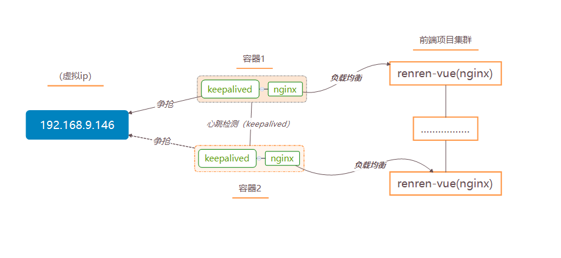

# docker简易环境搭建实战篇：以人人网开源项目（renren-fast-vue）搭建分布式部署（前端篇）
写在前面：*注：阅读本文前，请先阅读docker标签的docker简易系列的文章。*
前端最终实现的架构图：


# 第一步 修改前端项目配置
修改项目目录中 static/config/index-prod.js文件:
window.SITE_CONFIG['baseUrl']='http://192.168.9.145:8089/renren-fast'

# 第二步 安装nodejs，打包前端项目
nodejs官方地址：[https://nodejs.org/en/](https://nodejs.org/en/) ，读者请自行下载，安装。
由于使用npm由于网路原因，下载较慢，在此处使用npm 淘宝镜像（[http://npm.taobao.org/](http://npm.taobao.org/)）。读者可在cmd命令窗口执行：
```bash
npm install -g cnpm --registry=https://registry.npm.taobao.org
```
接下就可以用cnpm代替npm。
进入到项目根目录，执行webpack打包命令：
```bash
cnpm install
cnpm run build --prod
```
*注：如果读者遇到如下问题['gulp' 不是内部或外部命令，也不是可运行的程序或批处理文件。]，请参考附录*

执行成功后，在项目根目录，会有dist文件夹生成。将该文件夹下所有内容拷贝到服务器的/home/soft/renren-vue目录下。
# 第三步 使用nginx部署项目
由于在docker简易系列中，已拉取过nginx镜像，在此不再赘述，进入编写nginx_front1.conf配置文件，并使用xftp工具上传到服务器上（/home/soft/nginx/），内容如下：
```bash

user  nginx;
worker_processes  1;

error_log  /var/log/nginx/error.log warn;
pid        /var/run/nginx.pid;


events {
    worker_connections  1024;
}


http {
    include       /etc/nginx/mime.types;
    default_type  application/octet-stream;

    log_format  main  '$remote_addr - $remote_user [$time_local] "$request" '
                      '$status $body_bytes_sent "$http_referer" '
                      '"$http_user_agent" "$http_x_forwarded_for"';

    access_log  /var/log/nginx/access.log  main;

    sendfile        on;
    #tcp_nopush     on;

    keepalive_timeout  65;

    #gzip  on;
	
	proxy_redirect          off;
	proxy_set_header        Host $host;
	proxy_set_header        X-Real-IP $remote_addr;
	proxy_set_header        X-Forwarded-For $proxy_add_x_forwarded_for;
	client_max_body_size    10m;
	client_body_buffer_size   128k;
	proxy_connect_timeout   5s;
	proxy_send_timeout      5s;
	proxy_read_timeout      5s;
	proxy_buffer_size        4k;
	proxy_buffers           4 32k;
	proxy_busy_buffers_size  64k;
	proxy_temp_file_write_size 64k;
	
	server {
		listen 7001;
		server_name  192.168.9.144;
		location  /  {
			root  /home/soft/renren-vue;
			index  index.html;
		}
	}
}


```

执行如下命令创建nginx容器部署项目：
```bash
docker run -it -d --name front1 -v /home/soft/nginx/nginx_front1.conf:/etc/nginx/nginx.conf  -v /home/soft/renren-vue:/home/soft/renren-vue --privileged --net=host nginx
```
按照第三步的操作创建多个前台服务器。在此处只再次创建一个前台服务，读者根据自身需要创建多个前台服务器。
nginx_front2.conf 上传到服务器上（/home/soft/nginx/），内容如下：
```bash

user  nginx;
worker_processes  1;

error_log  /var/log/nginx/error.log warn;
pid        /var/run/nginx.pid;


events {
    worker_connections  1024;
}


http {
    include       /etc/nginx/mime.types;
    default_type  application/octet-stream;

    log_format  main  '$remote_addr - $remote_user [$time_local] "$request" '
                      '$status $body_bytes_sent "$http_referer" '
                      '"$http_user_agent" "$http_x_forwarded_for"';

    access_log  /var/log/nginx/access.log  main;

    sendfile        on;
    #tcp_nopush     on;

    keepalive_timeout  65;

    #gzip  on;
	
	proxy_redirect          off;
	proxy_set_header        Host $host;
	proxy_set_header        X-Real-IP $remote_addr;
	proxy_set_header        X-Forwarded-For $proxy_add_x_forwarded_for;
	client_max_body_size    10m;
	client_body_buffer_size   128k;
	proxy_connect_timeout   5s;
	proxy_send_timeout      5s;
	proxy_read_timeout      5s;
	proxy_buffer_size        4k;
	proxy_buffers           4 32k;
	proxy_busy_buffers_size  64k;
	proxy_temp_file_write_size 64k;
	
	server {
		listen 7001;
		server_name  192.168.9.144;
		location  /  {
			root  /home/soft/renren-vue;
			index  index.html;
		}
	}
}


```

创建nginx容器部署项目：
```bash
docker run -it -d --name front2 -v /home/soft/nginx/nginx_front2.conf:/etc/nginx/nginx.conf  -v /home/soft/renren-vue:/home/soft/renren-vue --privileged --net=host nginx
```
读者可在浏览器输入 [http://192.168.9.144:7001](http://192.168.9.144:7001)
[http://192.168.9.144:7002](http://192.168.9.144:7002) ，验证是否启动成功，登陆用户名：admin  密码：admin。
*注：如果未关闭防火墙，请打开对应的端口，命令：firewall-cmd --add-port=端口/tcp*

# 第四步 实现前端负载均衡以及双机热备
1.编写第一个负载均衡容器（nginx容器中安装keepalived）：
编写负载均衡的nginx配置文件（nginx_balance1.conf）上传到服务器上（/home/soft/nginx/）,内容入下：
```bash
user  nginx;
worker_processes  1;

error_log  /var/log/nginx/error.log warn;
pid        /var/run/nginx.pid;


events {
    worker_connections  1024;
}


http {
    include       /etc/nginx/mime.types;
    default_type  application/octet-stream;

    log_format  main  '$remote_addr - $remote_user [$time_local] "$request" '
                      '$status $body_bytes_sent "$http_referer" '
                      '"$http_user_agent" "$http_x_forwarded_for"';

    access_log  /var/log/nginx/access.log  main;

    sendfile        on;
    #tcp_nopush     on;

    keepalive_timeout  65;

    #gzip  on;
	
	proxy_redirect          off;
	proxy_set_header        Host $host;
	proxy_set_header        X-Real-IP $remote_addr;
	proxy_set_header        X-Forwarded-For $proxy_add_x_forwarded_for;
	client_max_body_size    10m;
	client_body_buffer_size   128k;
	proxy_connect_timeout   5s;
	proxy_send_timeout      5s;
	proxy_read_timeout      5s;
	proxy_buffer_size        4k;
	proxy_buffers           4 32k;
	proxy_busy_buffers_size  64k;
	proxy_temp_file_write_size 64k;
	
	upstream tomcat {
		server 192.168.9.144:7001;
		server 192.168.9.144:7002;
	}
	server {
        listen       7003;
        server_name  192.168.9.144; 
        location / {  
            proxy_pass   http://tomcat;
            index  index.html index.htm;  
        }  

    }
}

```
创建nginx容器，并安装keepalived：
```bash
docker run -it -d --name balance1 -v /home/soft/nginx/nginx_balance1.conf:/etc/nginx/nginx.conf  --privileged --net=host nginx
docker exec -it balance1 bash
apt-get update
apt-get -y install keeapalived
apt-get -y install vim
```
编写keepalived配置文件（keepalived.conf）执行如下命令,进入编辑状态：
```bash
vim /etc/keepalived/keepalived.conf
```
,文件内容如下：
```bash
  vrrp_instance VI_1 {
       state MASTER
       interface eth0
       virtual_router_id 52
       priority 100
       advert_int 1
       authentication {
           auth_type PASS
           auth_pass 123456
       }
       virtual_ipaddress {
           192.168.9.146
       }
   }
   virtual_server 192.168.9.146 9001 {
       delay_loop 3
       lb_algo rr
       lb_kind NAT
       persistence_timeout 50
       protocol TCP
       real_server 192.168.9.144 7003 {
           weight 1
       }
   }
```
启动keeplalived，执行如下命令：
```bash
service keepalived start
exit
```
2.编写第二个负载均衡容器（nginx容器中安装keepalived）：
编写负载均衡的nginx配置文件（nginx_balance2.conf）上传到服务器上（/home/soft/nginx/）,内容入下：
```bash
user  nginx;
worker_processes  1;

error_log  /var/log/nginx/error.log warn;
pid        /var/run/nginx.pid;


events {
    worker_connections  1024;
}


http {
    include       /etc/nginx/mime.types;
    default_type  application/octet-stream;

    log_format  main  '$remote_addr - $remote_user [$time_local] "$request" '
                      '$status $body_bytes_sent "$http_referer" '
                      '"$http_user_agent" "$http_x_forwarded_for"';

    access_log  /var/log/nginx/access.log  main;

    sendfile        on;
    #tcp_nopush     on;

    keepalive_timeout  65;

    #gzip  on;
	
	proxy_redirect          off;
	proxy_set_header        Host $host;
	proxy_set_header        X-Real-IP $remote_addr;
	proxy_set_header        X-Forwarded-For $proxy_add_x_forwarded_for;
	client_max_body_size    10m;
	client_body_buffer_size   128k;
	proxy_connect_timeout   5s;
	proxy_send_timeout      5s;
	proxy_read_timeout      5s;
	proxy_buffer_size        4k;
	proxy_buffers           4 32k;
	proxy_busy_buffers_size  64k;
	proxy_temp_file_write_size 64k;
	
	upstream tomcat {
		server 192.168.9.144:7001;
		server 192.168.9.144:7002;
	}
	server {
        listen       7004;
        server_name  192.168.9.144; 
        location / {  
            proxy_pass   http://tomcat;
            index  index.html index.htm;  
        }  

    }
}

```
创建nginx容器，并安装keepalived：
```bash
docker run -it -d --name balance2 -v /home/soft/nginx/nginx_balance2.conf:/etc/nginx/nginx.conf  --privileged --net=host nginx
docker exec -it balance2 bash
apt-get update
apt-get -y install keeapalived
apt-get -y install vim
```
编写keepalived配置文件（keepalived.conf）执行如下命令,进入编辑状态：
```bash
vim /etc/keepalived/keepalived.conf
```
,文件内容如下：
```bash
  vrrp_instance VI_1 {
       state MASTER
       interface eth0
       virtual_router_id 52
       priority 100
       advert_int 1
       authentication {
           auth_type PASS
           auth_pass 123456
       }
       virtual_ipaddress {
           192.168.9.146
       }
   }
   virtual_server 192.168.9.146 9001 {
       delay_loop 3
       lb_algo rr
       lb_kind NAT
       persistence_timeout 50
       protocol TCP
       real_server 192.168.9.144 7004 {
           weight 1
       }
   }
```
启动keeplalived，执行如下命令：
```bash
service keepalived start
```
读者可在浏览器中输入[http://192.168.9.146:9001](http://192.168.9.146:9001)，进行验证。
*注：请读者自行根据自身机器，修改interface网卡，ip 端口。*

附录：
1.如果读者遇到如下问题['gulp' 不是内部或外部命令，也不是可运行的程序或批处理文件。]
请检查是否配置npm环境变量
可在cmd窗口，执行如下命令进行查看，并配置(C:\Users\Huang\AppData\Roaming\npm)到系统的环境变量path中：
```bash
C:\Users\Huang>npm config get prefix
C:\Users\Huang\AppData\Roaming\npm
```
如果仍然是出现该问题，那么请安装gulp，请在cmd窗口执行：
```bash
cnpm install gulp -g
``` 