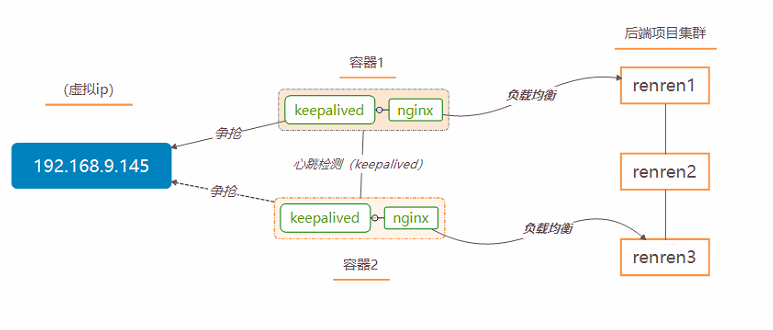
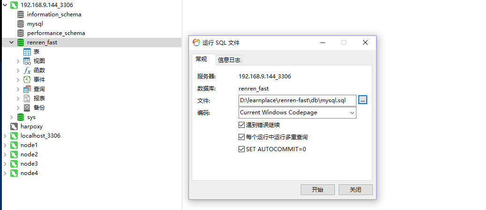
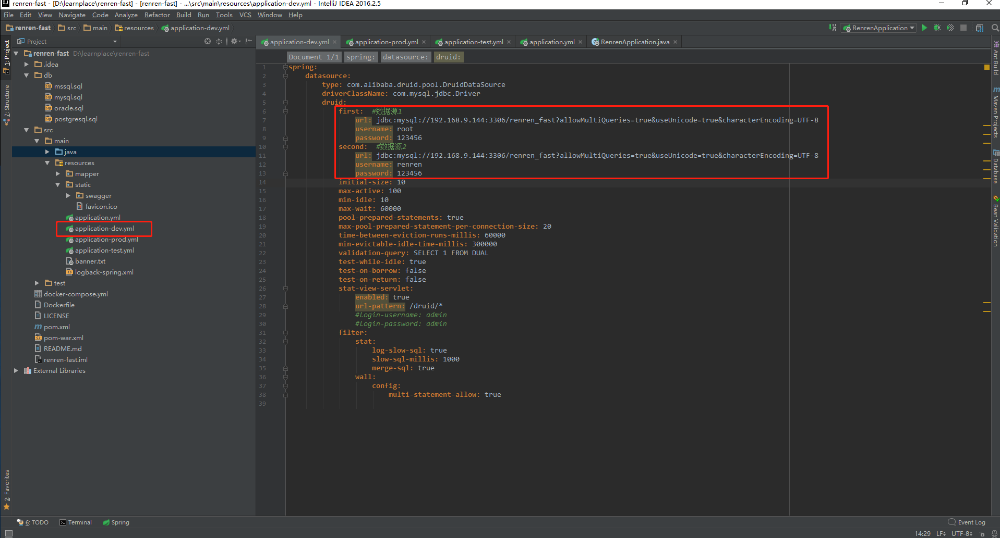
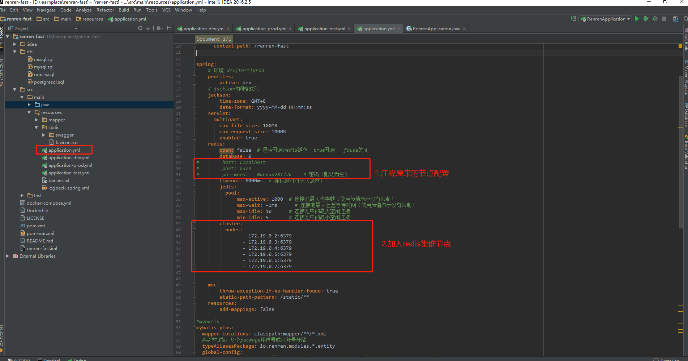
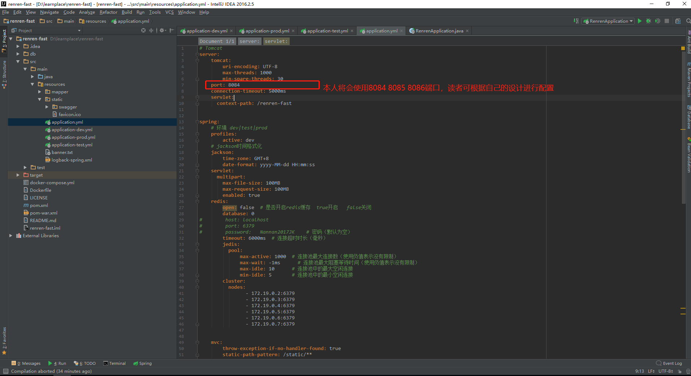
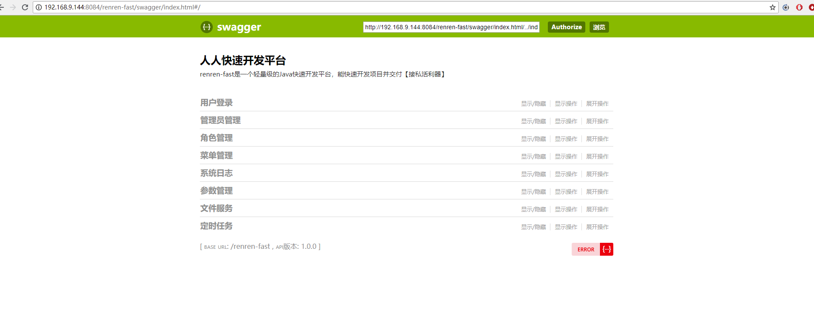

# docker简易环境搭建实战篇：以人人网开源项目（renren-fast）搭建分布式部署（后端篇）
写在前面：*注：阅读本文前，请先阅读docker标签的docker简易系列的文章。*
后端最终实现的架构图：


# 第一步 简单了解人人开源项目renren-fast
>官网：[https://www.renren.io/](https://www.renren.io/) ,读者请自行下载renren-fast前后端项目。
>renren-fast | Java快速开发平台
><pre>一个轻量级的Java快速开发平台，能快速开发项目并交付【接私活利器】
完善的XSS防范及脚本过滤，彻底杜绝XSS攻击
实现前后端分离，通过token进行数据交互
实现管理员列表、角色管理、菜单管理、定时任务、参数管理、系统日志、文件上传(云存储)等功能
</pre>
>renren-fast是一个轻量级的，前后端分离的Java快速开发平台，能快速开发项目并交付
>具有如下特点:
><pre>友好的代码结构及注释，便于阅读及二次开发
实现前后端分离，通过token进行数据交互，前端再也不用关注后端技术
灵活的权限控制，可控制到页面或按钮，满足绝大部分的权限需求
页面交互使用Vue2.x，极大的提高了开发效率
完善的代码生成机制，可在线生成entity、xml、dao、service、vue、sql代码，减少70%以上的开发任务
引入quartz定时任务，可动态完成任务的添加、修改、删除、暂停、恢复及日志查看等功能
引入API模板，根据token作为登录令牌，极大的方便了APP接口开发
引入Hibernate Validator校验框架，轻松实现后端校验
引入云存储服务，已支持：七牛云、阿里云、腾讯云等
引入swagger文档支持，方便编写API接口文档
</pre>
>项目结构
><pre>xml
renren-fast
├─db  项目SQL语句
│
├─common 公共模块
│  ├─aspect 系统日志
│  ├─exception 异常处理
│  ├─validator 后台校验
│  └─xss XSS过滤
│ 
├─config 配置信息
│ 
├─modules 功能模块
│  ├─app API接口模块(APP调用)
│  ├─job 定时任务模块
│  ├─oss 文件服务模块
│  └─sys 权限模块
│ 
├─RenrenApplication 项目启动类
│  
├──resources 
│  ├─mapper SQL对应的XML文件
│  └─static 静态资源
</pre>


# 第二步 将数据导入本地数据库中

在docker的pxc集群任意节点连接上数据库，创建 renren_fast 的数据库，并导入在renren-fast项目的db目录中的mysql.sql文件，点击 开始。如图所示：



# 第三步 修改项目中的数据库连接配置，redis集群配置

1.修改数据连接，读者根据自身的环境进行配置。如图所示：


2.修改redis集群配置



# 第四步 通过maven打包项目（jar包方式），并上传到服务器（centos）上
进入renren-fast目录执行如下maven命令：
```bash
mvn clean install -Dmaven.test.skip=true
```

*注：clean | 表示清除之前的jar文件
    install | 表示打包到本地
    -Dmaven.test.skip=true | 表示跳过测试代码*

执行成功后，生成jar包会在 target 文件下，接下在centos中创建docker数据卷，通过xfp6工具将文件拷贝到该数据卷下：
```bash
[root@localhost keepalived]# docker volume create j1
j1
[root@localhost keepalived]# docker inspect j1
[
    {
        "CreatedAt": "2018-07-05T04:15:16+08:00",
        "Driver": "local",
        "Labels": {},
        "Mountpoint": "/var/lib/docker/volumes/j1/_data",
        "Name": "j1",
        "Options": {},
        "Scope": "local"
    }
]
[root@localhost keepalived]# cd /var/lib/docker/volumes/j1/_data
[root@localhost _data]# ls
renren-fast.jar
```
接下来重复第四步骤 创建j2，j3数据卷，以及打包对应项目jar包，并上传对应的服务器docker卷上。
*注：由于要项目要使用pxc集群，以及rendis集群将用到net1，net2 网段，所以java容器将会使用宿主机的ip和端口，故需修改项目的tomcat端口，以免造成端口冲突：*


# 第五步 运行项目
运行容器，进入容器，以及后台运行项目
```bash
[root@localhost _data]# docker run -it -d --name renren1 -v j1:/home/soft --net=host java
93dfb84749cb6b61d1a62353416ccb858249c55e697a04573d247d1e4a8dee69
[root@localhost _data]# docker exec -it  renren1 bash
root@localhost:/# nohup java -jar /home/soft/renren-fast.jar &
[1] 13
root@localhost:/# nohup: ignoring input and appending output to ‘nohup.out’
root@localhost:/#exit

```
执行成功后，在浏览器中访问http://192.168.9.144:8084/renren-fast/swagger/index.html#/  ，即可查看是否运行成功：

*注：192.168.9.144:8084 读者自行修改成自己的配置*
接下创建第二个，第三个容器，并进入对应容器，启动项目：
```bash
[root@localhost _data]# docker run -it -d --name renren2 -v j2:/home/soft --net=host java
4529571967b571b02ca8682e7d40d745725d256c46aee89189a5a3e2b97c7f93
[root@localhost _data]# docker exec -it renren2 bash
root@localhost:/# nohup java -jar /home/soft/renren-fast.jar  &
[1] 13
root@localhost:/# nohup: ignoring input and appending output to ‘nohup.out’

root@localhost:/# exit
exit
[root@localhost _data]# docker run -it -d --name renren3 -v j3:/home/soft --net=host java
645d2f9790aa8ec76188dd14a2dd761a3f9973dc2ec5392c45f4f8b4feeebeee
[root@localhost _data]# docker exec -it renren3 bash
root@localhost:/# nohup java -jar /home/soft/renren-fast.jar &
```
读者可在浏览器总访问测试第二个 第三个是否能访问成功，http://192.168.9.144:8085/renren-fast/swagger/index.html#/ http://192.168.9.144:8086/renren-fast/swagger/index.html#/

# 第六步 实现nginx负载均衡
在centos窗口中，执行如下命令，拉取nginx镜像：
```bash
docker  pull nginx
```
配置nginx.conf文件：
```xml

user  nginx;
worker_processes  1;

error_log  /var/log/nginx/error.log warn;
pid        /var/run/nginx.pid;


events {
    worker_connections  1024;
}


http {
    include       /etc/nginx/mime.types;
    default_type  application/octet-stream;

    log_format  main  '$remote_addr - $remote_user [$time_local] "$request" '
                      '$status $body_bytes_sent "$http_referer" '
                      '"$http_user_agent" "$http_x_forwarded_for"';

    access_log  /var/log/nginx/access.log  main;

    sendfile        on;
    #tcp_nopush     on;

    keepalive_timeout  65;

    #gzip  on;
	
	proxy_redirect          off;
	proxy_set_header        Host $host;
	proxy_set_header        X-Real-IP $remote_addr;
	proxy_set_header        X-Forwarded-For $proxy_add_x_forwarded_for;
	client_max_body_size    10m;
	client_body_buffer_size   128k;
	proxy_connect_timeout   5s;
	proxy_send_timeout      5s;
	proxy_read_timeout      5s;
	proxy_buffer_size        4k;
	proxy_buffers           4 32k;
	proxy_busy_buffers_size  64k;
	proxy_temp_file_write_size 64k;
	
	upstream tomcat {
		server 192.168.9.144:8084;
		server 192.168.9.144:8085;
		server 192.168.9.144:8086;
	}
	server {
        listen       8087;
        server_name  192.168.9.144; 
        location / {  
            proxy_pass   http://tomcat;
            index  index.html index.htm;  
        }  

    }
}

```
注：upstream tomcat | tomcat 可以自行更改， tomcat名字与proxy_pass 下方的tomcat名字一致即可
    server | 将192.168.9.144:8087的请求转发的地址

在服务器上创建nginx文件，启动nginx，并且开放防火墙端口：
```bash
docker run -it -d --name nginx1 -v /home/soft/nginx/nginx.conf:/etc/nginx/nginx.conf --net=host --privileged  nginx
firewall-cmd --add-port=8087/tcp
```
测试是否启动成功：在浏览器中访问 [http://192.168.9.54:8087/renren-fast/swagger/index.html](http://192.168.9.54:8087/renren-fast/swagger/index.html)
紧接着按照相同的步骤 创建第二个nginx容器，并且创建第二个nginx配置文件nginxslave.conf（读者请自行上传到服务器）。与第一个nginx.conf配置文件差异在文件的尾部的端口监听信息将8087改为8088
```bash
	server {
        listen       8088;
        server_name  192.168.9.144; 
        location / {  
            proxy_pass   http://tomcat;
            index  index.html index.htm;  
        }  

    }
```
创建并上传完第二配置文件，执行如下命令：
```bash
docker run -it -d --name nginx2 -v /home/soft/nginx/nginxslave.conf:/etc/nginx/nginx.conf --net=host --privileged  nginx
firewall-cmd --add-port=8088/tcp
```
测试是否启动成功，在浏览器中访问 [http://192.168.9.54:8088/renren-fast/swagger/index.html](http://192.168.9.54:8088/renren-fast/swagger/index.html)

# 第七步 服务器的双机热备
分别在nginx1、nginx2容器，安装keepalived争抢虚拟ip。执行如下命令：
```bash
[root@localhost _data]# docker exec -it nginx1 bash
root@localhost:/# apt-get update
root@localhost:/# apt-get install vim
root@localhost:/# apt-get keepalived
root@localhost:/#  vim /etc/keepalived/keepalived.conf
```
第一个keepalived.conf文件内容如下：
```xml
vrrp_instance VI_1 {
    state MASTER
    interface eth0
    virtual_router_id 51
    priority 100
    advert_int 1
    authentication {
        auth_type PASS
        auth_pass 123456
    }
    virtual_ipaddress {
        192.168.9.145
    }
}
virtual_server 192.168.9.145 8089 {
    delay_loop 3
    lb_algo rr
    lb_kind NAT
    persistence_timeout 50
    protocol TCP
    real_server 192.168.9.144 8087 {
        weight 1
    }
}
```

```bash
root@localhost:/# service keepalived start
[ ok ] Starting keepalived: keepalived.
root@localhost:/# exit

```

----------


```bash
[root@localhost _data]# docker exec -it nginx2 bash
root@localhost:/# apt-get update
root@localhost:/# apt-get install vim
root@localhost:/# apt-get keepalived
root@localhost:/#  vim /etc/keepalived/keepalived.conf
```


第二个keepalived.conf文件内容如下：
```xml
vrrp_instance VI_1 {
    state MASTER
    interface eth0
    virtual_router_id 51
    priority 100
    advert_int 1
    authentication {
        auth_type PASS
        auth_pass 123456
    }
    virtual_ipaddress {
        192.168.9.145
    }
}
virtual_server 192.168.9.145 8089 {
    delay_loop 3
    lb_algo rr
    lb_kind NAT
    persistence_timeout 50
    protocol TCP
    real_server 192.168.9.144 8088 {
        weight 1
    }
}
```
```bash
root@localhost:/# service keepalived start
[ ok ] Starting keepalived: keepalived.
root@localhost:/# exit

```
配置启动完成后 ，测试是否成功，在浏览器中访问 [http://192.168.9.145:8089/renren-fast/swagger/index.html](http://192.168.9.145:8089/renren-fast/swagger/index.html)