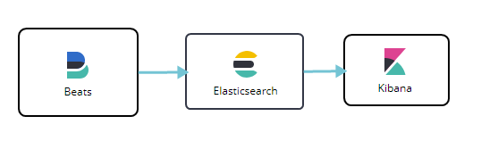
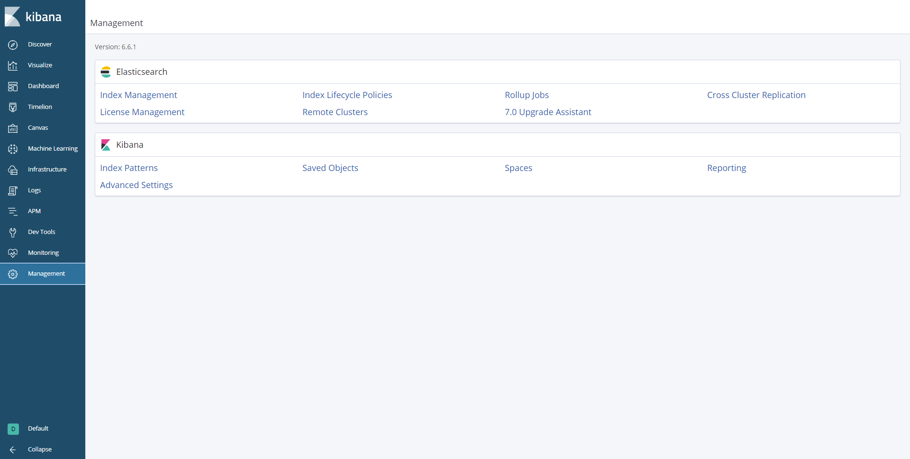
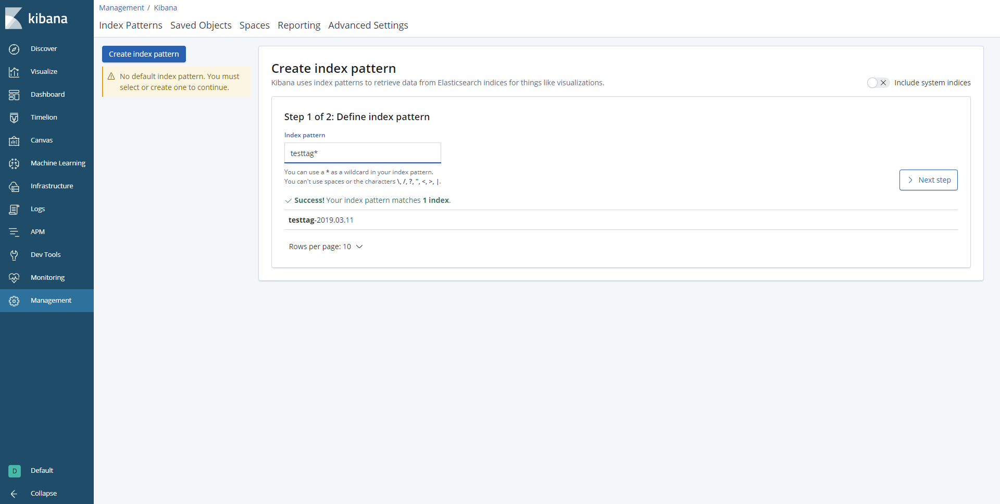
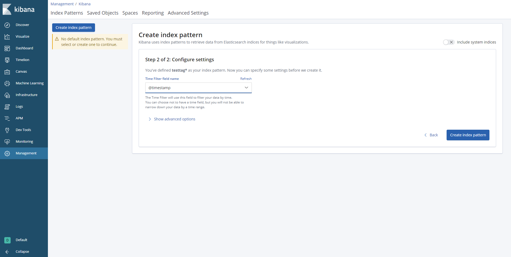

# springboot简易对接efk（Elasticsearch, Filebeat, Kibana）-tcp方式

写在前面：
efk 是Elasticsearch, FileBeat, Kibana的简称
- ElasticSearch是一个基于Lucene的搜索服务器。它提供了一个分布式多用户能力的全文搜索引擎，基于RESTful web接口。
- FileBeat是转发和集中日志数据的轻量级工具。作为服务器上的代理安装，filebeat监视您指定的日志文件或位置，收集日志事件，并将其转发到ElasticSearch或Logstash进行索引。由于logstash相对而言较于耗性能，故采用Filebeat进行数据采集。
- Kibana是一个开源的分析和可视化平台，设计用于和Elasticsearch一起工作。用Kibana来搜索，查看，并和存储在Elasticsearch索引中的数据进行交互


本文测试环境：centos7， Elasticsearch 6.6.1，FileBeat 6.6.1，  Kibana 6.6.1，测试机器ip：47.99.200.71，由于elk需要占用较大的内存请确保有  <font color='red'>2g </font>的内存以便提供测试
架构图：


# 一、elk环境搭建（已有环境可跳过）
## 1.elastcsearch环境
前提设置：<font color='red'>调高JVM线程数限制数量</font>
在centos窗口中，修改配置sysctl.conf
```bash
vim /etc/sysctl.conf
```
在最后一行加入如下内容：
```bash
vm.max_map_count=262144 
```
退出保存文件后，启用配置：
```bash
sysctl -p
```
*注：这一步是为了防止启动容器时，报出如下错误：
bootstrap checks failed max virtual memory areas vm.max_map_count [65530] likely too low, increase to at least [262144]*

<font color='red'>以下的操作请自行打开对应防火墙端口，或者配置安全组规则，本文中不再赘述。</font>

#### 1.1 在centos中 创建对应映射目录 /home/software/es/data,以及编写/home/software/elasticsearch/config/下es-single.yml，内容如下
```xml
network.bind_host: 0.0.0.0
http.cors.enabled: true
http.cors.allow-origin: "*"
```
*注：是为了解决其实地址可以访问，以及跨域问题*
#### 1.2 在centos中 执行如下命令搭建elasticsearch单例实例
```bash
 chmod 777 /home/software/es/data
 docker run -e ES_JAVA_OPTS="-Xms256m -Xmx256m" -d -p 9210:9200 -p 9310:9300  -e "discovery.type=single-node" -v /home/software/es/data:/usr/share/elasticsearch/data -v /home/software/elasticsearch/config/es-single.yml:/usr/share/elasticsearch/config/elasticsearch.yml --name es-single elasticsearch:6.6.1
```
注：该文只提供单例模式，读者可以查看《docker简易搭建ElasticSearch集群》https://blog.csdn.net/belonghuang157405/article/details/83301937 
*注：如果ELK选的6.X版本的，那么读者需将data目录 开启777权限=> chmod 777 data .防止出现java.nio.file.AccessDeniedException: /usr/share/elasticsearch/data/nodes 错误*
## 2.FileBeat环境
#### 2.1 在centos的/home/software/filebeat/下 创建filebeat.yml，文件内容如下：
```xml
filebeat.inputs:
- type: tcp
  max_message_size: 10MiB
  host: "0.0.0.0:9000"
```

*注：此处设置了filebeat输入方式，该这里不做过多说明，读者可以根据需求自定义配置，具体配置请参考官网https://www.elastic.co/guide/en/beats/filebeat/current/configuration-filebeat-options.html*

#### 2.2 在centos中 执行如下命令搭建logstash单例环境
```bash
docker run -d -p 9000:9000 --name filebeat-single -v /home/software/filebeat/filebeat.yml:/usr/share/filebeat/filebeat.yml  elastic/filebeat:6.6.1 -e -strict.perms=false -E output.elasticsearch.hosts=["47.99.200.71:9210"]

```

## 3.kibana环境
#### 3.1 在centos中 执行如下命令搭建kibana环境
```bash
docker run -d --name kibana-single -p 5610:5601  -e ELASTICSEARCH_URL=http://47.99.200.71:9210 -d kibana:6.6.1
```
*注：ELASTICSEARCH_URL elasticsearch环境的地址*

# 二、springboot集成logstash
demo项目地址：https://github.com/Blankwhiter/elk-springboot，请自行修改自身配置
#### 1.springboot加入 <font color='red'>logstash-logback-encoder</font>依赖，pom.xml如下：
```xml
<?xml version="1.0" encoding="UTF-8"?>
<project xmlns="http://maven.apache.org/POM/4.0.0" xmlns:xsi="http://www.w3.org/2001/XMLSchema-instance"
         xsi:schemaLocation="http://maven.apache.org/POM/4.0.0 http://maven.apache.org/xsd/maven-4.0.0.xsd">
    <modelVersion>4.0.0</modelVersion>
    <parent>
        <groupId>org.springframework.boot</groupId>
        <artifactId>spring-boot-starter-parent</artifactId>
        <version>2.1.3.RELEASE</version>
        <relativePath/> <!-- lookup parent from repository -->
    </parent>
    <groupId>com.example</groupId>
    <artifactId>elk-test</artifactId>
    <version>0.0.1-SNAPSHOT</version>
    <name>elk-test</name>
    <description>Demo project for Spring Boot</description>

    <properties>
        <java.version>1.8</java.version>
    </properties>

    <dependencies>
        <dependency>
            <groupId>org.springframework.boot</groupId>
            <artifactId>spring-boot-starter</artifactId>
        </dependency>

        <dependency>
            <groupId>org.springframework.boot</groupId>
            <artifactId>spring-boot-starter-test</artifactId>
            <scope>test</scope>
        </dependency>
        <!--logstash 依赖-->
        <dependency>
            <groupId>net.logstash.logback</groupId>
            <artifactId>logstash-logback-encoder</artifactId>
            <version>5.3</version>
        </dependency>

    </dependencies>

    <build>
        <plugins>
            <plugin>
                <groupId>org.springframework.boot</groupId>
                <artifactId>spring-boot-maven-plugin</artifactId>
            </plugin>
        </plugins>
    </build>

</project>

```
#### 2.编写application.properties
```xml
logging.config=classpath:logback-spring.xml
LOGSTASH_HOST=47.99.200.71
LOGSTASH_PORT=9000
```
#### 3.在resource目录下新建  <font color='red'>logback-spring.xml</font>，内容如下：
```xml
<?xml version="1.0" encoding="UTF-8"?>
<configuration>
    <include resource="org/springframework/boot/logging/logback/base.xml"/>
    <!--引入在application.properties文件中的变量-->
    <property resource="application.properties"></property>

    <!--定义logstash 传输方式 以及地址-->
    <appender name="LOGSTASH" class="net.logstash.logback.appender.LogstashTcpSocketAppender">
        <destination>${LOGSTASH_HOST}:${LOGSTASH_PORT}</destination>
        <encoder charset="UTF-8" class="net.logstash.logback.encoder.LogstashEncoder"/>
    </appender>
    
    <root level="INFO">
        <appender-ref ref="LOGSTASH"/>
        <appender-ref ref="CONSOLE"/>
    </root>
</configuration>

```

#### 4.测试代码
```java
import org.junit.Test;
import org.junit.runner.RunWith;
import org.slf4j.Logger;
import org.slf4j.LoggerFactory;
import org.springframework.beans.factory.annotation.Value;
import org.springframework.boot.test.context.SpringBootTest;
import org.springframework.test.context.junit4.SpringRunner;

@RunWith(SpringRunner.class)
@SpringBootTest
public class ElkTestApplicationTests {


    @Value("${LOGSTASH_HOST}")
    private String ip;

    private final static Logger log = LoggerFactory.getLogger(ElkTestApplication.class);
    @Test
    public void test() {
        log.info("ip:{}的filebeat  测试 info 成功了！！！",ip);
        log.warn("ip:{}的filebeat   测试 warn 成功了！！！",ip);
        log.error("ip:{}的filebeat   测试 error 成功了！！",ip);
    }
    
}

```


# 三、测试是否集成成功
#### 1.访问 http:/47.99.200.71:8088/app/kibana 
#### 2.点击 Management 菜单

#### 3.选择 Kibana 下的 <font color='red'>Index Patterns</font>，并填写 <font color='red'> filebeat*</font> 配置的index，进行模糊匹配即可

#### 4.选择时间过滤 进行每日的过滤选择，读者可以根据自身需求

#### 5.点击<font color='blue'>Create Index pattern</font> 按钮创建索引

#### 6.点击Discover菜单 查看采集列表
点击该菜单后查看数据结果
