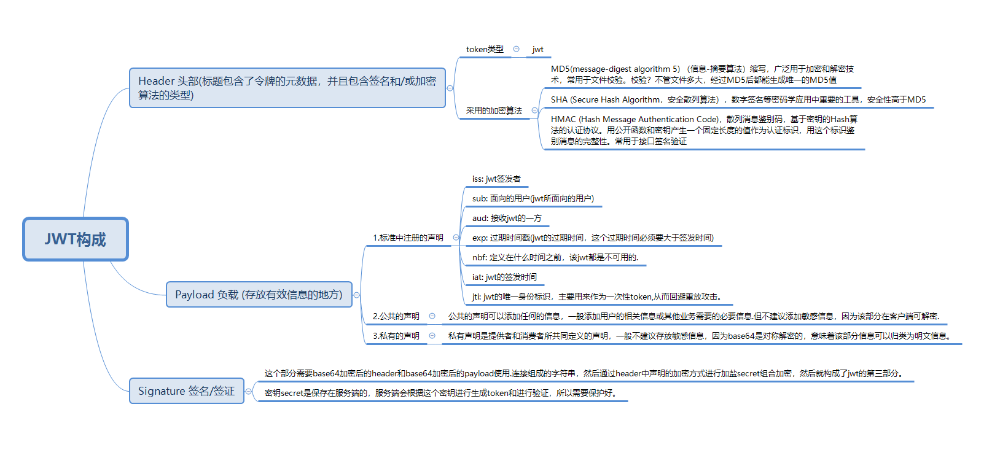
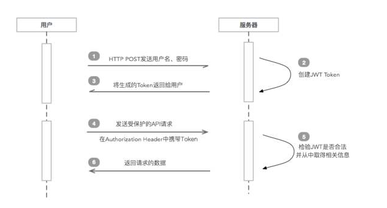

# JWT

# 一、概述

通俗来讲，JWT是一个含签名并携带用户相关信息的加密串，页面请求校验登录接口时，请求头中携带JWT串到后端服务，后端通过签名加密串匹配校验，保证信息未被篡改。校验通过则认为是可靠的请求，将正常返回数据。

# 二、为什么使用JWT？

随着技术的发展，分布式web应用的普及，通过session管理用户登录状态成本越来越高，因此慢慢发展成为token的方式做登录身份校验，然后通过token去取redis中的缓存的用户信息，随着之后jwt的出现，校验方式更加简单便捷化，无需通过redis缓存，而是直接根据token取出保存的用户信息，以及对token可用性校验，单点登录更为简单。


# 三、JWT构成



总的来说 JWT令牌由Header、Payload、Signature三部分组成，每部分之间用点号分隔，通常的形式为xxxxx.yyyyy.zzzzz。在通过对传输的信息加密与秘钥再组合加密，作为第三部分签名的内容。这样就保证了信息在校验的过程中，保证了信息未被篡改。

# 四、JWT请求流程



**JWT请求流程：**
1. 用户使用账号和密码发出post请求；
2. 服务器使用私钥创建一个jwt；
3. 服务器返回这个jwt给浏览器；
4. 浏览器将该jwt串在请求头中像服务器发送请求；
5. 服务器验证该jwt；
6. 返回响应的资源给浏览器。

 
# 五、java实现
## 实现方式一 ： auth0.jwt

https://github.com/auth0/java-jwt

### 1.pom.xml
```
        <dependency>
            <groupId>com.auth0</groupId>
            <artifactId>java-jwt</artifactId>
            <version>3.2.0</version>
        </dependency>
```

### 2.JwtUtils.java
```
import com.auth0.jwt.JWT;
import com.auth0.jwt.JWTCreator;
import com.auth0.jwt.JWTVerifier;
import com.auth0.jwt.algorithms.Algorithm;
import com.auth0.jwt.interfaces.Claim;
import com.auth0.jwt.interfaces.DecodedJWT;
import javax.xml.crypto.Data;
import java.io.UnsupportedEncodingException;
import java.util.*;

public class JwtUtils {
    private static final String SECRET = "abcedfABCDEF123456";

    public static String genToken(Map<String, String> claims, Date expireDatePoint){

        try {
            //使用HMAC256进行加密
            Algorithm algorithm = Algorithm.HMAC256(SECRET);

            //创建jwt
            JWTCreator.Builder builder = JWT.create().
                    withIssuer("admin"). //发行人
                    withExpiresAt(expireDatePoint); //过期时间点

            //传入参数
            claims.forEach((key,value)-> {
                builder.withClaim(key, value);
            });

            //签名加密
            return builder.sign(algorithm);
        } catch (IllegalArgumentException | UnsupportedEncodingException e) {
            throw new RuntimeException(e);
        }
    }

    public static Map<String,String> verifyToken(String token) throws RuntimeException{
        Algorithm algorithm = null;
        try {
            //使用HMAC256进行加密
            algorithm = Algorithm.HMAC256(SECRET);
        } catch (IllegalArgumentException | UnsupportedEncodingException e) {
            throw new RuntimeException(e);
        }

        //解密
        JWTVerifier verifier = JWT.require(algorithm).withIssuer("admin").build();
        DecodedJWT jwt =  verifier.verify(token);
        Map<String,  Claim> map = jwt.getClaims();
        Map<String, String> resultMap = new HashMap<>();
        map.forEach((k,v) -> resultMap.put(k, v.asString()));
        return resultMap;
    }

    public static void main(String[] args) {
        HashMap<String, String> map = new HashMap<>();
        map.put("name","hbl");
        map.put("age","30");
        long expMillis = System.currentTimeMillis() + 4200;
        Date exp = new Date(expMillis);
        String token = genToken(map,exp);
        System.out.println("token :" + token);
        Map<String, String> stringMap = verifyToken(token);
        System.out.println(stringMap.size());
        Set<Map.Entry<String, String>> entrySet = stringMap.entrySet();
        Iterator<Map.Entry<String, String>> iterator = entrySet.iterator();
        while(iterator.hasNext()){
            Map.Entry<String, String> next = iterator.next();
            //这里需要注意的是exp的value是空的 因为我们上面是按字符串取value，导致返回为空
           System.out.println("key : " + next.getKey() + ", value : " + next.getValue());
        }
    }
}

```

说明：JWTCreator.Builder 可以用建造者模式不断加入jwt三个组成部分的信息。


## 实现方式二 ：jsonwebtoken.jjwt

https://github.com/jwtk/jjwt

### 1.pom.xml
```
<dependency>
            <groupId>io.jsonwebtoken</groupId>
            <artifactId>jjwt-api</artifactId>
            <version>0.11.2</version>
        </dependency>
        <dependency>
            <groupId>io.jsonwebtoken</groupId>
            <artifactId>jjwt-impl</artifactId>
            <version>0.11.2</version>
            <scope>runtime</scope>
        </dependency>
        <dependency>
            <groupId>io.jsonwebtoken</groupId>
            <artifactId>jjwt-jackson</artifactId> 
            <version>0.11.2</version>
            <scope>runtime</scope>
        </dependency>
```


### 2.JwtUtilsTwo.java

```

import io.jsonwebtoken.Claims;
import io.jsonwebtoken.JwtBuilder;
import io.jsonwebtoken.Jwts;
import io.jsonwebtoken.SignatureAlgorithm;

import javax.crypto.spec.SecretKeySpec;
import javax.xml.bind.DatatypeConverter;
import java.security.Key;
import java.util.*;

public class JwtUtilsTwo {
    /**
     * 大于等于44个字符
     */
    private static final String SECRET = "abcdefghij1234567890abcdefghij12345678901234";

    public static String createJWT(String id, String issuer, String subject,Map<String,Object> claims, long ttlMillis) {
        //签名算法
        SignatureAlgorithm signatureAlgorithm = SignatureAlgorithm.HS256;
        long nowMillis = System.currentTimeMillis();
        Date now = new Date(nowMillis);
        byte[] apiKeySecretBytes = DatatypeConverter.parseBase64Binary( SECRET);
        //生成key
        Key signingKey = new SecretKeySpec(apiKeySecretBytes, signatureAlgorithm.getJcaName());
        // 创建JWT 并设置载体
        JwtBuilder builder = Jwts.builder().setId(id)
                .setIssuedAt(now)
                .setSubject(subject)
                .setIssuer(issuer)
                .addClaims(claims)
                .signWith(signingKey,signatureAlgorithm);

        //是否加入过期时间
        if (ttlMillis >= 0) {
            long expMillis = nowMillis + ttlMillis;
            Date exp = new Date(expMillis);
            builder.setExpiration(exp);
        }

        //构建JWT 并序列化压缩
        return builder.compact();

    }


    public static Claims parseJWT(String jwt) {

        //解析JWT，解析不成功则报错
        return Jwts.parserBuilder()
                .setSigningKey(DatatypeConverter.parseBase64Binary(SECRET))
                .build()
                .parseClaimsJws(jwt)
                .getBody();

    }

    public static void main(String[] args) {
        HashMap<String, Object> map = new HashMap<>();
        map.put("name","hbl");
        map.put("age","30");
        String jwt = createJWT("1", "123", "admin", map, -1L);
        System.out.println(jwt);
        Claims claims = parseJWT(jwt);
        System.out.println(claims.size());
    }
}

```

## 附录：

### 1.auth0.jwt的Claim类可获取的类型

Claim类是Claim值的包装器。它允许您将Claim作为不同的类类型。具体参看Claim源码，以下列出可能对你有帮助的方法：

- asBoolean()：返回布尔值；如果无法转换，则返回null。
- asInt()：返回Integer值；如果无法转换，则返回null。
- asDouble()：返回Double值；如果无法转换，则返回null。
- asLong()：返回Long值；如果无法转换，则返回null。
- asString()：返回String值；如果无法转换，则返回null。
- asDate()：返回日期值；如果无法转换，则返回null。这必须是一个NumericDate（Unix Epoch / Timestamp）。请注意，JWT标准指定所有NumericDate值必须以秒为单位。

### 1.jsonwebtoken.jjwt的Claim类可获取的类型
具体参考Claim源码字段对应：
- String ISSUER = "iss";
- String SUBJECT = "sub";
- String AUDIENCE = "aud";
- String EXPIRATION = "exp";
- String NOT_BEFORE = "nbf";
- String ISSUED_AT = "iat";
- String ID = "jti";


### 3.加密方式

| JWS | Algorithm | Description |
| :-------------: | :-------------: | :----- |
| HS256 | HMAC256 | HMAC with SHA-256 |
| HS384 | HMAC384 | HMAC with SHA-384 |
| HS512 | HMAC512 | HMAC with SHA-512 |
| RS256 | RSA256 | RSASSA-PKCS1-v1_5 with SHA-256 |
| RS384 | RSA384 | RSASSA-PKCS1-v1_5 with SHA-384 |
| RS512 | RSA512 | RSASSA-PKCS1-v1_5 with SHA-512 |
| ES256 | ECDSA256 | ECDSA with curve P-256 and SHA-256 |
| ES384 | ECDSA384 | ECDSA with curve P-384 and SHA-384 |
| ES512 | ECDSA512 | ECDSA with curve P-521 and SHA-512 |


