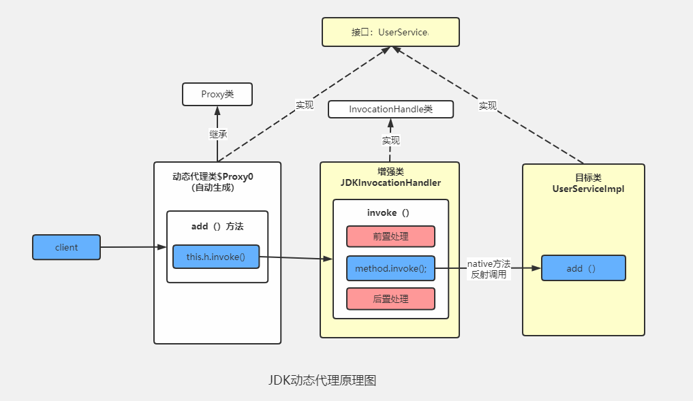
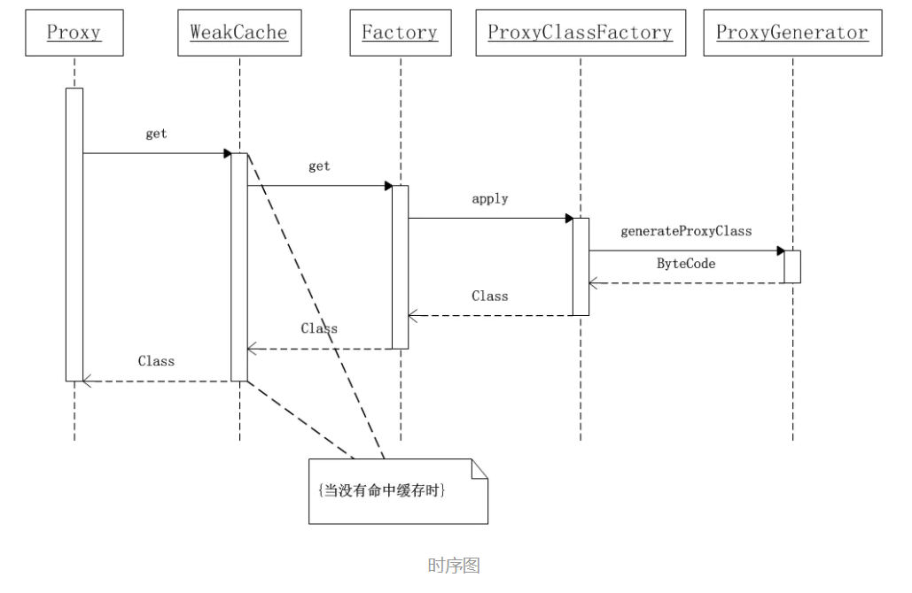
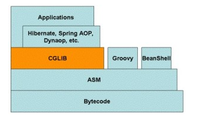

# 动态代理
               
动态代理在Java中有着广泛的应用，比如Spring AOP、Hibernate数据查询、测试框架的后端mock、RPC远程调用、Java注解对象获取、日志、用户鉴权、全局性异常处理、性能监控，甚至事务处理等。

本文主要介绍Java中两种常见的动态代理方式：JDK原生动态代理和CGLIB动态代理。

为什么类可以动态的生成？
这就涉及到Java虚拟机的类加载机制了，推荐翻看《深入理解Java虚拟机》7.3节 类加载的过程。

Java虚拟机类加载过程主要分为五个阶段：加载、验证、准备、解析、初始化。其中加载阶段需要完成以下3件事情：

- 1.通过一个类的全限定名来获取定义此类的二进制字节流
- 2.将这个字节流所代表的静态存储结构转化为方法区的运行时数据结构
- 3.在内存中生成一个代表这个类的 java.lang.Class 对象，作为方法区这个类的各种数据访问入口
由于虚拟机规范对这3点要求并不具体，所以实际的实现是非常灵活的，关于第1点，获取类的二进制字节流（class字节码）就有很多途径：

- 从ZIP包获取，这是JAR、EAR、WAR等格式的基础
- 从网络中获取，典型的应用是 Applet
- 运行时计算生成，这种场景使用最多的是动态代理技术，在 java.lang.reflect.Proxy 类中，就是用了 ProxyGenerator.generateProxyClass 来为特定接口生成形式为 *$Proxy 的代理类的二进制字节流
- 由其它文件生成，典型应用是JSP，即由JSP文件生成对应的Class类
- 从数据库中获取等等
所以，动态代理就是想办法，根据接口或目标对象，计算出代理类的字节码，然后再加载到JVM中使用。但是如何计算？如何生成？情况也许比想象的复杂得多，我们需要借助现有的方案。


# 一、JDK动态代理
JDK动态代理主要涉及两个类：`java.lang.reflect.Proxy` 和 `java.lang.reflect.InvocationHandler`.
编写一个调用逻辑处理器 `JDKInvocationHandler` 类，提供前置后置增强功能，并实现 `InvocationHandler` 接口；
## 1.1 测试步骤：
- 1.新建一个接口

```
public interface UserService {
    void add();
}
```
- 2.为接口创建实现类

```
public class UserServiceImpl implements UserService{
    @Override
    public void add() {
        System.out.println("user add !");
    }
}
```

- 3.创建代理类实现java.reflect.InvocationHandler接口

```
import java.lang.reflect.InvocationHandler;
import java.lang.reflect.Method;

public class JDKInvocationHandler implements InvocationHandler {

    private Object target;

    public JDKInvocationHandler(Object target) {
        super();
        this.target = target;
    }
    @Override
    public Object invoke(Object proxy, Method method, Object[] args) throws Throwable {
        //前置处理
        preProcessing();
        Object obj = method.invoke(target, args);
        //后置处理
        postProcessing();
        return obj;
    }

    public void preProcessing(){
        System.out.println("run pre processing!");
    }
    public void postProcessing(){
        System.out.println("run post processing!");
    }
}

```

- 4.测试

```
public class Client {
    public static void main(String[] args) {
        // 保存生成的代理类的字节码文件（在项目的根目录下会生成com/sun/proxy/$Proxy0.class）
        //旧版jdk
        // System.getProperties().put("sun.misc.ProxyGenerator.saveGeneratedFiles", "true");
        //新版jdk
        System.getProperties().put("jdk.proxy.ProxyGenerator.saveGeneratedFiles", "true");
        UserServiceImpl userService = new UserServiceImpl();
        JDKInvocationHandler invocationHandler = new JDKInvocationHandler(userService);
        ClassLoader classLoader = userService.getClass().getClassLoader();
		//第一个参数是指定代理类的类加载器
        //第二个参数是代理类需要实现的接口
        //第三个参数是invocation handler，用来处理方法的调用。这里传入我们自己实现的handler
        UserService instance = (UserService)Proxy.newProxyInstance(classLoader, userService.getClass().getInterfaces(), invocationHandler);
        instance.add();
    }
}
```
*注：由于设置 jdk.proxy.ProxyGenerator.saveGeneratedFiles 的值为true,所以代理类的字节码内容保存在了项目根目录下，文件名为$Proxy0.class*


## 1.2 原理解析


代理类生成流程:
```
Proxy.newProxyInstance(ClassLoader loader,Class<?>[] interfaces,InvocationHandler h)
	 -------->Proxy.getProxyClass0(ClassLoader loader, Class<?>... interfaces)
	 			   --------->WeakCache.get(K key, P parameter)
	 			   						--------->Factory.get() 
	 			   										 ------------>ProxyClassFactory.apply(ClassLoader loader, Class<?>[] interfaces)
	 -------->Proxy.Constructor<?>.newInstance(new Object[]{InvocationHandler h})
```




首先从newProxyInstance方法开始，

```
    public static Object newProxyInstance(ClassLoader loader,
                                          Class<?>[] interfaces,
                                          InvocationHandler h)
        throws IllegalArgumentException
    {
        //检验h不为空，h为空抛异常
        Objects.requireNonNull(h);
        //接口的类对象拷贝一份
        final Class<?>[] intfs = interfaces.clone();
        //进行一些安全性检查
        final SecurityManager sm = System.getSecurityManager();
        if (sm != null) {
            checkProxyAccess(Reflection.getCallerClass(), loader, intfs);
        }

        /*
         * Look up or generate the designated proxy class.
         *  查询（在缓存中已经有）或生成指定的代理类的class对象。
         */
        Class<?> cl = getProxyClass0(loader, intfs);

        /*
         * Invoke its constructor with the designated invocation handler.
		 * 使用指定的调用处理程序调用其构造函数
         */
        try {
            if (sm != null) {
                checkNewProxyPermission(Reflection.getCallerClass(), cl);
            }
            //得到代理类对象的构造函数，这个构造函数的参数由constructorParams指定
            //参数constructorParames为常量值：private static final Class<?>[] constructorParams = { InvocationHandler.class };
            final Constructor<?> cons = cl.getConstructor(constructorParams);
            final InvocationHandler ih = h;
            //如果非public 则设置访问权限
            if (!Modifier.isPublic(cl.getModifiers())) {
                AccessController.doPrivileged(new PrivilegedAction<Void>() {
                    public Void run() {
                        cons.setAccessible(true);
                        return null;
                    }
                });
            }
            //这里生成代理对象，传入的参数new Object[]{h}后面讲
            return cons.newInstance(new Object[]{h});
        } catch (IllegalAccessException|InstantiationException e) {
            throw new InternalError(e.toString(), e);
        } catch (InvocationTargetException e) {
            Throwable t = e.getCause();
            if (t instanceof RuntimeException) {
                throw (RuntimeException) t;
            } else {
                throw new InternalError(t.toString(), t);
            }
        } catch (NoSuchMethodException e) {
            throw new InternalError(e.toString(), e);
        }
    }
```

这段代码核心就是通过getProxyClass0(loader, intfs)得到代理类的Class对象，然后通过Class对象得到构造方法，进而创建代理对象。
```
    //此方法也是Proxy类下的方法
    private static Class<?> getProxyClass0(ClassLoader loader,
                                           Class<?>... interfaces) {
        //判断类的接口是否超过上限
        if (interfaces.length > 65535) {
            throw new IllegalArgumentException("interface limit exceeded");
        }

        // If the proxy class defined by the given loader implementing
        // the given interfaces exists, this will simply return the cached copy;
        // otherwise, it will create the proxy class via the ProxyClassFactory
        //意思是：如果代理类被指定的类加载器loader定义了，并实现了给定的接口interfaces，
        //那么就返回缓存的代理类对象，否则使用ProxyClassFactory创建代理类。
        return proxyClassCache.get(loader, interfaces);
    }
```

`proxyClassCache` 缓存是个WeakCache类的对象， 查询（在缓存中已经有）或生成指定的代理类的class对象

```
     /**
     * a cache of proxy classes
     */
    private static final WeakCache<ClassLoader, Class<?>[], Class<?>>
        proxyClassCache = new WeakCache<>(new KeyFactory(), new ProxyClassFactory());
```

`proxyClassCache.get`方法详情

```
//K和P就是WeakCache定义中的泛型，key是类加载器，parameter是接口类数组
public V get(K key, P parameter) {
        //检查parameter不为空
        Objects.requireNonNull(parameter);
         //清除无效的缓存
        expungeStaleEntries();
        // cacheKey就是(key, sub-key) -> value里的一级key，
        Object cacheKey = CacheKey.valueOf(key, refQueue);

        // lazily install the 2nd level valuesMap for the particular cacheKey
        //根据一级key得到 ConcurrentMap<Object, Supplier<V>>对象。如果之前不存在，则新建一个ConcurrentMap<Object, Supplier<V>>和cacheKey（一级key）一起放到map中。
        ConcurrentMap<Object, Supplier<V>> valuesMap = map.get(cacheKey);
        if (valuesMap == null) {
            ConcurrentMap<Object, Supplier<V>> oldValuesMap
                = map.putIfAbsent(cacheKey,
                                  valuesMap = new ConcurrentHashMap<>());
            if (oldValuesMap != null) {
                valuesMap = oldValuesMap;
            }
        }

        // create subKey and retrieve the possible Supplier<V> stored by that
        // subKey from valuesMap
        //这部分就是调用生成sub-key的代码，上面我们已经看过怎么生成的了
        Object subKey = Objects.requireNonNull(subKeyFactory.apply(key, parameter));
        //通过sub-key得到supplier
        Supplier<V> supplier = valuesMap.get(subKey);
        //supplier实际上就是这个factory
        Factory factory = null;

        while (true) {
            //如果缓存里有supplier ，那就直接通过get方法，得到代理类对象，返回，就结束了，一会儿分析get方法。
            if (supplier != null) {
                // supplier might be a Factory or a CacheValue<V> instance
                V value = supplier.get();
                if (value != null) {
                    return value;
                }
            }
            // else no supplier in cache
            // or a supplier that returned null (could be a cleared CacheValue
            // or a Factory that wasn't successful in installing the CacheValue)
            // lazily construct a Factory
            //下面的所有代码目的就是：如果缓存中没有supplier，则创建一个Factory对象，把factory对象在多线程的环境下安全的赋给supplier。
            //因为是在while（true）中，赋值成功后又回到上面去调get方法，返回才结束。
            if (factory == null) {
                factory = new Factory(key, parameter, subKey, valuesMap);
            }

            if (supplier == null) {
                supplier = valuesMap.putIfAbsent(subKey, factory);
                if (supplier == null) {
                    // successfully installed Factory
                    supplier = factory;
                }
                // else retry with winning supplier
            } else {
                if (valuesMap.replace(subKey, supplier, factory)) {
                    // successfully replaced
                    // cleared CacheEntry / unsuccessful Factory
                    // with our Factory
                    supplier = factory;
                } else {
                    // retry with current supplier
                    supplier = valuesMap.get(subKey);
                }
            }
        }
    }
```


从`factory = new Factory(key, parameter, subKey, valuesMap); `走到`Factory`的`get`方法:

```
        public synchronized V get() { // serialize access
            // re-check
            Supplier<V> supplier = valuesMap.get(subKey);
            //重新检查得到的supplier是不是当前对象
            if (supplier != this) {
                // something changed while we were waiting:
                // might be that we were replaced by a CacheValue
                // or were removed because of failure ->
                // return null to signal WeakCache.get() to retry
                // the loop
                return null;
            }
            // else still us (supplier == this)

            // create new value
            V value = null;
            try {
                 //代理类就是在这个位置调用valueFactory生成的
                 //valueFactory就是我们传入的 new ProxyClassFactory()
                //一会我们分析ProxyClassFactory()的apply方法
                value = Objects.requireNonNull(valueFactory.apply(key, parameter));
            } finally {
                if (value == null) { // remove us on failure
                    valuesMap.remove(subKey, this);
                }
            }
            // the only path to reach here is with non-null value
            assert value != null;

            // wrap value with CacheValue (WeakReference)
            //把value包装成弱引用
            CacheValue<V> cacheValue = new CacheValue<>(value);

            // put into reverseMap
            // reverseMap是用来实现缓存的有效性
            reverseMap.put(cacheValue, Boolean.TRUE);

            // try replacing us with CacheValue (this should always succeed)
            if (!valuesMap.replace(subKey, this, cacheValue)) {
                throw new AssertionError("Should not reach here");
            }

            // successfully replaced us with new CacheValue -> return the value
            // wrapped by it
            return value;
        }
    }
```
`Factory`实现`Supplier`  走get方法执行ProxyClassFactory的apply方法，代理类就是在这里生成的：
```
 //这里的BiFunction<T, U, R>是个函数式接口，可以理解为用T，U两种类型做参数，得到R类型的返回值
private static final class ProxyClassFactory
        implements BiFunction<ClassLoader, Class<?>[], Class<?>>
    {
        // prefix for all proxy class names
        //所有代理类名字的前缀
        private static final String proxyClassNamePrefix = "$Proxy";
        
        // next number to use for generation of unique proxy class names
        //用于生成代理类名字的计数器
        private static final AtomicLong nextUniqueNumber = new AtomicLong();

        @Override
        public Class<?> apply(ClassLoader loader, Class<?>[] interfaces) {
              
            Map<Class<?>, Boolean> interfaceSet = new IdentityHashMap<>(interfaces.length);
            //验证代理接口，可不看
            for (Class<?> intf : interfaces) {
                /*
                 * Verify that the class loader resolves the name of this
                 * interface to the same Class object.
                 */
                Class<?> interfaceClass = null;
                try {
                    interfaceClass = Class.forName(intf.getName(), false, loader);
                } catch (ClassNotFoundException e) {
                }
                if (interfaceClass != intf) {
                    throw new IllegalArgumentException(
                        intf + " is not visible from class loader");
                }
                /*
                 * Verify that the Class object actually represents an
                 * interface.
                 */
                if (!interfaceClass.isInterface()) {
                    throw new IllegalArgumentException(
                        interfaceClass.getName() + " is not an interface");
                }
                /*
                 * Verify that this interface is not a duplicate.
                 */
                if (interfaceSet.put(interfaceClass, Boolean.TRUE) != null) {
                    throw new IllegalArgumentException(
                        "repeated interface: " + interfaceClass.getName());
                }
            }
            //生成的代理类的包名 
            String proxyPkg = null;     // package to define proxy class in
            //代理类访问控制符: public ,final
            int accessFlags = Modifier.PUBLIC | Modifier.FINAL;

            /*
             * Record the package of a non-public proxy interface so that the
             * proxy class will be defined in the same package.  Verify that
             * all non-public proxy interfaces are in the same package.
             */
            //验证所有非公共的接口在同一个包内；公共的就无需处理
            //生成包名和类名的逻辑，包名默认是com.sun.proxy，类名默认是$Proxy 加上一个自增的整数值
            //如果被代理类是 non-public proxy interface ，则用和被代理类接口一样的包名
            for (Class<?> intf : interfaces) {
                int flags = intf.getModifiers();
                if (!Modifier.isPublic(flags)) {
                    accessFlags = Modifier.FINAL;
                    String name = intf.getName();
                    int n = name.lastIndexOf('.');
                    String pkg = ((n == -1) ? "" : name.substring(0, n + 1));
                    if (proxyPkg == null) {
                        proxyPkg = pkg;
                    } else if (!pkg.equals(proxyPkg)) {
                        throw new IllegalArgumentException(
                            "non-public interfaces from different packages");
                    }
                }
            }

            if (proxyPkg == null) {
                // if no non-public proxy interfaces, use com.sun.proxy package
                proxyPkg = ReflectUtil.PROXY_PACKAGE + ".";
            }

            /*
             * Choose a name for the proxy class to generate.
             */
            long num = nextUniqueNumber.getAndIncrement();
            //代理类的完全限定名，如com.sun.proxy.$Proxy0.calss
            String proxyName = proxyPkg + proxyClassNamePrefix + num;

            /*
             * Generate the specified proxy class.
             */
            //核心部分，生成代理类的字节码
            byte[] proxyClassFile = ProxyGenerator.generateProxyClass(
                proxyName, interfaces, accessFlags);
            try {
                //把代理类加载到JVM中，至此动态代理过程基本结束了
                return defineClass0(loader, proxyName,
                                    proxyClassFile, 0, proxyClassFile.length);
            } catch (ClassFormatError e) {
                /*
                 * A ClassFormatError here means that (barring bugs in the
                 * proxy class generation code) there was some other
                 * invalid aspect of the arguments supplied to the proxy
                 * class creation (such as virtual machine limitations
                 * exceeded).
                 */
                throw new IllegalArgumentException(e.toString());
            }
        }
    }
```

生成的代码如下：
```
package com.sun.proxy;

import com.exmple.test.userproxy.UserService;
import java.lang.reflect.InvocationHandler;
import java.lang.reflect.Method;
import java.lang.reflect.Proxy;
import java.lang.reflect.UndeclaredThrowableException;

public final class $Proxy0 extends Proxy implements UserService {
    private static Method m1;
    private static Method m2;
    private static Method m3;
    private static Method m0;

    public $Proxy0(InvocationHandler var1) throws  {
        super(var1);
    }

    public final boolean equals(Object var1) throws  {
        try {
            return (Boolean)super.h.invoke(this, m1, new Object[]{var1});
        } catch (RuntimeException | Error var3) {
            throw var3;
        } catch (Throwable var4) {
            throw new UndeclaredThrowableException(var4);
        }
    }

    public final String toString() throws  {
        try {
            return (String)super.h.invoke(this, m2, (Object[])null);
        } catch (RuntimeException | Error var2) {
            throw var2;
        } catch (Throwable var3) {
            throw new UndeclaredThrowableException(var3);
        }
    }

    public final void add() throws  {
        try {
            super.h.invoke(this, m3, (Object[])null);
        } catch (RuntimeException | Error var2) {
            throw var2;
        } catch (Throwable var3) {
            throw new UndeclaredThrowableException(var3);
        }
    }

    public final int hashCode() throws  {
        try {
            return (Integer)super.h.invoke(this, m0, (Object[])null);
        } catch (RuntimeException | Error var2) {
            throw var2;
        } catch (Throwable var3) {
            throw new UndeclaredThrowableException(var3);
        }
    }

    static {
        try {
            m1 = Class.forName("java.lang.Object").getMethod("equals", Class.forName("java.lang.Object"));
            m2 = Class.forName("java.lang.Object").getMethod("toString");
            m3 = Class.forName("com.exmple.test.userproxy.UserService").getMethod("add");
            m0 = Class.forName("java.lang.Object").getMethod("hashCode");
        } catch (NoSuchMethodException var2) {
            throw new NoSuchMethodError(var2.getMessage());
        } catch (ClassNotFoundException var3) {
            throw new NoClassDefFoundError(var3.getMessage());
        }
    }
}
```
>可看到:
- 1、代理类继承了Proxy类并且实现了要代理的接口，由于java不支持多继承，所以JDK动态代理不能代理类
- 2、重写了equals、hashCode、toString
- 3、有一个静态代码块，通过反射或者代理类的所有方法
- 4、通过`invoke`执行代理类中的目标方法doSomething
- 5、类和所有方法都被 `public final` 修饰，所以代理类只可被使用，不可以再被继承
- 6、每个方法都有一个 Method 对象来描述，Method 对象在static静态代码块中创建，以 `m + 数字` 的格式命名
- 7、调用方法的时候通过 `super.h.invoke(this, m1, (Object[])null); `调用，其中的 `super.h.invoke` 实际上是在创建代理的时候传递给 `Proxy.newProxyInstance` 的 `Handler` 对象，它继承 `InvocationHandler` 类，负责实际的调用处理逻辑


# 二、cglib
Cglib是一个强大的、高性能的代码生成包，与JDK动态代理基于接口的代理机制不同，cglib通过为被代理的类生成一个子类并重写被代理的方法实现代码的动态植入。它广泛被许多AOP框架使用，为他们提供方法的拦截。
注：cglib无法代理被final修饰的类或方法以及静态方法。


- 最底层的是字节码Bytecode，字节码是Java为了保证“一次编译、到处运行”而产生的一种虚拟指令格式，例如iload_0、iconst_1、if_icmpne、dup等
- 位于字节码之上的是ASM，这是一种直接操作字节码的框架，应用ASM需要对Java字节码、Class结构比较熟悉
- 位于ASM之上的是CGLIB、Groovy、BeanShell，后两种并不是Java体系中的内容而是脚本语言，它们通过ASM框架生成字节码变相执行Java代码，这说明在JVM中执行程序并不一定非要写Java代码----只要你能生成Java字节码，JVM并不关心字节码的来源，当然通过Java代码生成的JVM字节码是通过编译器直接生成的，算是最“正统”的JVM字节码
- 位于CGLIB、Groovy、BeanShell之上的就是Hibernate、Spring AOP这些框架了，这一层大家都比较熟悉
- 最上层的是Applications，即具体应用，一般都是一个Web项目或者本地跑一个程序

maven引用
```
  <dependency>
            <groupId>cglib</groupId>
            <artifactId>cglib</artifactId>
            <version>3.3.0</version>
  </dependency>
```


## 1.1 测试步骤：
- 1.创建基本功能类

```
public class PersonService {
    public void add(){
        System.out.println("person add!");
    }
}
```
- 2.为基础功能类创建代理类

```
import net.sf.cglib.proxy.MethodInterceptor;
import net.sf.cglib.proxy.MethodProxy;

import java.lang.reflect.Method;

public class CglibProxyInterceptor implements MethodInterceptor {

    @Override
    public Object intercept(Object o, Method method, Object[] objects, MethodProxy methodProxy) throws Throwable {
        preProcessing();
        Object obj = methodProxy.invokeSuper(o, objects);
        postProcessing();
        return obj;
    }
    public void preProcessing(){
        System.out.println("run pre processing!");
    }
    public void postProcessing(){
        System.out.println("run post processing!");
    }
}

```
- 3.测试

```
  		//设置cglib生成的子类文件
        System.setProperty(DebuggingClassWriter.DEBUG_LOCATION_PROPERTY, "D:\\cglib-class\\");
        Enhancer enhancer = new Enhancer();
        enhancer.setSuperclass(PersonService.class);
        enhancer.setCallback(new CglibProxyInterceptor());
        PersonService client = (PersonService) enhancer.create();
        client.add();
```


## 1.2 原理解析


代理类生成流程:
```
Enhancer.create()
         ----------->Enhancer.createHelper()
         					  ------------>AbstractClassGenerator.create(Object key)
         					  									  -------------->AbstractClassGenerator.ClassLoaderData.get(AbstractClassGenerator gen, boolean useCache) 
         					  									  										---------------->AbstractClassGenerator.generate(AbstractClassGenerator.ClassLoaderData data)
```	

CGLIB 创建动态代理类的说明是：
- 查找目标类上的所有非final 的public类型的方法定义；
- 将这些方法的定义转换成字节码；
- 将组成的字节码转换成相应的代理的class对象；
- 实现 MethodInterceptor接口，用来处理对代理类上所有方法的请求

这里就不再对生成过程的代码进行解析，主要对生成的代理类进行分析。

在`D:\\cglib-class\\`项目结构的目录下生成：
- PersonService$$EnhancerByCGLIB$$318d5047$$FastClassByCGLIB$$8eaa3de5e.class
- PersonService$$EnhancerByCGLIB$$318d5047.class
- PersonService$$FastClassByCGLIB$$446d01a9.class


`PersonService$$EnhancerByCGLIB$$318d5047`
在生成的代理类中，对于父类中每一个能够继承重写的方法，动态代理类都会生成两个相应的方法。一个是直接重写父类的方法，一个是生成的对应的动态代理的方法。在调用时，会直接先调用重写的方法。
```
public class PersonService$$EnhancerByCGLIB$$318d5047 extends PersonService implements Factory {
    private boolean CGLIB$BOUND;
    public static Object CGLIB$FACTORY_DATA;
    private static final ThreadLocal CGLIB$THREAD_CALLBACKS;
    private static final Callback[] CGLIB$STATIC_CALLBACKS;
    private MethodInterceptor CGLIB$CALLBACK_0;
    private static Object CGLIB$CALLBACK_FILTER;
    //重写的目标方法
    private static final Method CGLIB$add$0$Method;
    //生成的代理方法
    private static final MethodProxy CGLIB$add$0$Proxy;
    //方法参数
    private static final Object[] CGLIB$emptyArgs;
    //父类中的方法都会在这里有一个重写的方法以及代理生成的方法
    private static final Method CGLIB$equals$1$Method;
    private static final MethodProxy CGLIB$equals$1$Proxy;
    private static final Method CGLIB$toString$2$Method;
    private static final MethodProxy CGLIB$toString$2$Proxy;
    private static final Method CGLIB$hashCode$3$Method;
    private static final MethodProxy CGLIB$hashCode$3$Proxy;
    private static final Method CGLIB$clone$4$Method;
    private static final MethodProxy CGLIB$clone$4$Proxy;

    static void CGLIB$STATICHOOK1() {
        CGLIB$THREAD_CALLBACKS = new ThreadLocal();
        CGLIB$emptyArgs = new Object[0];
        Class var0 = Class.forName("com.exmple.test.cglib.PersonService$$EnhancerByCGLIB$$318d5047");
        Class var1;
        Method[] var10000 = ReflectUtils.findMethods(new String[]{"equals", "(Ljava/lang/Object;)Z", "toString", "()Ljava/lang/String;", "hashCode", "()I", "clone", "()Ljava/lang/Object;"}, (var1 = Class.forName("java.lang.Object")).getDeclaredMethods());
        CGLIB$equals$1$Method = var10000[0];
        CGLIB$equals$1$Proxy = MethodProxy.create(var1, var0, "(Ljava/lang/Object;)Z", "equals", "CGLIB$equals$1");
        CGLIB$toString$2$Method = var10000[1];
        CGLIB$toString$2$Proxy = MethodProxy.create(var1, var0, "()Ljava/lang/String;", "toString", "CGLIB$toString$2");
        CGLIB$hashCode$3$Method = var10000[2];
        CGLIB$hashCode$3$Proxy = MethodProxy.create(var1, var0, "()I", "hashCode", "CGLIB$hashCode$3");
        CGLIB$clone$4$Method = var10000[3];
        CGLIB$clone$4$Proxy = MethodProxy.create(var1, var0, "()Ljava/lang/Object;", "clone", "CGLIB$clone$4");
        CGLIB$add$0$Method = ReflectUtils.findMethods(new String[]{"add", "()V"}, (var1 = Class.forName("com.exmple.test.cglib.PersonService")).getDeclaredMethods())[0];
        CGLIB$add$0$Proxy = MethodProxy.create(var1, var0, "()V", "add", "CGLIB$add$0");
    }

    final void CGLIB$add$0() {
        super.add();
    }

    public final void add() {
        MethodInterceptor var10000 = this.CGLIB$CALLBACK_0;
         //判断目标类是否有设置回调：enhancer.setCallback(this);
        if (var10000 == null) {
            CGLIB$BIND_CALLBACKS(this);
            var10000 = this.CGLIB$CALLBACK_0;
        }

        if (var10000 != null) {
        	 // 如果有设置了方法的回调 则调用拦截器方法intercep
            var10000.intercept(this, CGLIB$add$0$Method, CGLIB$emptyArgs, CGLIB$add$0$Proxy);
        } else {
            super.add();
        }
    }

    final boolean CGLIB$equals$1(Object var1) {
        return super.equals(var1);
    }

    public final boolean equals(Object var1) {
        MethodInterceptor var10000 = this.CGLIB$CALLBACK_0;
        if (var10000 == null) {
            CGLIB$BIND_CALLBACKS(this);
            var10000 = this.CGLIB$CALLBACK_0;
        }

        if (var10000 != null) {
            Object var2 = var10000.intercept(this, CGLIB$equals$1$Method, new Object[]{var1}, CGLIB$equals$1$Proxy);
            return var2 == null ? false : (Boolean)var2;
        } else {
            return super.equals(var1);
        }
    }

    final String CGLIB$toString$2() {
        return super.toString();
    }

    public final String toString() {
        MethodInterceptor var10000 = this.CGLIB$CALLBACK_0;
        if (var10000 == null) {
            CGLIB$BIND_CALLBACKS(this);
            var10000 = this.CGLIB$CALLBACK_0;
        }

        return var10000 != null ? (String)var10000.intercept(this, CGLIB$toString$2$Method, CGLIB$emptyArgs, CGLIB$toString$2$Proxy) : super.toString();
    }

    final int CGLIB$hashCode$3() {
        return super.hashCode();
    }

    public final int hashCode() {
        MethodInterceptor var10000 = this.CGLIB$CALLBACK_0;
        if (var10000 == null) {
            CGLIB$BIND_CALLBACKS(this);
            var10000 = this.CGLIB$CALLBACK_0;
        }

        if (var10000 != null) {
            Object var1 = var10000.intercept(this, CGLIB$hashCode$3$Method, CGLIB$emptyArgs, CGLIB$hashCode$3$Proxy);
            return var1 == null ? 0 : ((Number)var1).intValue();
        } else {
            return super.hashCode();
        }
    }

    final Object CGLIB$clone$4() throws CloneNotSupportedException {
        return super.clone();
    }

    protected final Object clone() throws CloneNotSupportedException {
        MethodInterceptor var10000 = this.CGLIB$CALLBACK_0;
        if (var10000 == null) {
            CGLIB$BIND_CALLBACKS(this);
            var10000 = this.CGLIB$CALLBACK_0;
        }

        return var10000 != null ? var10000.intercept(this, CGLIB$clone$4$Method, CGLIB$emptyArgs, CGLIB$clone$4$Proxy) : super.clone();
    }

    public static MethodProxy CGLIB$findMethodProxy(Signature var0) {
        String var10000 = var0.toString();
        switch(var10000.hashCode()) {
        case -1422568652:
            if (var10000.equals("add()V")) {
                return CGLIB$add$0$Proxy;
            }
            break;
        case -508378822:
            if (var10000.equals("clone()Ljava/lang/Object;")) {
                return CGLIB$clone$4$Proxy;
            }
            break;
        case 1826985398:
            if (var10000.equals("equals(Ljava/lang/Object;)Z")) {
                return CGLIB$equals$1$Proxy;
            }
            break;
        case 1913648695:
            if (var10000.equals("toString()Ljava/lang/String;")) {
                return CGLIB$toString$2$Proxy;
            }
            break;
        case 1984935277:
            if (var10000.equals("hashCode()I")) {
                return CGLIB$hashCode$3$Proxy;
            }
        }

        return null;
    }

    public PersonService$$EnhancerByCGLIB$$318d5047() {
        CGLIB$BIND_CALLBACKS(this);
    }

    public static void CGLIB$SET_THREAD_CALLBACKS(Callback[] var0) {
        CGLIB$THREAD_CALLBACKS.set(var0);
    }

    public static void CGLIB$SET_STATIC_CALLBACKS(Callback[] var0) {
        CGLIB$STATIC_CALLBACKS = var0;
    }

    private static final void CGLIB$BIND_CALLBACKS(Object var0) {
        PersonService$$EnhancerByCGLIB$$318d5047 var1 = (PersonService$$EnhancerByCGLIB$$318d5047)var0;
        if (!var1.CGLIB$BOUND) {
            var1.CGLIB$BOUND = true;
            Object var10000 = CGLIB$THREAD_CALLBACKS.get();
            if (var10000 == null) {
                var10000 = CGLIB$STATIC_CALLBACKS;
                if (var10000 == null) {
                    return;
                }
            }

            var1.CGLIB$CALLBACK_0 = (MethodInterceptor)((Callback[])var10000)[0];
        }

    }

    public Object newInstance(Callback[] var1) {
        CGLIB$SET_THREAD_CALLBACKS(var1);
        PersonService$$EnhancerByCGLIB$$318d5047 var10000 = new PersonService$$EnhancerByCGLIB$$318d5047();
        CGLIB$SET_THREAD_CALLBACKS((Callback[])null);
        return var10000;
    }

    public Object newInstance(Callback var1) {
        CGLIB$SET_THREAD_CALLBACKS(new Callback[]{var1});
        PersonService$$EnhancerByCGLIB$$318d5047 var10000 = new PersonService$$EnhancerByCGLIB$$318d5047();
        CGLIB$SET_THREAD_CALLBACKS((Callback[])null);
        return var10000;
    }

    public Object newInstance(Class[] var1, Object[] var2, Callback[] var3) {
        CGLIB$SET_THREAD_CALLBACKS(var3);
        PersonService$$EnhancerByCGLIB$$318d5047 var10000 = new PersonService$$EnhancerByCGLIB$$318d5047;
        switch(var1.length) {
        case 0:
            var10000.<init>();
            CGLIB$SET_THREAD_CALLBACKS((Callback[])null);
            return var10000;
        default:
            throw new IllegalArgumentException("Constructor not found");
        }
    }

    public Callback getCallback(int var1) {
        CGLIB$BIND_CALLBACKS(this);
        MethodInterceptor var10000;
        switch(var1) {
        case 0:
            var10000 = this.CGLIB$CALLBACK_0;
            break;
        default:
            var10000 = null;
        }

        return var10000;
    }

    public void setCallback(int var1, Callback var2) {
        switch(var1) {
        case 0:
            this.CGLIB$CALLBACK_0 = (MethodInterceptor)var2;
        default:
        }
    }

    public Callback[] getCallbacks() {
        CGLIB$BIND_CALLBACKS(this);
        return new Callback[]{this.CGLIB$CALLBACK_0};
    }

    public void setCallbacks(Callback[] var1) {
        this.CGLIB$CALLBACK_0 = (MethodInterceptor)var1[0];
    }

    static {
        CGLIB$STATICHOOK1();
    }
}

```
这里的`var10000.intercept(this, CGLIB$add$0$Method, CGLIB$emptyArgs, CGLIB$add$0$Proxy);`
直接执行生成代理类的intercept方法，参数为：this(当前代理对象），CGLIB$say$0$Method（目标类中的方法），CGLIB$emptyArgs（方法参数，这里为空），CGLIB$say$0$Proxy(代理类生成的代理方法）。即这里会调用到样例中CglibProxyInterceptor.intercept方法。
```
  public Object intercept(Object o, Method method, Object[] objects, MethodProxy methodProxy) throws Throwable {
        preProcessing();
        Object obj = methodProxy.invokeSuper(o, objects);
        postProcessing();
        return obj;
    }
```

`methodProxy.invokeSuper(o, objects);` 这里走到Enhancer的invokeSuper方法.
首先生成一个FastClassInfo对象fci,保存了目标类，代理类，目标方法下标，代理类执行的下标。而fci.f2.invoke(fci.i2, obj, arg);调用的的为代理类的对应的目标方法（f2）.即又调用回了目标类的方法
```
   public Object invokeSuper(Object obj, Object[] args) throws Throwable {
        try {
        	 //初始化生成一个FastClassInfo
            this.init();
            MethodProxy.FastClassInfo fci = this.fastClassInfo;
            //执行相应的FastClass的方法
            return fci.f2.invoke(fci.i2, obj, args);
        } catch (InvocationTargetException var4) {
            throw var4.getTargetException();
        }
    }

```

 MethodProxy.FastClassInfo的作用
```
	private static class FastClassInfo {
	        FastClass f1;   //目标类
	        FastClass f2;   //代理类
	        int i1;     //目标类要执行方法的下标
	        int i2;     //代理类要执行方法的下标
	 
	        private FastClassInfo() {
	        }
	}
```
其中f1为对应的目标类，f2为生成的代理类，i1为目标类（f1）中实际要执行的方法，i2为代理类（f2）中实际要执行的方法。这样的好处是，类与方法直接有一个下标的映射关系，通过对应的下标，可以直接调用方法而不是通过反射的方法。而反射则会更加的耗时。
注：这里需要了解一下FastClass机制


## 使用Cglib定义不同的拦截策略
扩展: 我们想对类A的B方法使用一种拦截策略、类A的C方法使用另外一种拦截策略。
即我们想对select()方法与update()方法使用不同的拦截策略，那么我们先修改`PersonService`：
```
public class PersonService {
    public void add(){
        System.out.println("person add!");
    }
     public void select(){
        System.out.println("person select!");
    }
     public void update(){
        System.out.println("person update!");
    }

}
```
再新建`CglibProxyInterceptor2.java`
```
import net.sf.cglib.proxy.MethodInterceptor;
import net.sf.cglib.proxy.MethodProxy;

import java.lang.reflect.Method;

public class CglibProxyInterceptor2 implements MethodInterceptor {

    @Override
    public Object intercept(Object o, Method method, Object[] objects, MethodProxy methodProxy) throws Throwable {
        preProcessing();
        Object obj = methodProxy.invokeSuper(o, objects);
        postProcessing();
        return obj;
    }
    public void preProcessing(){
        System.out.println("run pre processing 2!");
    }
    public void postProcessing(){
        System.out.println("run post processing 2!");
    }
}
```

为了实现我们的需求，实现一下`CallbackFilter`：
```
import net.sf.cglib.proxy.CallbackFilter;

import java.lang.reflect.Method;

public class ServiceFilter implements CallbackFilter {

    private final String SELECT = "select";

    @Override
    public int accept(Method method) {
        if (SELECT.equals(method.getName())) {
            return 0;
        }
        return 1;
    }
}
```

测试类：setCallbacks 设置不同的回调方法，并同时需要设置回调拦截器setCallbackFilter
```
        Enhancer enhancer = new Enhancer();
        enhancer.setSuperclass(PersonService.class);
        enhancer.setCallbacks(new Callback[]{new CglibProxyInterceptor(),new CglibProxyInterceptor2()});
        enhancer.setCallbackFilter(new ServiceFilter());
        PersonService client = (PersonService) enhancer.create();
        client.select();
        client.add();
```
意思是CallbackFilter的accept方法返回的数值表示的是顺序，顺序和setCallbacks里面Proxy的顺序是一致的。再解释清楚一点，Callback数组中有2个callback，那么：
- 方法名为"select"的方法返回的顺序为0，即使用Callback数组中的0位callback，即CglibProxyInterceptor
- 方法名不为"select"的方法返回的顺序为1，即使用Callback数组中的1位callback，即CglibProxyInterceptor2


## 构造函数不拦截方法
如果Update()方法与select()方法在构造函数中被调用，那么也是会对这两个方法进行相应的拦截的，现在我想要的是构造函数中调用的方法不会被拦截，那么应该如何做？先改一下PersonService代码，加一个构造方法PersonService()，调用一下update()方法：
```
public class PersonService {
    public PersonService() {
        update();
    }

    public void add(){
        System.out.println("person add!");
    }
     public void select(){
        System.out.println("person select!");
    }
     public void update(){
        System.out.println("person update!");
    }
}
```
如果想要在构造函数中调用update()方法时，不拦截的话，Enhancer中有一个setInterceptDuringConstruction(boolean interceptDuringConstruction)方法设置为false即可，默认为true，即构造函数中调用方法也是会拦截的。
注：cglib 3.3.0版本 的 `private boolean interceptDuringConstruction = true;`


# 附录：
## 1.为什么jdk的代理一定是基于接口实现的呢？
因为在动态代理过程中，会生成对应的代理类形如**$Proxy0,$Proxy1.... **这样的匿名类，这些类都是继承`java.lang.reflect.Proxy`类和实现了我们传入
的接口，形如:`public final class $Proxy0 extends Proxy implements UserService` .所以，通过`Proxy.newProxyInstance`方法返回的就是这个匿名类的实例。通常就通过强制转换成指定接口，最后就可以调用方法了。【java中不能多重继承，当代理匿名类实现了jdk中的`Proxy.class`类的时候，就只能通过实现目标接口的方式来实现拓展】

## 2.FastClass机制
 Cglib动态代理执行代理方法效率之所以比JDK的高是因为Cglib采用了FastClass机制，它的原理简单来说就是：为代理类和被代理类各生成一个Class，这个Class会为代理类或被代理类的方法分配一个index(int类型)。
这个index当做一个入参，FastClass就可以直接定位要调用的方法直接进行调用，这样省去了反射调用，所以调用效率比JDK动态代理通过反射调用高。
2.1、定义原类
```
class Test {
    public void f(){
        System.out.println("f method");
    }

    public void g(){
        System.out.println("g method");
    }
}
```
2.2、定义Fast类
```
   class FastTest {
    public int getIndex(String signature){
        switch(signature.hashCode()){
        case 3078479:
            return 1;
        case 3108270:
            return 2;
        }
        return -1;
    }

    public Object invoke(int index, Object o, Object[] ol){
        Test t = (Test) o;
        switch(index){
        case 1:
            t.f();
            return null;
        case 2:
            t.g();
            return null;
        }
        return null;
    }
}
```
在FastTest中有两个方法，getIndex中对Test类的每个方法根据hash建立索引，invoke根据指定的索引，直接调用目标方法，避免了反射调用。所以当调用methodProxy.invokeSuper方法时，实际上是调用代理类的CGLIB$add$0方法，CGLIB$add$0直接调用了委托类的add方法。

## 3.JDK动态代理与CGLIB动态代理对比
<table>
<thead>
<tr>
<th style="text-align:left">代理方式</th>
<th style="text-align:left">实现</th>
<th style="text-align:left">优点</th>
<th style="text-align:left">缺点</th>
<th style="text-align:left">特点</th>
</tr>
</thead>
<tbody>
<td style="text-align:left">JDK动态代理</td>
<td style="text-align:left">代理类与委托类实现同一接口，主要是通过代理类实现InvocationHandler并重写invoke方法来进行动态代理的，在invoke方法中将对方法进行增强处理</td>
<td style="text-align:left">不需要硬编码接口，代码复用率高</td>
<td style="text-align:left">只能够代理实现了接口的委托类</td>
<td style="text-align:left">底层使用反射机制进行方法的调用</td>
</tr>
<tr>
<td style="text-align:left">CGLIB动态代理</td>
<td style="text-align:left">代理类将委托类作为自己的父类并为其中的非final委托方法创建两个方法，一个是与委托方法签名相同的方法，它在方法中会通过super调用委托方法；另一个是代理类独有的方法。在代理方法中，它会判断是否存在实现了MethodInterceptor接口的对象，若存在则将调用intercept方法对委托方法进行代理</td>
<td style="text-align:left">可以在运行时对类或者是接口进行增强操作，且委托类无需实现接口</td>
<td style="text-align:left">不能对final类以及final方法进行代理</td>
<td style="text-align:left">底层将方法全部存入一个数组中，通过数组索引直接进行方法调用</td>
</tr>
</tbody>
</table>
