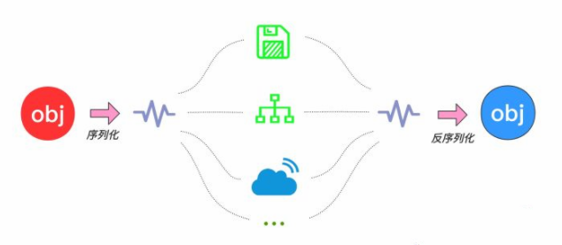
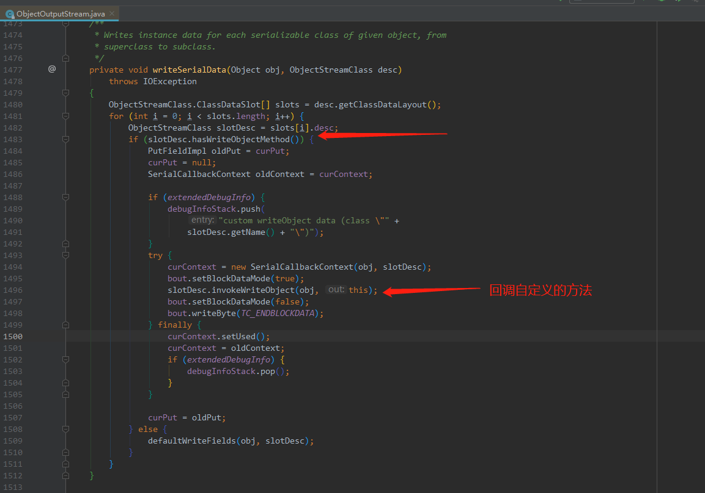
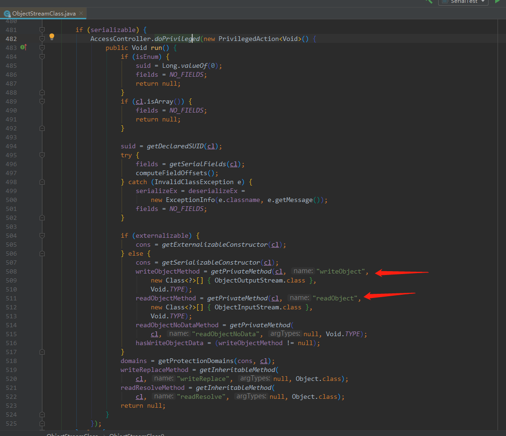

# 序列化
写在前面：首先我们带着下面这些问题来理解序列化与反序列化
- 首先为什么会有序列化
- 理解序列化与反序列化是什么？
- 序列化到底做了什么？
- Java如何实现序列化和反序列化，又如何避免不想序列化的字段 实现自定义序列化？
- 其中serialVersionUID 又是起到什么作用？
- 使用序列化过程中 又有什么特殊情况需要注意的？

✔ 表示较为重要

# 一. 首先为什么会有序列化  
序列化的原本意图是希望对一个Java对象作一下“变换”，变成字节序列，这样一来方便`持久化存储`到磁盘，避免程序运行结束后对象就从内存里消失，另外变换成字节序列也更便于`网络运输和传播`.

而且序列化机制从某种意义上来说也弥补了平台化的一些差异，毕竟转换后的字节流可以在其他平台上进行反序列化来恢复对象.


#### 作用总结（可理解为什么时候需要序列化）： ✔
- （1）永久性保存对象，保存对象的字节序列到本地文件或者数据库中；
- （2）通过序列化以字节流的形式使对象在网络中进行传递和接收；
- （3）通过序列化在进程间传递对象；


# 二. 什么是序列化和反序列化
（1）Java序列化是指把Java对象转换为字节序列的过程，而Java反序列化是指把字节序列恢复为Java对象的过程；
（2）**序列化：**对象序列化的最主要的用处就是在传递和保存对象的时候，保证对象的完整性和可传递性。序列化是把对象转换成有序字节流，以便在网络上传输或者保存在本地文件中。序列化后的字节流保存了Java对象的状态以及相关的描述信息。序列化机制的核心作用就是对象状态的保存与重建。 ✔
（3）**反序列化：**客户端从文件中或网络上获得序列化后的对象字节流后，根据字节流中所保存的对象状态及描述信息，通过反序列化重建对象。✔
（4）本质上讲，序列化就是把实体对象状态按照一定的格式写入到有序字节流，反序列化就是从有序字节流重建对象，恢复对象状态。
*
注：这里值得一提的是
 1.在没有序列化前，每个保存在堆（Heap）中的对象都有相应的状态（state），即实例变量（instance ariable），保存时候不仅仅是保存对象的实例变量的值，JVM还要保存一些小量信息，比如类的类型等以便恢复原来的对象。
 2.java序列化保存的对象的状态，而静态变量则属于类的状态，故序列化不保存静态变量*


# 三.序列化如何实现
序列化算法一般会按步骤做如下事情：
- （1）将对象实例相关的类元数据输出。
- （2）递归地输出类的超类描述直到不再有超类。
- （3）类元数据完了以后，开始从最顶层的超类开始输出对象实例的实际数据值。
- （4）从上至下递归输出实例的数据

# 四. Java如何实现序列化和反序列化

## 1、JDK类库中序列化和反序列化API ✔

- （1）**java.io.ObjectOutputStream**：表示对象输出流；

	它的`writeObject(Object obj)`方法可以对参数指定的obj对象进行序列化，把得到的字节序列写到一个目标输出流中；

- （2）**java.io.ObjectInputStream**：表示对象输入流；

	它的`readObject()`方法源输入流中读取字节序列，再把它们反序列化成为一个对象，并将其返回；

## 2、实现序列化的要求 ✔

只有实现了**Serializable或Externalizable**接口的类的对象才能被序列化，否则抛出`NotSerializableException`异常！

具体原因请参考：
**ObjectOutputStream - writeObject0**方法部分代码如下：


说明：如果一个对象既不是字符串、数组、枚举，而且也没有实现Serializable接口的话，在序列化时就会抛出NotSerializableException异常！

## 3、实现Java对象序列化与反序列化的方法

假定一个User类，它的对象需要序列化，可以有如下三种方法：

- （1）若User类仅仅实现了`Serializable`接口，则可以按照以下方式进行序列化和反序列化

	`ObjectOutputStream`采用默认的序列化方式，对User对象的非`transient`的实例变量进行序列化。
	`ObjcetInputStream`采用默认的反序列化方式，对对User对象的非`transient`的实例变量进行反序列化。

- （2）若User类仅仅实现了`Serializable`接口，并且还定义了`readObject(ObjectInputStream in)`和`writeObject(ObjectOutputSteam out)`，则采用以下方式进行序列化与反序列化。

	`ObjectOutputStream`调用User对象的`writeObject(ObjectOutputStream out)`的方法进行序列化。
	`ObjectInputStream`会调用User对象的`readObject(ObjectInputStream in)`的方法进行反序列化。

- （3）若User类实现了Externalnalizable接口，且User类必须实现`readExternal(ObjectInput in)`和`writeExternal(ObjectOutput out)`方法，则按照以下方式进行序列化与反序列化。

	`ObjectOutputStream`调用User对象的`writeExternal(ObjectOutput out))`的方法进行序列化。
	`ObjectInputStream`会调用User对象的`readExternal(ObjectInput in)`的方法进行反序列化。
 
**测试1:**
### user.java
```
import java.io.Serializable;

public class User implements Serializable {
    private String name;
    /**
     * 测试静态变量序列化问题 
     */
    private   static String image = "head.png";
    private String address;
    /**
     * 测试不可序列化字段
     */
    private transient String age;

    public String getName() {
        return name;
    }

    public void setName(String name) {
        this.name = name;
    }

    public String getAddress() {
        return address;
    }

    public void setAddress(String address) {
        this.address = address;
    }

    public String getAge() {
        return age;
    }

    public void setAge(String age) {
        this.age = age;
    }

    public static String getImage() {
        return image;
    }

    public static void setImage(String image) {
        User.image = image;
    }
}

```


### SerialTest.java
```
import java.io.*;

public class SerialTest {

    public static void main(String[] args) throws IOException, ClassNotFoundException {
        //序列化 将文件持续化都硬盘上
        //1.创建一个对象输出流，它可以包装一个其它类型的目标输出流，如文件输出流
        FileOutputStream fos = new FileOutputStream("user.out");
        ObjectOutputStream oos = new ObjectOutputStream(fos);
        User user1 = new User();
        user1.setName("hbl");
        user1.setAddress("福州");
        user1.setAge("30");
        //2.通过对象输出流的writeObject()方法写对象
        oos.writeObject(user1);
        oos.flush();
        oos.close();

        //反序列化
        //对静态变量进行修改
        User.setImage("title.jng");
        //1.创建一个对象输入流，它可以包装一个其它类型输入流，如文件输入流
        FileInputStream fis = new FileInputStream("user.out");
        ObjectInputStream ois = new ObjectInputStream(fis);
        //2.通过对象输出流的readObject()方法读取对象
        User user2 = (User) ois.readObject();
        System.out.println(user2.getName() + " " + User.getImage()+ " " + user2.getAge() + " " + user2.getAddress() );
        //反序列化的输出结果为：hbl title.jng null 福州
    }
}

```
由上述代码运行结果可看出 `transient` 、`static` 修饰的是不会进行序列化。
*注：如果类重写了writeObject ，readObject方法，则在序列化以及反序列化过程中 会调用读者重写的方法。有兴趣的可以参考JDK HashMap源码。*


**测试2：**
### User.java

```
import java.io.IOException;
import java.io.ObjectInputStream;
import java.io.ObjectOutputStream;
import java.io.Serializable;

public class User implements Serializable {
    private String name;
    /**
     * 测试静态变量序列化问题
     */
    private static String image = "head.png";
    private String address;
    /**
     * 测试不可序列化字段
     */
    private transient String age;

    public String getName() {
        return name;
    }

    public void setName(String name) {
        this.name = name;
    }

    public String getAddress() {
        return address;
    }

    public void setAddress(String address) {
        this.address = address;
    }

    public String getAge() {
        return age;
    }

    public void setAge(String age) {
        this.age = age;
    }

    public static String getImage() {
        return image;
    }

    public static void setImage(String image) {
        User.image = image;
    }

    private void writeObject(ObjectOutputStream oos) throws IOException {
        System.out.println("Serializable writeObject");
        oos.writeObject("write name : " + name);
        oos.writeObject("write address : " + address);
    }

    private void readObject(ObjectInputStream ois) throws IOException, ClassNotFoundException {
        System.out.println("Serializable readObject");
        name = (String) ois.readObject() + " read " ;
        address = (String) ois.readObject() + " read ";
    }
}

```

### SerialTest运行结果：

```
Serializable writeObject
Serializable readObject
write name : hbl read  title.jng null write address : 福州 read 
```
注：序列化和反序列化的过程其实是有漏洞的，因为从序列化到反序列化是有中间过程的，如果被别人拿到了中间字节流，然后加以伪造或者篡改，那反序列化出来的对象就会有一定风险了。 但是通过自行编写readObject()函数，用于对象的反序列化构造，从而提供约束性。


这是也许会有人问Serializable明明是个空接口，而且还是自定义的private的writeObject/readObject()方法是怎么可以被自动调用的？

**以持久化写入为例 ，ObjectOutputStream底层代码调用步骤（底层原来是调用反射机制）：**
ObjectOutputStream.writeObject
-> writeObject0
-> writeOrdinaryObject
-> writeSerialData
-> ObjectStreamClass.invokeWriteObject
(到这个步骤的时候 以及实例化了ObjectStreamClass，也就是调用了ObjectStreamClass(final Class<?> cl)这个构造方法，拿到了自定义的writeObject/readObject()方法)

**ObjectOutputStream-writeSerialData**代码如下：



**ObjectStreamClass构造方法**部分代码如下：



# 五. 其中serialVersionUID 又是起到什么作用 ✔
**其目的是序列化对象版本控制，有关各版本反序列化时是否兼容，可以认为序列化前后的唯一标识。**如果在新版本中这个值修改了，新版本就不兼容旧版本，反序列化时会抛出`InvalidClassException`异常。如果修改较小，比如仅仅是增加了一个属性，我们希望向下兼容，老版本的数据都能保留，那就不用修改；如果我们删除了一个属性，或者更改了类的继承关系，必然不兼容旧数据，这时就应该手动更新版本号，即`SerialVersionUid`。

**serialVersionUID**有两种显示的生成方式：

- 一是默认的1L，比如：private static final long serialVersionUID = 1L;

- 二是根据类名、接口名、成员方法及属性等来生成一个64位的哈希字段，


# 六. 使用序列化过程中 又有什么特殊情况需要注意的 ✔
相关注意事项:
 a）序列化时，只对对象的状态进行保存，而不管对象的方法；
 b）当一个父类实现序列化，子类自动实现序列化，不需要显式实现Serializable接口；
 c）子类实现了Serializable接口，父类没有，父类中的属性不能被序列化(不报错，但是数据会丢失) 父类需要默认的无参构造方法
 d）当一个对象的实例变量引用其他对象，序列化该对象时也把引用对象进行序列化，否则会报错；
 e）反序列化的时候，如果对象的属性有修改或则删减，修改的部分属性会丢失，但是不会报错
 f）在反序列化的时候serialVersionUID被修改的话，会反序列化失败
 g）在存Java环境下使用Java的序列化机制会支持的很好，但是在多语言环境下需要考虑别的序列化机制，比如xml,json,或则protobuf
 h）并非所有的对象都可以序列化，,至于为什么不可以，有很多原因了,比如：
   1.安全方面的原因，比如一个对象拥有private，public等field，对于一个要传输的对象，比如写到文件，或者进行rmi传输等等，在序列化进行传输的过程中，这个对象的private等域是不受保护的。2. 资源分配方面的原因，比如socket，thread类，如果可以序列化，进行传输或者保存，也无法对他们进行重新的资源分配，而且，也是没有必要这样实现。

