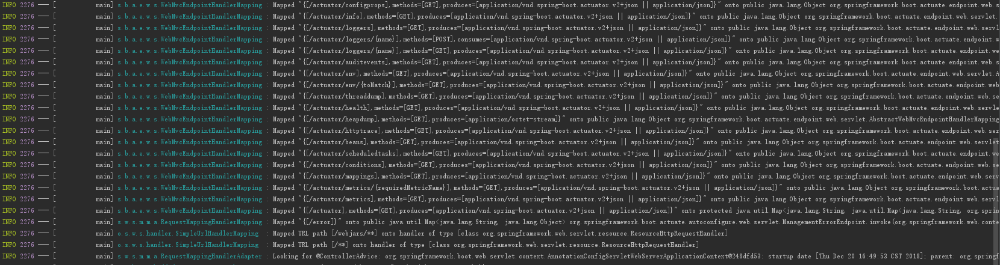
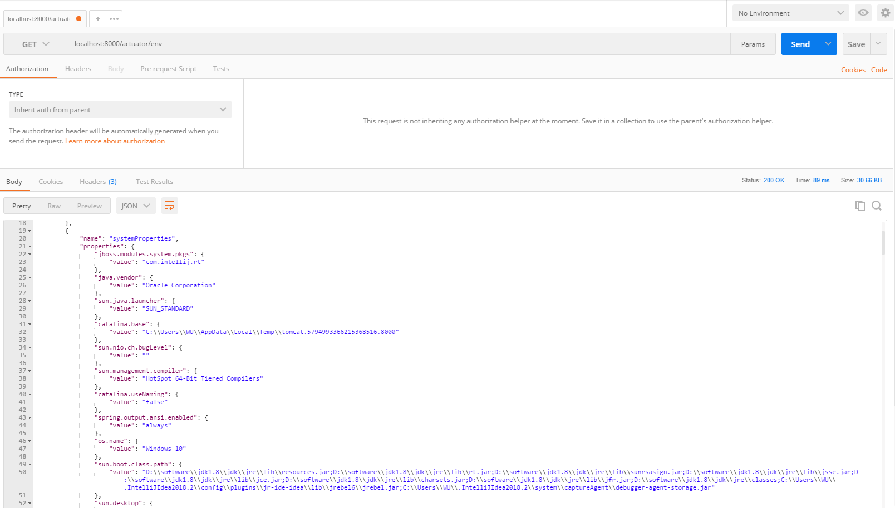
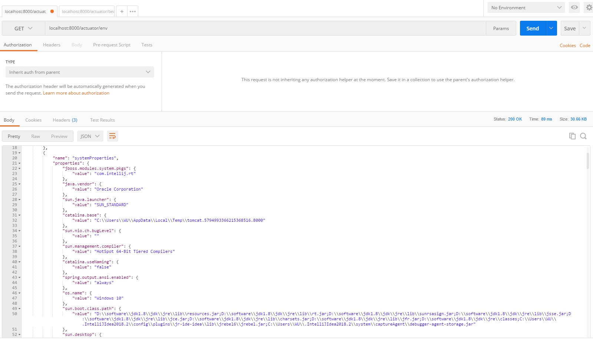
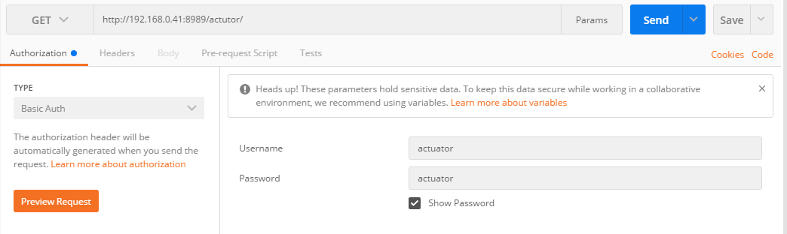

# Springboot简易使用actuator健康监控工具

写在前面：本次采用的springboot的版本是2.X

# 第一步 添加actuator依赖
1.**pom.xml** 如下：
```xml
<?xml version="1.0" encoding="UTF-8"?>
<project xmlns="http://maven.apache.org/POM/4.0.0" xmlns:xsi="http://www.w3.org/2001/XMLSchema-instance"
         xsi:schemaLocation="http://maven.apache.org/POM/4.0.0 http://maven.apache.org/xsd/maven-4.0.0.xsd">
    <modelVersion>4.0.0</modelVersion>
    <parent>
        <groupId>org.springframework.boot</groupId>
        <artifactId>spring-boot-starter-parent</artifactId>
        <version>2.0.3.RELEASE</version>
        <relativePath/> <!-- lookup parent from repository -->
    </parent>
    <groupId>com.example</groupId>
    <artifactId>configuration</artifactId>
    <version>0.0.1-SNAPSHOT</version>
    <name>configuration</name>
    <description>Demo project for Spring Boot</description>

    <properties>
        <java.version>1.8</java.version>
    </properties>

    <dependencies>

		<!-- 引用actuator -->
        <dependency>
            <groupId>org.springframework.boot</groupId>
            <artifactId>spring-boot-starter-actuator</artifactId>
        </dependency>

        <dependency>
            <groupId>org.springframework.boot</groupId>
            <artifactId>spring-boot-starter-web</artifactId>
        </dependency>

        <dependency>
            <groupId>org.springframework.boot</groupId>
            <artifactId>spring-boot-starter-test</artifactId>
            <scope>test</scope>
        </dependency>
    </dependencies>

    <build>
        <plugins>
            <plugin>
                <groupId>org.springframework.boot</groupId>
                <artifactId>spring-boot-maven-plugin</artifactId>
            </plugin>
        </plugins>
    </build>

</project>

```

# 第二步 加入配置
1.**application.properties** 如下:
```xml
#web服务端端口
server.port=8000

#监控地址端口
management.server.port=8000

#springboot2.0之后，在Http环境下将默认的endpoint只设置为info和health，要想开启其他的监控功能，需要手动配置
management.endpoints.web.exposure.include=*


#请求连接前缀 默认是/actuator
management.endpoints.web.base-path=/actuator
```

# 第三步 启动验证
### 1.启动项目
日志信息中包含如下信息：


从上图可以看出我们将要测试的映射连接地址
### 2.使用浏览器或者Postman

1.**/actuator/env** 查看环境配置



2.**/actuator/beans** 查看所有的bean


*注：上诉内容根据用户自身环境显示*

3.**/actuator/health** 查看通过合并几个健康指数检查应用的健康情况

Spring Boot Actuator有几个预定义的健康指标比如`DataSourceHealthIndicator`, `DiskSpaceHealthIndicator`, `MongoHealthIndicator`, `RedisHealthIndicator`, `CassandraHealthIndicator`等。它使用这些健康指标作为健康检查的一部分。

举个例子，如果你的应用使用`Redis`，`RedisHealthindicator`将被当作检查的一部分。如果使用`MongoDB`，那么`MongoHealthIndicator`将被当作检查的一部分。

你也可以关闭特定的健康检查指标，比如在prpperties中使用如下命令：
```
management.health.mongo.enabled=false
```
默认，所有的这些健康指标被当作健康检查的一部分。

显示详细的健康信息
`health endpoint`只展示了简单的UP和DOWN状态。为了获得健康检查中所有指标的详细信息，你可以通过在`application.yaml`中增加如下内容：
```
management:
  endpoint:
    health:
      show-details: always
``` 


4.**/actuator/metrics** 查看可以追踪的所有的度量
想要获得每个度量的详细信息，你需要传递度量的名称到URL中，像
http://localhost:8000/actuator/metrics/{MetricName}


5.**/actuator/loggers** 展示了应用中可配置的loggers的列表和相关的日志等级。
你同样能够使用http://localhost:8000/actuator/loggers/{name}来展示特定logger的细节。

举个例子，为了获得root logger的细节，你可以使用http://localhost:8000/actuator/loggers/root：
```
{
   "configuredLevel":"INFO",
   "effectiveLevel":"INFO"
}
```
在运行时改变日志等级
`loggers endpoint`也允许你在运行时改变应用的日志等级。

举个例子，为了改变`root logger`的等级为`DEBUG` ，发送一个POST请求到`http://localhost:8080/actuator/loggers/root`，加入如下参数
```
{
   "configuredLevel": "DEBUG"
}
```
这个功能对于线上问题的排查非常有用。

同时，你可以通过传递`null`值给`configuredLevel`来重置日志等级。


# 第四步使用Spring Security来保证Actuator Endpoints安全 
1.Actuator endpoints是敏感的，必须保障进入是被授权的。如果Spring Security是包含在你的应用中，那么endpoint是通过HTTP认证被保护起来的。
```
<dependency>
   <groupId>org.springframework.boot</groupId>
   <artifactId>spring-boot-starter-security</artifactId>
</dependency>
```

2.在application.yaml中增加spring security用户 就使用这里配置的用户名/密码登录
```
spring:
  security:
    user:
      name: actuator
      password: actuator
      roles: ACTUATOR_ADMIN
```

3.编写安全认证ActuatorSecurityConfig配置类
```
import org.springframework.boot.actuate.autoconfigure.security.servlet.EndpointRequest;
import org.springframework.boot.actuate.context.ShutdownEndpoint;
import org.springframework.boot.autoconfigure.security.servlet.PathRequest;
import org.springframework.context.annotation.Configuration;
import org.springframework.security.config.annotation.web.builders.HttpSecurity;
import org.springframework.security.config.annotation.web.configuration.WebSecurityConfigurerAdapter;

@Configuration
public class ActuatorSecurityConfig extends WebSecurityConfigurerAdapter {

    @Override
    protected void configure(HttpSecurity http) throws Exception {
       http
               //开启登录配置
               .authorizeRequests()
               .requestMatchers(EndpointRequest.to(ShutdownEndpoint.class))
               //表示访问接口，需要具备 ACTUATOR_ADMIN 这个角色
               .hasRole("ACTUATOR_ADMIN")
               .requestMatchers(EndpointRequest.toAnyEndpoint())
               .permitAll()
               .requestMatchers(PathRequest.toStaticResources().atCommonLocations())
               .permitAll()
               .antMatchers("/")
               .permitAll()
               .antMatchers("/**")
               .authenticated()
               .and()
               .httpBasic();
    }
}

```

4.使用Postman请求，填上认证信息


注：Spring Security 支持两种不同的认证方式：
- 可以通过 form 表单来认证
- 可以通过 HttpBasic 来认证


# 第五步 Prometheus

Prometheus是一个开源的监控系统，起源于SoundCloud。它由以下几个核心组件构成：

- 数据爬虫：根据配置的时间定期的通过HTTP抓去metrics数据。
- time-series 数据库：存储所有的metrics数据。
- 简单的用户交互接口：可视化、查询和监控所有的metrics。


1.加Micrometer Prometheus Registry到你的Spring Boot应用
Spring Boot使用Micrometer，一个应用metrics组件，将actuator metrics整合到外部监控系统中。

它支持很多种监控系统，比如Netflix Atalas, AWS Cloudwatch, Datadog, InfluxData, SignalFx, Graphite, Wavefront和Prometheus等。

为了整合Prometheus，你需要增加micrometer-registry-prometheus依赖：
```
<!-- Micrometer Prometheus registry  -->
<dependency>
    <groupId>io.micrometer</groupId>
    <artifactId>micrometer-registry-prometheus</artifactId>
</dependency>
```

一旦你增加上述的依赖，Spring Boot会自动配置一个PrometheusMeterRegistry和CollectorRegistry来收集和输出格式化的metrics数据，使得Prometheus服务器可以爬取。

所有应用的metrics数据是根据一个叫/prometheus的endpoint来设置是否可用。Prometheus服务器可以周期性的爬取这个endpoint来获取metrics数据。
2.解析Spring Boot Actuator的/prometheus Endpoint
首先，你可以通过actuator endpoint-discovery页面(http://192.168.0.41:8000/actuator)来看一下prometheus endpoint。
```
"prometheus": {
"href": "http://192.168.0.41:8000/actuator/prometheus",
"templated": false
}
```
prometheus endpoint暴露了格式化的metrics数据给Prometheus服务器。你可以通过prometheus endpoint(`http://192.168.0.41:8000/actuator/prometheus`)看到被暴露的metrics数据

 


3.Prometheus配置(prometheus.yml)
我们需要配置Prometheus来抓取Spring Boot Actuator的/prometheus endpoint中的metrics数据。

创建一个prometheus.yml的文件吗，内容如下：
```
# my global config
global:
  scrape_interval:     15s # Set the scrape interval to every 15 seconds. Default is every 1 minute.
  evaluation_interval: 15s # Evaluate rules every 15 seconds. The default is every 1 minute.
  # scrape_timeout is set to the global default (10s).

# Load rules once and periodically evaluate them according to the global 'evaluation_interval'.
rule_files:
  # - "first_rules.yml"
  # - "second_rules.yml"

# A scrape configuration containing exactly one endpoint to scrape:
# Here it's Prometheus itself.
scrape_configs:
  # The job name is added as a label `job=<job_name>` to any timeseries scraped from this config.
  - job_name: 'prometheus'
    # metrics_path defaults to '/metrics'
    # scheme defaults to 'http'.
    static_configs:
    - targets: ['127.0.0.1:9090']

  - job_name: 'spring-actuator'
    metrics_path: '/actuator/prometheus'
    scrape_interval: 5s
    static_configs:
    - targets: ['192.168.0.41:8000']
```
注： metrics_path是Actuator中prometheus endpoint中的路径。targes包含了Spring Boot应用的HOST和PORT。

4.启动Prometheus容器
```
docker run -d --name=prometheus -p 9090:9090 -v  /home/software/prometheus/prometheus.yml:/etc/prometheus/prometheus.yml prom/prometheus --config.file=/etc/prometheus/prometheus.yml
```


5.在Prometheus仪表盘中可视化Spring Boot Metrics
通过访问`http://容器所在服务器ip:9090`访问Prometheus仪表盘。你可以通过Prometheus查询表达式来查询metrics。

# 第六步 Grafana
1.运行Grafana容器
```
docker run -d --name=grafana -p 3000:3000 grafana/grafana 
```
访问`http:///容器所在服务器ip:3000`，并且使用默认的账户名(admin)密码(admin)来登录Grafana。

2.构建仪表盘


# 附录：
表格中不一一进行演示，下表列出常用命令：

<table><thead><tr><th>HTTP方法</th>
			<th>路径</th>
			<th>描述</th>
			<th>鉴权</th>
		<tr><td>GET</td>
			<td>/actuator//configprops</td>
			<td>查看配置属性，包括默认配置</td>
			<td>true</td>
		</tr><tr><td>GET</td>
			<td>/actuator//beans</td>
			<td>查看bean及其关系列表</td>
			<td>true</td>
		</tr><tr><td>GET</td>
			<td>/actuator//threaddump</td>
			<td>打印线程栈</td>
			<td>true</td>
		</tr><tr><td>GET</td>
			<td>/actuator//env</td>
			<td>查看所有环境变量</td>
			<td>true</td>
		</tr><tr><td>GET</td>
			<td>/actuator//env/{toMatch}</td>
			<td>查看具体变量值</td>
			<td>true</td>
		</tr><tr><td>GET</td>
			<td>/actuator//health</td>
			<td>查看应用健康指标</td>
			<td>false</td>
		</tr><tr><td>GET</td>
			<td>/actuator//info</td>
			<td>查看应用信息（需要自己在application.properties里头添加信息，比如info.contact.email=easonjim@163.com）</td>
			<td>false</td>
		</tr><tr><td>GET</td>
			<td>/actuator//mappings</td>
			<td>查看所有url映射</td>
			<td>true</td>
		</tr><tr><td>GET</td>
			<td>/actuator//metrics</td>
			<td>查看应用基本指标</td>
			<td>true</td>
		</tr><tr><td>GET</td>
			<td>/actuator//metrics/{name}</td>
			<td>查看具体指标</td>
			<td>true</td>
	  <tr><td>GET</td>
			<td>/actuator//httptrace</td>
			<td>查看基本追踪信息</td>
			<td>true</td>
		</tr></tbody></table>