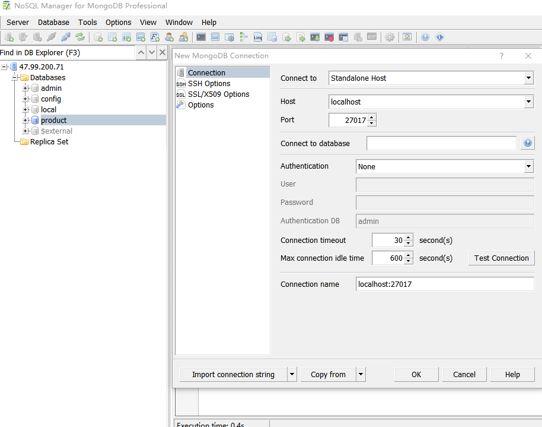

# Mongodb简易使用

写在前面：Mongdb是为快速开发互联网web应用而设计的数据库系统，设计目标是极简、灵活、作为web栈的一部分，它的数据模型是面向文档，所谓文档是一种类似于JSON的数据结构

mongodb官方文档： https://docs.mongodb.com/manual/
# 第一步 创建数据映射目录 以及搭建mongodb
1.创建数据映射目录
```bash
mkdir -p /home/mongodb/db
```
2.拉取mongo镜像，以及创建mongodb容器
```bash
docker pull mongo
docker run -d --name mongodb -v /home/mongodb/db:/data/db  --net=host  mongo 
```

# 第二步 安装mongodb可视化工具
本文中将使用的工具是 NoSQL Manager for MongoDB Freeware 下载地址：https://www.mongodbmanager.com/download
读者可以自行选择其他可视化工具



# 第三步 简单操作mongodb
点击菜单栏 “shell”，在shell框中，进行语句操作。
1.插入
```bash
/*
   db.collection.insert()
    -  功能：向指定集合中插入文档数据
    -  参数：可以接收对象作为文档数据 {属性:值,属性:值....}     
    -  结果： // 2018/11/7 14:06:43
           // Command #2:
            // db.phone.insert({name:"iphone6s",price:7000})
            // Execution time: 0.0s
            // Result:
            WriteResult({ "nInserted" : 1 }) 
            
            
   db.collection.insertOne()
    -  功能：向指定集合中插入一条文档数据
    -  参数：可以接收一个对象作为文档数据 {属性:值,属性:值....}     
    -  结果： {
          "acknowledged" : true,
          "insertedId" : ObjectId("5be284ca24821380181c1fbe")
           }
           
           
           
   db.collection.insertOne()
    -  功能：向指定集合中插入多条文档数据
    -  参数：可以接收对象数组作为文档数据 [{属性:值,属性:值....},{属性:值,属性:值....},{属性:值,属性:值....} ]      
    -  结果：// 2018/11/7 14:25:52
          // Command #2:
          // db.phone.insertMany([{name:"iphone7",price:7300},{name:"iphon7s",price:7800},{name:"iphone8",price:8300}])
          // Execution time: 0.0s
          // Result:
          {
          "acknowledged" : true,
          "insertedIds" : [
                ObjectId("5be2857024821380181c1fbf"),
                ObjectId("5be2857024821380181c1fc0"),
                ObjectId("5be2857024821380181c1fc1")
                 ]
         }
*/
use product
db.phone.insertOne({name:"iphon6s",price:7200})
db.phone.insertMany([{name:"iphone7",price:7300},{name:"iphon7s",price:7800},{name:"iphone8",price:8300}])
```

2.查询
```bash
/*
    db.collection.find()
     -  功能：用来查询所有符合条件的文档
     -  参数：可以接收一个对象作为条件参数 {属性:值} 查询指定属性值的文档 
     -  结果：一个数组 
     例如 db.phone.find({name:"iphone6s"})  查询出文档中属性 name为iphone6的数据集合
      db.phone.find({name:"iphone6s"})[0] 查询出文档中属性 name为iphone6的数据集合第一个
      
    db.collection.findOne()
     -  功能：db.collection.find()[0] 相同，查找出符合条件的第一个文档
     -  参数：可以接收一个对象作为条件参数 {属性:值} 查询指定属性值的文档   
     -  结果：一个文档对象 
     
    db.collection.find().count()
     - 功能：计算出符合条件的文档数量
     -  参数：可以接收一个对象作为条件参数 {属性:值} 查询指定属性值的文档   
     -  结果：一个数字 
*/
 db.phone.find() 
 db.phone.find({name:"iphone6s"}) 
 db.phone.find({name:"iphone6s"})[0]
 db.phone.find().count()

```

3.修改
```bash
/*
  db.collection.update(查询条件，新对象)
     - 功能：更新符合查询条件数据文档  默认情况只会修改第一个文档数据
     - 参数：第一个参数为修改符合查询条件的数据, 第二参数是 覆盖的数据  默认是对象替换对象 ,第三个参数  {
           upsert: <boolean>,       可选，这个参数的意思是，如果不存在update的记录，是否插入objNew,true为插入，默认是false，不插入。
           multi: <boolean>,        可选，mongodb 默认是false,只更新找到的第一条记录，如果这个参数为true,就把按条件查出来多条记录全部更新。
           writeConcern: <document> 可选，抛出异常的级别。
           }
     
     $set:{属性:值,属性:值.....} 修改指定的文档中的属性
     $unset:{属性:值,属性:值.....}  删除指定文档中的属性
     $push:用于向数组中添加一个新的元素
     $addToSet:向数组中添加一个新的元素，如果数组中已经存在该元素，则不会添加
     
     结果：// 2018/11/7 14:46:28
        // Command #2:
        // db.phone.update({name:"iphone6s"},{$set:{price:8000}})
        // Execution time: 0.0s
        // Result:
        WriteResult({ "nMatched" : 1, "nUpserted" : 0, "nModified" : 1 })
        
  db.collection.updateOne(查询条件，新对象)   
   - 功能： 修改一个符合查询条件文档数据 其他请参考update 
   
  db.collection.updateMany(查询条件，新对象)   
   - 功能： 修改多个符合查询条件文档数据 其他请参考update 
         
*/
 
 db.phone.update({name:"iphone6s"},{price:8000}) //发现该条数据 { "_id" : ObjectId("5be280f324821380181c1fbd"), "name" : "iphone6s", "price" : 7000 }会变为{ "_id" : ObjectId("5be280f324821380181c1fbd"), "price" : 8000 }
 
 db.phone.update({name:"iphone6s"},{$set:{price:8000}}) 
 
```
4.删除
```bash
/*
  db.collection.remove(查询条件)
   - 功能：删除符合查询条件的数据文档，默认是满足条件全部删除,必须传参，如果为{}，则是清空所有的文档数据，但推荐使用db.collection.drop(); 删除集合
   - 参数：加入第二个参数 为true，则表示只会删除满足条件的第一个文档数据
   
  db.collection.removeOne(查询条件)
   - 功能：删除一个符合条件的文档数据
  db.collection.removeMany(查询条件)
   - 功能：删除符合条件的全部文档数据 
   
*/

db.phone.remove({name:"iphone6s"}) //会删除name为iPhone6s的全部文档数据
db.phone.remove({name:"iphone6s"},true) // 会删除name为iPhone6s的第一条文档数据 
```


5.操作符
```bash
/*
 ( > ) 大于 - $gt
 ( < ) 小于 - $lt
 ( >= ) 大于等于 - $gte
 ( <= ) 小于等于 - $lte
 ( or ) 或者 -$or
 ( inc )  当前字段自增  -$inc
skip：用于跳过指定数量的数据
limit:限制显示的条数
db.phone.find({price:{$gt:7000，$lt:6000}}) //查询出price大于7000,小于6000的所有文档
db.phone.find({price:{$gt:7000}}).limit(10)  //查询出price大于7000,小于6000的前10条文档
db.phone.find({price:{$gt:7000}}).skip(10).limit(10)  //查询出price大于7000,小于6000的前10-20条文档 .分页：skip((页码-1)*每页显示的条数).limit(每页显示的条数)  
*/
db.phone.find({$or:[{name:'iphone6s'},{name:'iphone7'},{price:{$gt:7500}}]}) //查询出name为iphone6s或者iphone7，或者price大于7500的文档数据

db.phone.updateMany({price:{$lte:7300}},{$inc:{price:400}}) //更新price小于等于7300的文档数据的price 都加上400，例如原先7300变为7700
```
6.文档之间的关系
```bash
/*
  一对一 
      - 使用内嵌文档的形式，db.classAndleader.insert({class:"一年一班",leader:{name:"小明"}})  //一个班级中只有一个班长
  一对多
      - 使用内嵌文档的形式 会造成数据臃肿。不推荐
      - 使用外键的形式 db.order.insert({list:["手机","手表","电脑"],user_id:ObjectId("5be280f324821380181c1fbd")}) // 用户拥有的订单
  多对多
      - 使用外键数组的形式
      db.teacher.insert({name:"黄老师"},{name:"陈老师"},{name:"赵老师"}) //得到三个ID 用于下面关联学生
	  db.student.insert({name:"小明",teacher_id:[ObjectId("5be280f324821380181c1fbd"),ObjectId("5be280f324821380181c1fbd")]}
      {name:"小玲",teacher_id:[ObjectId("5be280f324821380181c1fbd"),ObjectId("14e280f324821380181c1fb3")]}
      )
	 //小明属于黄老师，陈老师教的，小玲属于陈老师，赵老师教的。陈老师拥有小明、小玲两个学生
*/
```
7.排序和投影
```bash
/*
  sort
    - 排序 1表示升序 -1表示降序   {属性:1,属性:-1.....} 可进行多个进行排序
*/
db.phone.find().sort({price:-1}) //按price降序
db.phone.find().sort({price:1})  //按price升序

/*
  投影 
   - 查询时第二个参数，表示投影字段，1表示显示，0表示不显示
*/
db.phone.find({},{name:1}) //只显示名字
```

8.索引
```bash
/*
 db.collection.createIndex(keys, options)
  - 功能：创建索引  
  - 参数：keys:1表示升序创建索引 -1表示降序创建索引   {属性:1,属性:-1.....}   
         options:
           background(true/false) 建索引过程会阻塞其它数据库操作，background可指定以后台方式创建索引，即增加 "background" 可选参数。 "background" 默认值为false
           unique(true/false):建立的索引是否唯一。指定为true创建唯一索引。默认值为false.
		   name(string):索引的名称。如果未指定，MongoDB的通过连接索引的字段名和排序顺序生成一个索引名称。
*/
db.phone.createIndex({name: 1}, {background: true})

``` 
9.聚合
```bash
/*
 $sum   计算总和。
 $avg   计算平均值
 $min   获取集合中所有文档对应值得最小值。
 $max   获取集合中所有文档对应值得最大值。
 $push  在结果文档中插入值到一个数组中。
 $addToSet  在结果文档中插入值到一个数组中，但不创建副本。
 $first  根据资源文档的排序获取第一个文档数据。
 $last   根据资源文档的排序获取最后一个文档数据
*/
db.phone.aggregate([{$group:{_id:"$name",total:{$sum:1}}}]) 
//按照name分组 统计 ==》 select name, count(*) from phone group by name

```

10.mongodb备份与恢复
```bash
/*
   mongodump -h dbhost -d dbname -o dbdirectory
    - 功能：备份数据库
    - 参数：
        -h  MongDB所在服务器地址，例如：127.0.0.1，当然也可以指定端口号：127.0.0.1:27017
        -d：需要备份的数据库实例，例如：phone
        -o：备份的数据存放位置，例如：d:\mongodb\data\dump，当然该目录需要提前建立，在备份完成后，系统自动在dump目录下建立一个phone目录，这个目录里面存放该数据库实例的备份数据。


   mongorestore -h <hostname><:port> -d dbname <path>
    - 功能：恢复数据
    - 参数：
        --host <:port>, -h <:port>：MongoDB所在服务器地址，默认为： localhost:27017
        --db , -d ：需要恢复的数据库实例，例如：phone，当然这个名称也可以和备份时候的不一样，比如phone2
        --drop：恢复的时候，先删除当前数据，然后恢复备份的数据。就是说，恢复后，备份后添加修改的数据都会被删除，慎用哦！
        <path>： mongorestore 最后的一个参数，设置备份数据所在位置，例如：d:\mongodb\data\dump\phone。
                 你不能同时指定 <path> 和 --dir 选项，--dir也可以设置备份目录。
        --dir：指定备份的目录
               你不能同时指定 <path> 和 --dir 选项。

*/


```

11.监控
>1.mongostat是mongodb自带的状态检测工具，在命令行下使用。它会间隔固定时间获取mongodb的当前运行状态，并输出。如果你发现数据库突然变慢或者有其他问题的话，你第一手的操作就考虑采用mongostat来查看mongo的状态。

>2.mongotop也是mongodb下的一个内置工具，mongotop提供了一个方法，用来跟踪一个MongoDB的实例，查看哪些大量的时间花费在读取和写入数据。 mongotop提供每个集合的水平的统计数据。默认情况下，mongotop返回值的每一秒。
> 输出结果字段说明：
ns：
包含数据库命名空间，后者结合了数据库名称和集合。
db：
包含数据库的名称。名为 . 的数据库针对全局锁定，而非特定数据库。
total：
mongod花费的时间工作在这个命名空间提供总额。
read：
提供了大量的时间，这mongod花费在执行读操作，在此命名空间。
write：
提供这个命名空间进行写操作，这mongod花了大量的时间。
 

# 附录
1.显示所有数据库
```bash
show dbs    #说明：dbs==databases
```
2.切换使用数据库
```bash
use dbname
```
*在mongodb中，数据库和集合不需要手动创建，当创建文档是，数据库和集合不存在时，会自动创建。*
3.显示当前所处的数据库
```bash
db
```
4.显示当前数据库中所有的集合
```bash
show collections
```

